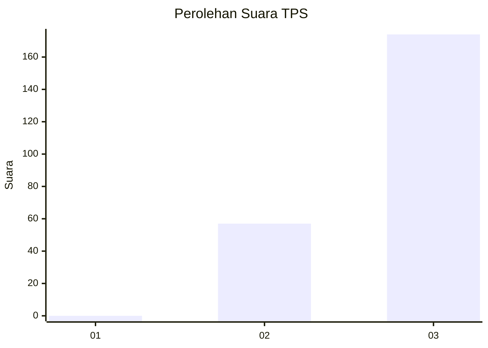
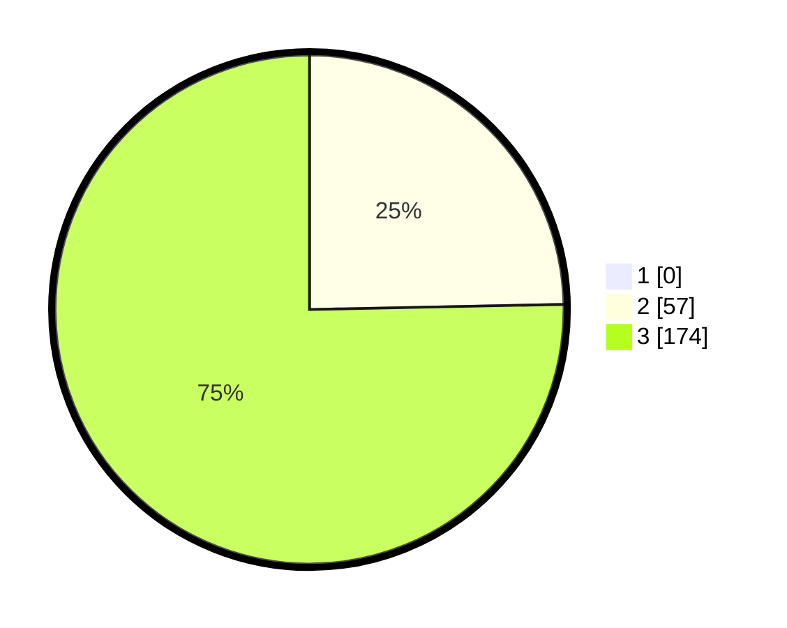

# Hasil

## Grafik

## Tabel

| No. | Nama Paslon    | Suara | Suara (raw) | Persentase |
|:--- |:-------------- | -----:| -----------:| ----------:|
| 1   | ANIES MUHAIMIN | 0     | [0][p-1]    | 0,00       |
| 2   | PRABOWO GIBRAN | 57    | [57][p-2]   | 24,68      |
| 3   | GANJAR MAHFUD  | 174   | [174][p-3]  | 75,32      |

[p-1]: https://github.com/gigit-pemilu/pemilu-2024-51-bali/blob/main/pilpres/hitung-suara/sub/51-bali/sub/02-tabanan/sub/07-marga/sub/2014-marga-dauh-puri/sub/001-tps/sub/paslon-1.txt
[p-2]: https://github.com/gigit-pemilu/pemilu-2024-51-bali/blob/main/pilpres/hitung-suara/sub/51-bali/sub/02-tabanan/sub/07-marga/sub/2014-marga-dauh-puri/sub/001-tps/sub/paslon-2.txt
[p-3]: https://github.com/gigit-pemilu/pemilu-2024-51-bali/blob/main/pilpres/hitung-suara/sub/51-bali/sub/02-tabanan/sub/07-marga/sub/2014-marga-dauh-puri/sub/001-tps/sub/paslon-3.txt

## Foto C Plano

https://sirekap-obj-formc.kpu.go.id/4b03/pemilu/ppwp/51/02/07/20/14/5102072014001-20240216-154216--22e4c589-525c-4dbf-a527-8e8dae09cddf.jpg

https://sirekap-obj-formc.kpu.go.id/4b03/pemilu/ppwp/51/02/07/20/14/5102072014001-20240216-154217--790ba4a1-7425-40e1-af19-21ad980c7d40.jpg

https://sirekap-obj-formc.kpu.go.id/4b03/pemilu/ppwp/51/02/07/20/14/5102072014001-20240216-154217--52d73c6a-1468-45b2-99cc-245c90bf3b90.jpg

## Metadata

| Key        | Value               |
| ---------- | ------------------- |
| Time Stamp | 2024-02-22 11:00:00 |

## DATA PEMILIH TETAP

Jumlah pemilih dalam DPT: **237**.
 * L: **114**.
 * P: **123**.

## DATA PENGGUNA HAK PILIH

Jumlah pengguna hak pilih dalam DPT: **232**.
 * L: **112**.
 * P: **120**.

Jumlah pengguna hak pilih dalam DPTb: **0**.
 * L: **0**.
 * P: **0**.

Jumlah pengguna hak pilih dalam DPK: **0**.
 * L: **0**.
 * P: **0**.

Jumlah pengguna hak pilih: **232**.
 * L: **112**.
 * P: **120**.

## JUMLAH SUARA SAH DAN TIDAK SAH

JUMLAH SELURUH SUARA SAH: **231**.

JUMLAH SUARA TIDAK SAH: **1**.

JUMLAH SELURUH SUARA SAH DAN SUARA TIDAK SAH: **232**.

