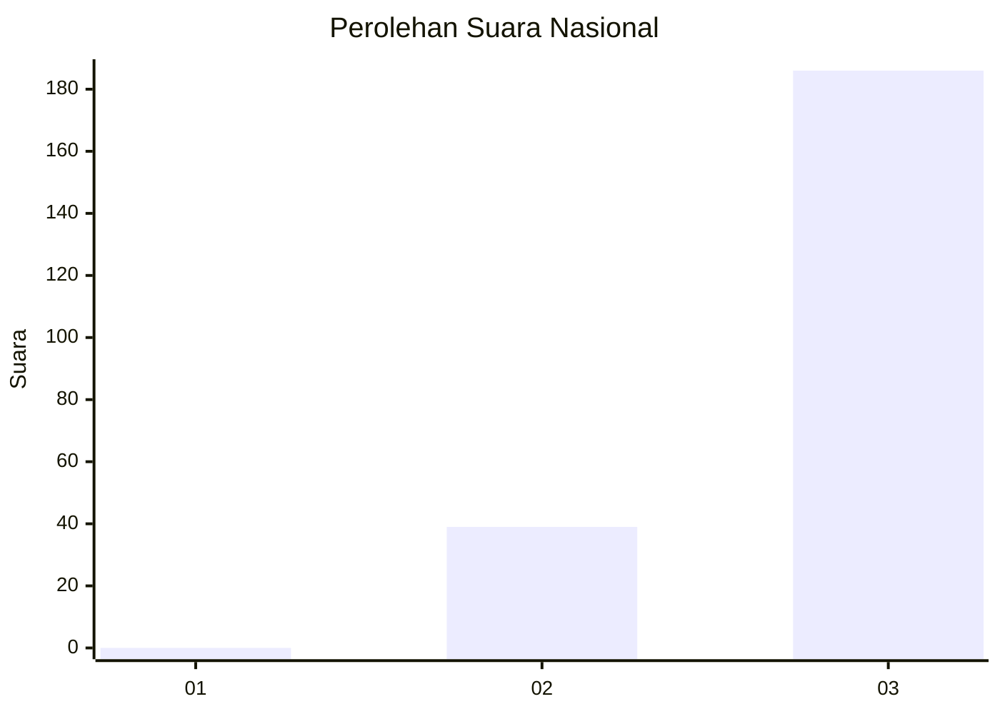
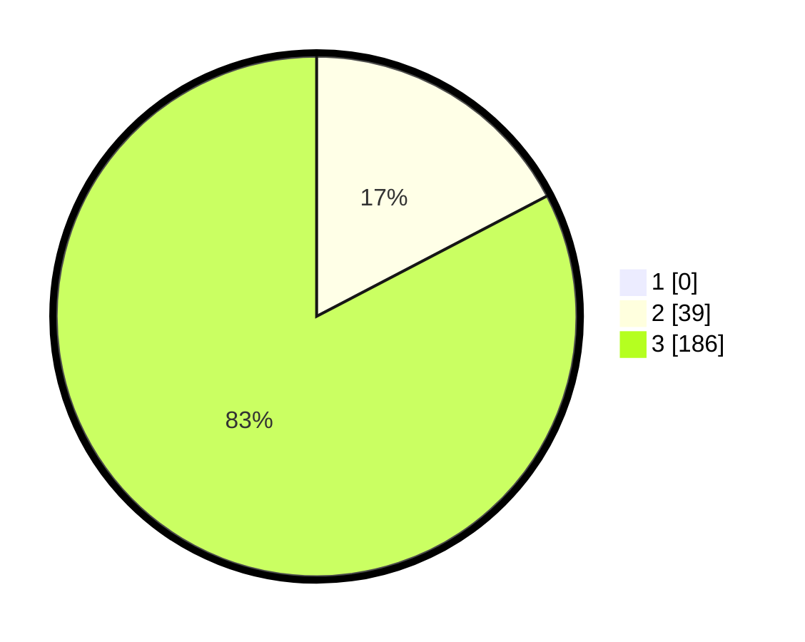

# Hasil

## Grafik

## Tabel

| No. | Nama Paslon    | Suara | Suara (raw) | Persentase |
|:--- |:-------------- | -----:| -----------:| ----------:|
| 1   | ANIES MUHAIMIN | 0     | [0][p-1]    | 0,00       |
| 2   | PRABOWO GIBRAN | 39    | [39][p-2]   | 17,33      |
| 3   | GANJAR MAHFUD  | 186   | [186][p-3]  | 82,67      |

[p-1]: https://github.com/gigit-pemilu/pemilu-2024/blob/main/pilpres/hitung-suara/sub/51-bali/sub/02-tabanan/sub/07-marga/sub/2014-marga-dauh-puri/sub/002-tps/sub/paslon-1.txt
[p-2]: https://github.com/gigit-pemilu/pemilu-2024/blob/main/pilpres/hitung-suara/sub/51-bali/sub/02-tabanan/sub/07-marga/sub/2014-marga-dauh-puri/sub/002-tps/sub/paslon-2.txt
[p-3]: https://github.com/gigit-pemilu/pemilu-2024/blob/main/pilpres/hitung-suara/sub/51-bali/sub/02-tabanan/sub/07-marga/sub/2014-marga-dauh-puri/sub/002-tps/sub/paslon-3.txt

## Foto C Plano

https://sirekap-obj-formc.kpu.go.id/bf35/pemilu/ppwp/51/02/07/20/14/5102072014002-20240216-075910--ee6d8bc0-340c-4ba0-8e83-afaa4cc80f92.jpg

https://sirekap-obj-formc.kpu.go.id/bf35/pemilu/ppwp/51/02/07/20/14/5102072014002-20240216-075912--876f5840-9d91-43a1-8cc9-efb5565d5c93.jpg

https://sirekap-obj-formc.kpu.go.id/bf35/pemilu/ppwp/51/02/07/20/14/5102072014002-20240216-075911--7586f97e-86f2-4601-b17d-388028e153f8.jpg

## Metadata

| Key        | Value               |
| ---------- | ------------------- |
| Time Stamp | 2024-02-16 12:51:22 |

## DATA PEMILIH TETAP

Jumlah pemilih dalam DPT: **232**.
 * L: **110**.
 * P: **122**.

## DATA PENGGUNA HAK PILIH

Jumlah pengguna hak pilih dalam DPT: **223**.
 * L: **106**.
 * P: **117**.

Jumlah pengguna hak pilih dalam DPTb: **3**.
 * L: **0**.
 * P: **3**.

Jumlah pengguna hak pilih dalam DPK: **0**.
 * L: **0**.
 * P: **0**.

Jumlah pengguna hak pilih: **226**.
 * L: **106**.
 * P: **120**.

## JUMLAH SUARA SAH DAN TIDAK SAH

JUMLAH SELURUH SUARA SAH: **225**.

JUMLAH SUARA TIDAK SAH: **1**.

JUMLAH SELURUH SUARA SAH DAN SUARA TIDAK SAH: **226**.

