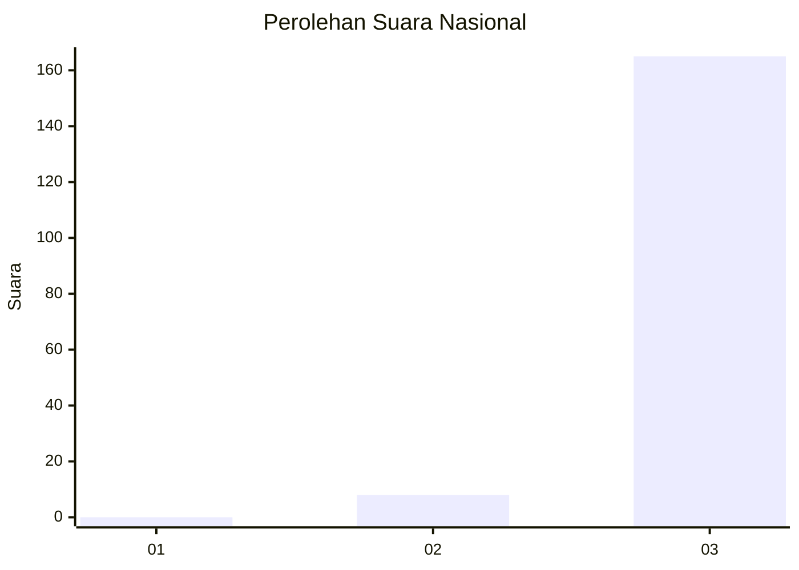
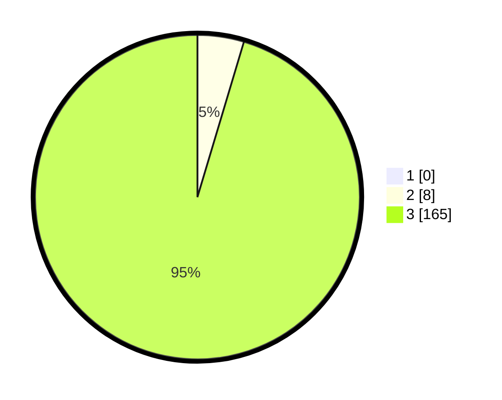

# Hasil

## Grafik

## Tabel

| No. | Nama Paslon    | Suara | Suara (raw) | Persentase |
|:--- |:-------------- | -----:| -----------:| ----------:|
| 1   | ANIES MUHAIMIN | 0     | [0][p-1]    | 0,00       |
| 2   | PRABOWO GIBRAN | 8     | [8][p-2]    | 4,62       |
| 3   | GANJAR MAHFUD  | 165   | [165][p-3]  | 95,38      |

[p-1]: https://github.com/gigit-pemilu/pemilu-2024/blob/main/pilpres/hitung-suara/sub/51-bali/sub/02-tabanan/sub/07-marga/sub/2014-marga-dauh-puri/sub/006-tps/sub/paslon-1.txt
[p-2]: https://github.com/gigit-pemilu/pemilu-2024/blob/main/pilpres/hitung-suara/sub/51-bali/sub/02-tabanan/sub/07-marga/sub/2014-marga-dauh-puri/sub/006-tps/sub/paslon-2.txt
[p-3]: https://github.com/gigit-pemilu/pemilu-2024/blob/main/pilpres/hitung-suara/sub/51-bali/sub/02-tabanan/sub/07-marga/sub/2014-marga-dauh-puri/sub/006-tps/sub/paslon-3.txt

## Foto C Plano

https://sirekap-obj-formc.kpu.go.id/77af/pemilu/ppwp/51/02/07/20/14/5102072014006-20240216-040719--be8e8d98-89d7-4fdb-9f91-04ae6e42e0b5.jpg

https://sirekap-obj-formc.kpu.go.id/77af/pemilu/ppwp/51/02/07/20/14/5102072014006-20240216-041627--86e31669-9cac-4f27-82aa-be4f487fbdef.jpg

https://sirekap-obj-formc.kpu.go.id/77af/pemilu/ppwp/51/02/07/20/14/5102072014006-20240216-040726--39f08aff-cbbf-421a-ae4c-8bd69551eef2.jpg

## Metadata

| Key        | Value               |
| ---------- | ------------------- |
| Time Stamp | 2024-02-16 12:51:22 |

## DATA PEMILIH TETAP

Jumlah pemilih dalam DPT: **236**.
 * L: **113**.
 * P: **123**.

## DATA PENGGUNA HAK PILIH

Jumlah pengguna hak pilih dalam DPT: **230**.
 * L: **110**.
 * P: **120**.

Jumlah pengguna hak pilih dalam DPTb: **0**.
 * L: **0**.
 * P: **0**.

Jumlah pengguna hak pilih dalam DPK: **0**.
 * L: **0**.
 * P: **0**.

Jumlah pengguna hak pilih: **230**.
 * L: **110**.
 * P: **120**.

## JUMLAH SUARA SAH DAN TIDAK SAH

JUMLAH SELURUH SUARA SAH: **173**.

JUMLAH SUARA TIDAK SAH: **57**.

JUMLAH SELURUH SUARA SAH DAN SUARA TIDAK SAH: **230**.

