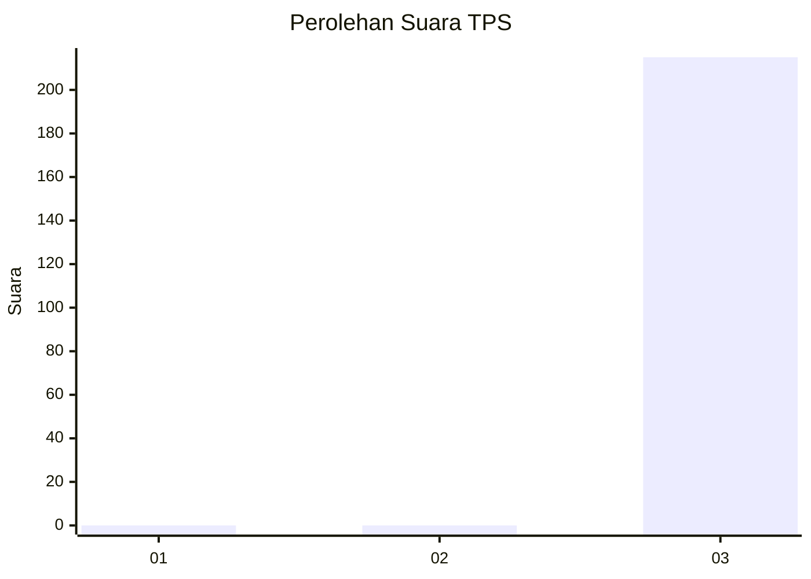
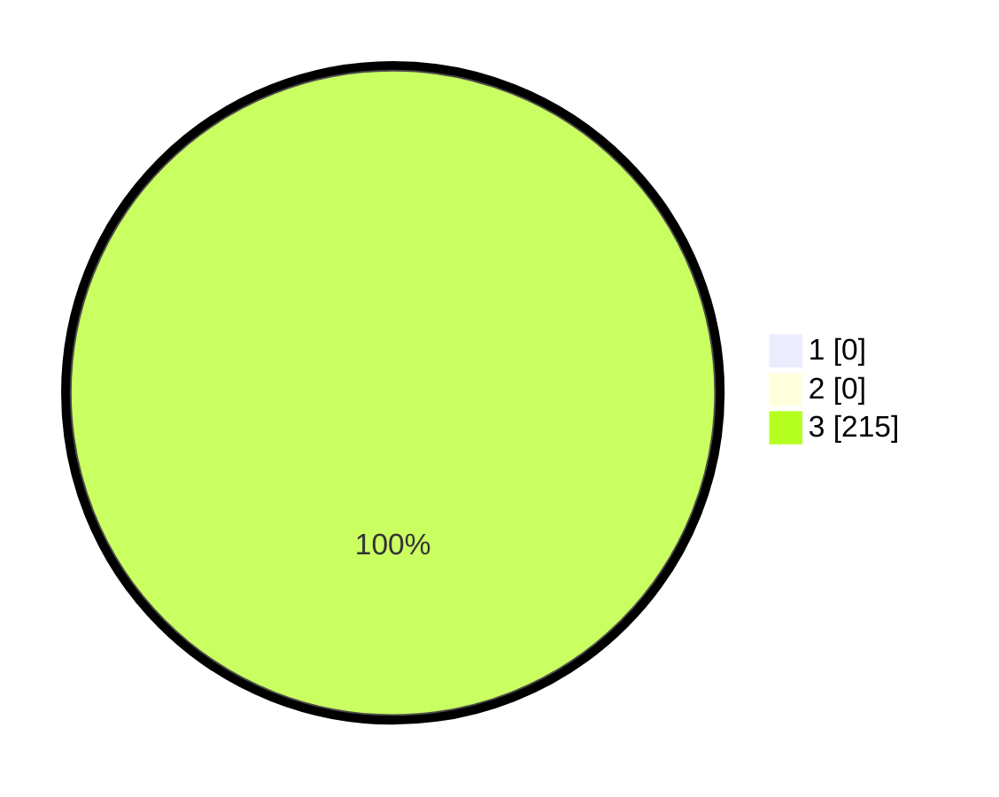

# Hasil

## Grafik

## Tabel

| No. | Nama Paslon    | Suara | Suara (raw) | Persentase |
|:--- |:-------------- | -----:| -----------:| ----------:|
| 1   | ANIES MUHAIMIN | 0     | [0][p-1]    | 0,00       |
| 2   | PRABOWO GIBRAN | 0     | [0][p-2]    | 0,00       |
| 3   | GANJAR MAHFUD  | 215   | [215][p-3]  | 100,00     |

[p-1]: https://github.com/gigit-pemilu/pemilu-2024-51-bali/blob/main/pilpres/hitung-suara/sub/51-bali/sub/02-tabanan/sub/07-marga/sub/2014-marga-dauh-puri/sub/007-tps/sub/paslon-1.txt
[p-2]: https://github.com/gigit-pemilu/pemilu-2024-51-bali/blob/main/pilpres/hitung-suara/sub/51-bali/sub/02-tabanan/sub/07-marga/sub/2014-marga-dauh-puri/sub/007-tps/sub/paslon-2.txt
[p-3]: https://github.com/gigit-pemilu/pemilu-2024-51-bali/blob/main/pilpres/hitung-suara/sub/51-bali/sub/02-tabanan/sub/07-marga/sub/2014-marga-dauh-puri/sub/007-tps/sub/paslon-3.txt

## Foto C Plano

https://sirekap-obj-formc.kpu.go.id/5d92/pemilu/ppwp/51/02/07/20/14/5102072014007-20240214-130425--77aa35c6-3b07-435c-962d-c3c8f3a82760.jpg

https://sirekap-obj-formc.kpu.go.id/5d92/pemilu/ppwp/51/02/07/20/14/5102072014007-20240214-130435--b53c4634-9d03-4a9b-8427-c26a1b58cda7.jpg

https://sirekap-obj-formc.kpu.go.id/5d92/pemilu/ppwp/51/02/07/20/14/5102072014007-20240214-130454--94d05c44-a8b9-4bb7-b574-5cd68c3c37aa.jpg

## Metadata

| Key        | Value               |
| ---------- | ------------------- |
| Time Stamp | 2024-02-14 21:46:01 |

## DATA PEMILIH TETAP

Jumlah pemilih dalam DPT: **234**.
 * L: **112**.
 * P: **122**.

## DATA PENGGUNA HAK PILIH

Jumlah pengguna hak pilih dalam DPT: **228**.
 * L: **110**.
 * P: **118**.

Jumlah pengguna hak pilih dalam DPTb: **2**.
 * L: **1**.
 * P: **0**.

Jumlah pengguna hak pilih dalam DPK: **0**.
 * L: **0**.
 * P: **0**.

Jumlah pengguna hak pilih: **229**.
 * L: **111**.
 * P: **118**.

## JUMLAH SUARA SAH DAN TIDAK SAH

JUMLAH SELURUH SUARA SAH: **215**.

JUMLAH SUARA TIDAK SAH: **14**.

JUMLAH SELURUH SUARA SAH DAN SUARA TIDAK SAH: **229**.

