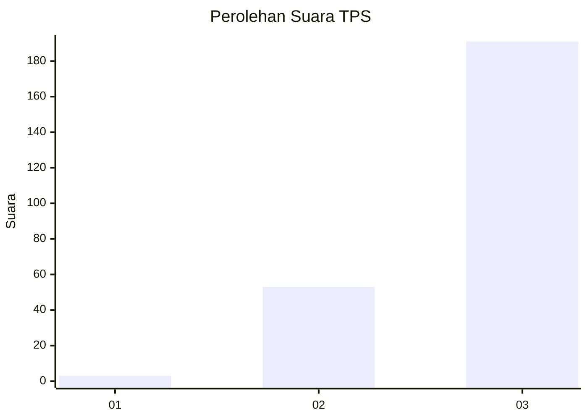
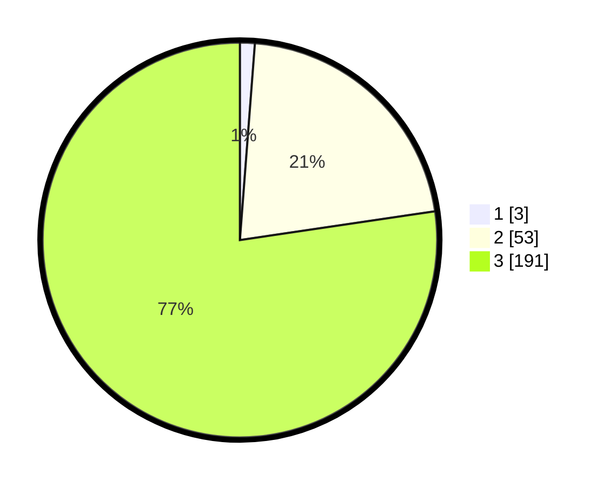

# Hasil

## Grafik

## Tabel

| No. | Nama Paslon    | Suara | Suara (raw) | Persentase |
|:--- |:-------------- | -----:| -----------:| ----------:|
| 1   | ANIES MUHAIMIN | 3     | [3][p-1]    | 1,21       |
| 2   | PRABOWO GIBRAN | 53    | [53][p-2]   | 21,46      |
| 3   | GANJAR MAHFUD  | 191   | [191][p-3]  | 77,33      |

[p-1]: https://github.com/gigit-pemilu/pemilu-2024-51-bali/blob/main/pilpres/hitung-suara/sub/51-bali/sub/02-tabanan/sub/07-marga/sub/2015-geluntung/sub/003-tps/sub/paslon-1.txt
[p-2]: https://github.com/gigit-pemilu/pemilu-2024-51-bali/blob/main/pilpres/hitung-suara/sub/51-bali/sub/02-tabanan/sub/07-marga/sub/2015-geluntung/sub/003-tps/sub/paslon-2.txt
[p-3]: https://github.com/gigit-pemilu/pemilu-2024-51-bali/blob/main/pilpres/hitung-suara/sub/51-bali/sub/02-tabanan/sub/07-marga/sub/2015-geluntung/sub/003-tps/sub/paslon-3.txt

## Foto C Plano

https://sirekap-obj-formc.kpu.go.id/50e5/pemilu/ppwp/51/02/07/20/15/5102072015003-20240214-210519--114baeff-54b2-4c00-96fc-4968406ea04b.jpg

https://sirekap-obj-formc.kpu.go.id/50e5/pemilu/ppwp/51/02/07/20/15/5102072015003-20240214-210634--66b7d0c7-338d-4415-a3b5-e38a50884186.jpg

https://sirekap-obj-formc.kpu.go.id/50e5/pemilu/ppwp/51/02/07/20/15/5102072015003-20240216-170304--1d6e122d-1674-4d2b-aeae-5915be7fc817.jpg

## Metadata

| Key        | Value               |
| ---------- | ------------------- |
| Time Stamp | 2024-02-16 17:30:00 |

## DATA PEMILIH TETAP

Jumlah pemilih dalam DPT: **247**.
 * L: **124**.
 * P: **123**.

## DATA PENGGUNA HAK PILIH

Jumlah pengguna hak pilih dalam DPT: **245**.
 * L: **123**.
 * P: **122**.

Jumlah pengguna hak pilih dalam DPTb: **2**.
 * L: **1**.
 * P: **1**.

Jumlah pengguna hak pilih dalam DPK: **0**.
 * L: **0**.
 * P: **0**.

Jumlah pengguna hak pilih: **247**.
 * L: **124**.
 * P: **123**.

## JUMLAH SUARA SAH DAN TIDAK SAH

JUMLAH SELURUH SUARA SAH: **247**.

JUMLAH SUARA TIDAK SAH: **0**.

JUMLAH SELURUH SUARA SAH DAN SUARA TIDAK SAH: **247**.

