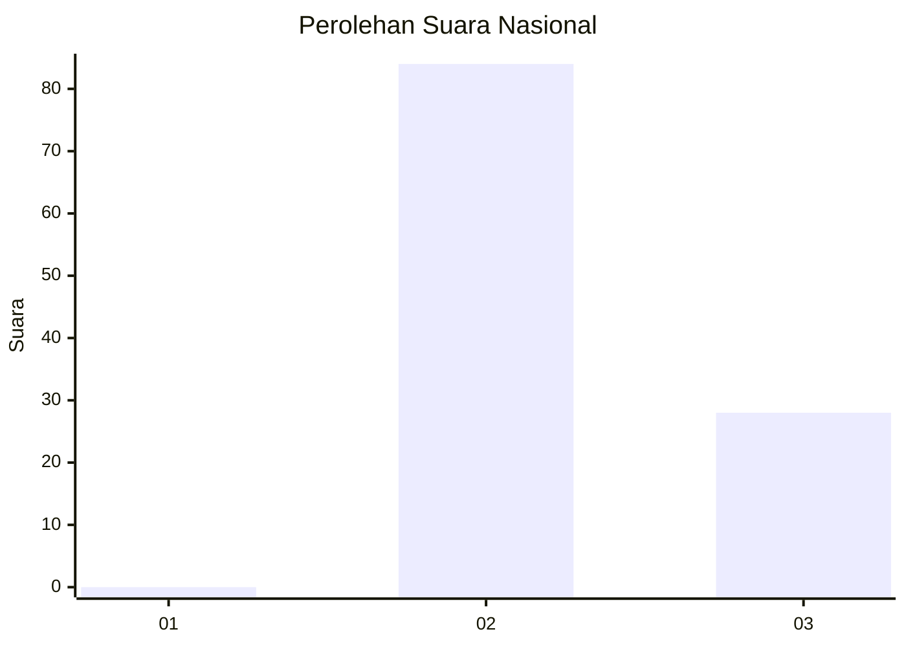
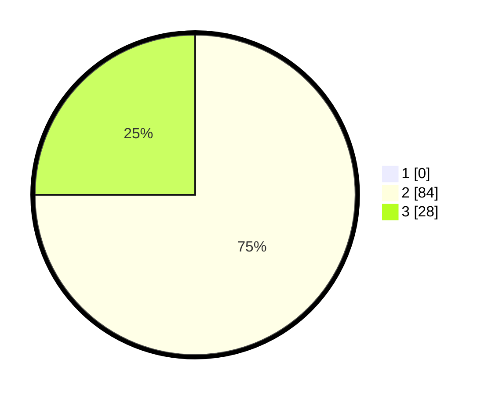

# Hasil

## Grafik

## Tabel

| No. | Nama Paslon    | Suara | Suara (raw) | Persentase |
|:--- |:-------------- | -----:| -----------:| ----------:|
| 1   | ANIES MUHAIMIN | 0     | [0][p-1]    | 0,00       |
| 2   | PRABOWO GIBRAN | 84    | [84][p-2]   | 75,00      |
| 3   | GANJAR MAHFUD  | 28    | [28][p-3]   | 25,00      |

[p-1]: https://github.com/gigit-pemilu/pemilu-2024/blob/main/pilpres/hitung-suara/sub/51-bali/sub/02-tabanan/sub/07-marga/sub/2016-baru/sub/003-tps/sub/paslon-1.txt
[p-2]: https://github.com/gigit-pemilu/pemilu-2024/blob/main/pilpres/hitung-suara/sub/51-bali/sub/02-tabanan/sub/07-marga/sub/2016-baru/sub/003-tps/sub/paslon-2.txt
[p-3]: https://github.com/gigit-pemilu/pemilu-2024/blob/main/pilpres/hitung-suara/sub/51-bali/sub/02-tabanan/sub/07-marga/sub/2016-baru/sub/003-tps/sub/paslon-3.txt

## Foto C Plano

https://sirekap-obj-formc.kpu.go.id/1ff9/pemilu/ppwp/51/02/07/20/16/5102072016003-20240216-151518--508974f6-dccb-4f01-b750-5ed30a2760d9.jpg

https://sirekap-obj-formc.kpu.go.id/1ff9/pemilu/ppwp/51/02/07/20/16/5102072016003-20240216-151520--f8c7e803-1690-44b3-8207-0b6180d30eb6.jpg

https://sirekap-obj-formc.kpu.go.id/1ff9/pemilu/ppwp/51/02/07/20/16/5102072016003-20240216-151519--80bebac1-ba9d-4f9b-b864-8670e3605318.jpg

## Metadata

| Key        | Value               |
| ---------- | ------------------- |
| Time Stamp | 2024-02-16 16:25:10 |

## DATA PEMILIH TETAP

Jumlah pemilih dalam DPT: **122**.
 * L: **62**.
 * P: **60**.

## DATA PENGGUNA HAK PILIH

Jumlah pengguna hak pilih dalam DPT: **115**.
 * L: **60**.
 * P: **55**.

Jumlah pengguna hak pilih dalam DPTb: **0**.
 * L: **0**.
 * P: **0**.

Jumlah pengguna hak pilih dalam DPK: **0**.
 * L: **0**.
 * P: **0**.

Jumlah pengguna hak pilih: **115**.
 * L: **60**.
 * P: **55**.

## JUMLAH SUARA SAH DAN TIDAK SAH

JUMLAH SELURUH SUARA SAH: **112**.

JUMLAH SUARA TIDAK SAH: **3**.

JUMLAH SELURUH SUARA SAH DAN SUARA TIDAK SAH: **115**.

