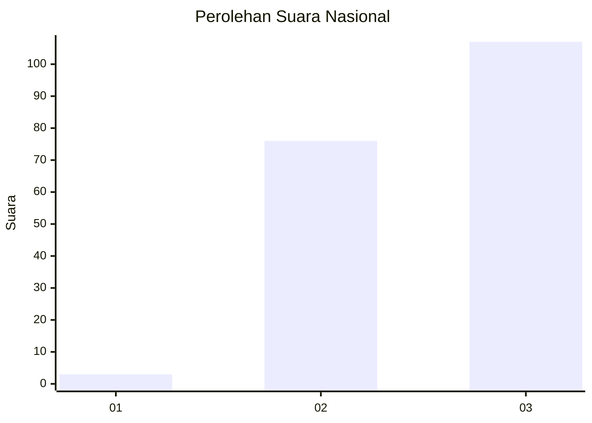
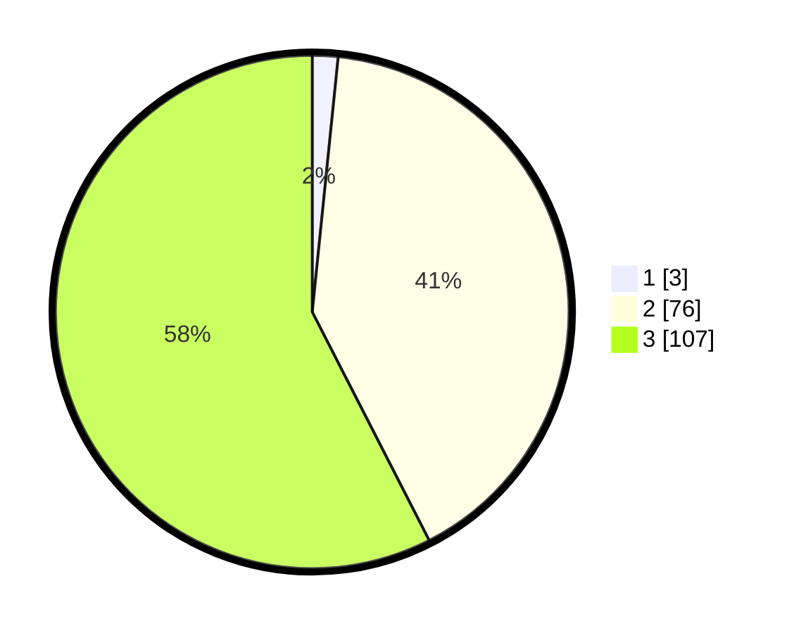

# Hasil

## Grafik

## Tabel

| No. | Nama Paslon    | Suara | Suara (raw) | Persentase |
|:--- |:-------------- | -----:| -----------:| ----------:|
| 1   | ANIES MUHAIMIN | 3     | [3][p-1]    | 1,61       |
| 2   | PRABOWO GIBRAN | 76    | [76][p-2]   | 40,86      |
| 3   | GANJAR MAHFUD  | 107   | [107][p-3]  | 57,53      |

[p-1]: https://github.com/gigit-pemilu/pemilu-2024/blob/main/pilpres/hitung-suara/sub/51-bali/sub/02-tabanan/sub/07-marga/sub/2016-baru/sub/006-tps/sub/paslon-1.txt
[p-2]: https://github.com/gigit-pemilu/pemilu-2024/blob/main/pilpres/hitung-suara/sub/51-bali/sub/02-tabanan/sub/07-marga/sub/2016-baru/sub/006-tps/sub/paslon-2.txt
[p-3]: https://github.com/gigit-pemilu/pemilu-2024/blob/main/pilpres/hitung-suara/sub/51-bali/sub/02-tabanan/sub/07-marga/sub/2016-baru/sub/006-tps/sub/paslon-3.txt

## Foto C Plano

https://sirekap-obj-formc.kpu.go.id/b71a/pemilu/ppwp/51/02/07/20/16/5102072016006-20240214-140953--77d015f8-8476-4728-9437-0308fd9489c7.jpg

https://sirekap-obj-formc.kpu.go.id/b71a/pemilu/ppwp/51/02/07/20/16/5102072016006-20240216-002342--c8408330-7bf5-4dda-9628-8dcd2d5792d5.jpg

https://sirekap-obj-formc.kpu.go.id/b71a/pemilu/ppwp/51/02/07/20/16/5102072016006-20240216-002341--78021d21-c478-4fb4-a6e4-d2934bb0aa69.jpg

## Metadata

| Key        | Value               |
| ---------- | ------------------- |
| Time Stamp | 2024-02-16 12:51:22 |

## DATA PEMILIH TETAP

Jumlah pemilih dalam DPT: **239**.
 * L: **115**.
 * P: **124**.

## DATA PENGGUNA HAK PILIH

Jumlah pengguna hak pilih dalam DPT: **188**.
 * L: **94**.
 * P: **94**.

Jumlah pengguna hak pilih dalam DPTb: **1**.
 * L: **1**.
 * P: **0**.

Jumlah pengguna hak pilih dalam DPK: **0**.
 * L: **0**.
 * P: **0**.

Jumlah pengguna hak pilih: **189**.
 * L: **95**.
 * P: **94**.

## JUMLAH SUARA SAH DAN TIDAK SAH

JUMLAH SELURUH SUARA SAH: **186**.

JUMLAH SUARA TIDAK SAH: **3**.

JUMLAH SELURUH SUARA SAH DAN SUARA TIDAK SAH: **189**.

