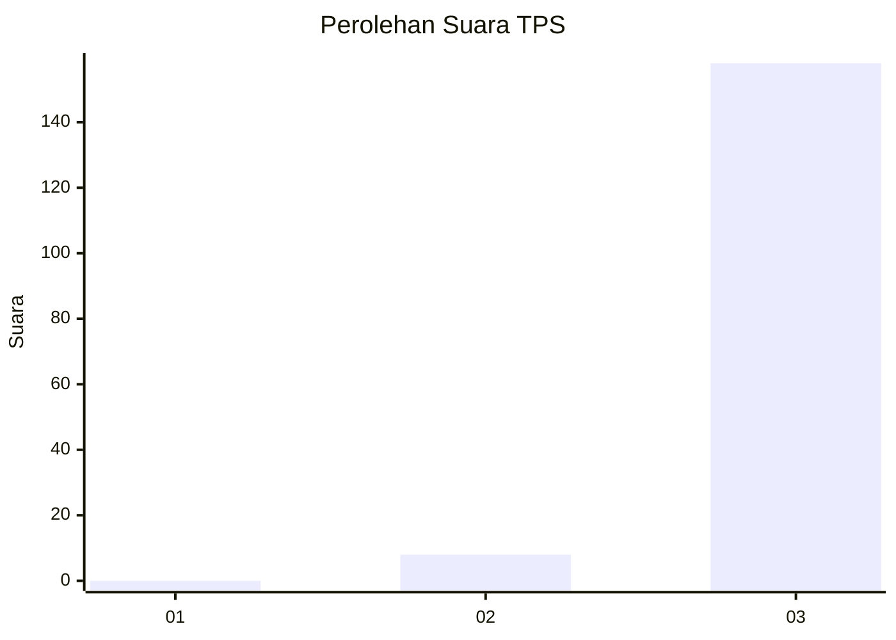
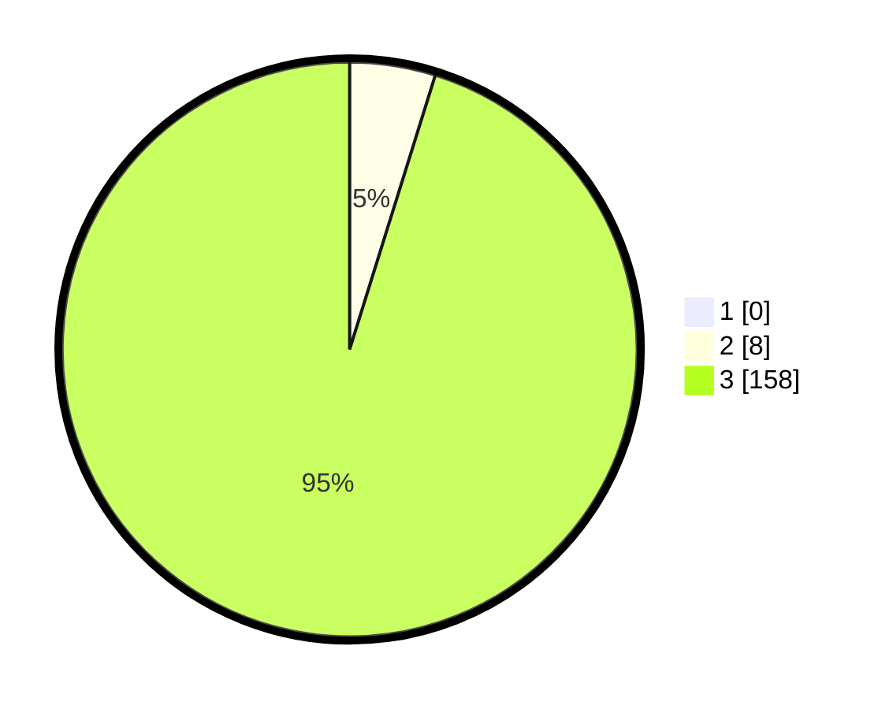

# Hasil

## Grafik

## Tabel

| No. | Nama Paslon    | Suara | Suara (raw) | Persentase |
|:--- |:-------------- | -----:| -----------:| ----------:|
| 1   | ANIES MUHAIMIN | 0     | [0][p-1]    | 0,00       |
| 2   | PRABOWO GIBRAN | 8     | [8][p-2]    | 4,82       |
| 3   | GANJAR MAHFUD  | 158   | [158][p-3]  | 95,18      |

[p-1]: https://github.com/gigit-pemilu/pemilu-2024-51-bali/blob/main/pilpres/hitung-suara/sub/51-bali/sub/02-tabanan/sub/08-penebel/sub/2001-rejasa/sub/001-tps/sub/paslon-1.txt
[p-2]: https://github.com/gigit-pemilu/pemilu-2024-51-bali/blob/main/pilpres/hitung-suara/sub/51-bali/sub/02-tabanan/sub/08-penebel/sub/2001-rejasa/sub/001-tps/sub/paslon-2.txt
[p-3]: https://github.com/gigit-pemilu/pemilu-2024-51-bali/blob/main/pilpres/hitung-suara/sub/51-bali/sub/02-tabanan/sub/08-penebel/sub/2001-rejasa/sub/001-tps/sub/paslon-3.txt

## Foto C Plano

https://sirekap-obj-formc.kpu.go.id/7c1b/pemilu/ppwp/51/02/08/20/01/5102082001001-20240215-212927--93265cb6-9710-466e-be91-f9b3f3a371c8.jpg

https://sirekap-obj-formc.kpu.go.id/7c1b/pemilu/ppwp/51/02/08/20/01/5102082001001-20240215-212928--79a02119-487c-462d-84e8-b36f851e4117.jpg

https://sirekap-obj-formc.kpu.go.id/7c1b/pemilu/ppwp/51/02/08/20/01/5102082001001-20240215-212927--f3f2c6af-1b22-46bb-ac81-4b4378562e2a.jpg

## Metadata

| Key        | Value               |
| ---------- | ------------------- |
| Time Stamp | 2024-02-15 23:29:50 |

## DATA PEMILIH TETAP

Jumlah pemilih dalam DPT: **176**.
 * L: **83**.
 * P: **93**.

## DATA PENGGUNA HAK PILIH

Jumlah pengguna hak pilih dalam DPT: **169**.
 * L: **80**.
 * P: **89**.

Jumlah pengguna hak pilih dalam DPTb: **0**.
 * L: **0**.
 * P: **0**.

Jumlah pengguna hak pilih dalam DPK: **0**.
 * L: **0**.
 * P: **0**.

Jumlah pengguna hak pilih: **169**.
 * L: **80**.
 * P: **89**.

## JUMLAH SUARA SAH DAN TIDAK SAH

JUMLAH SELURUH SUARA SAH: **166**.

JUMLAH SUARA TIDAK SAH: **3**.

JUMLAH SELURUH SUARA SAH DAN SUARA TIDAK SAH: **169**.

