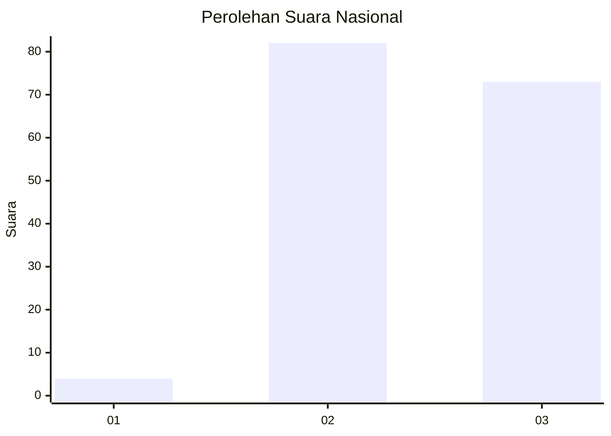
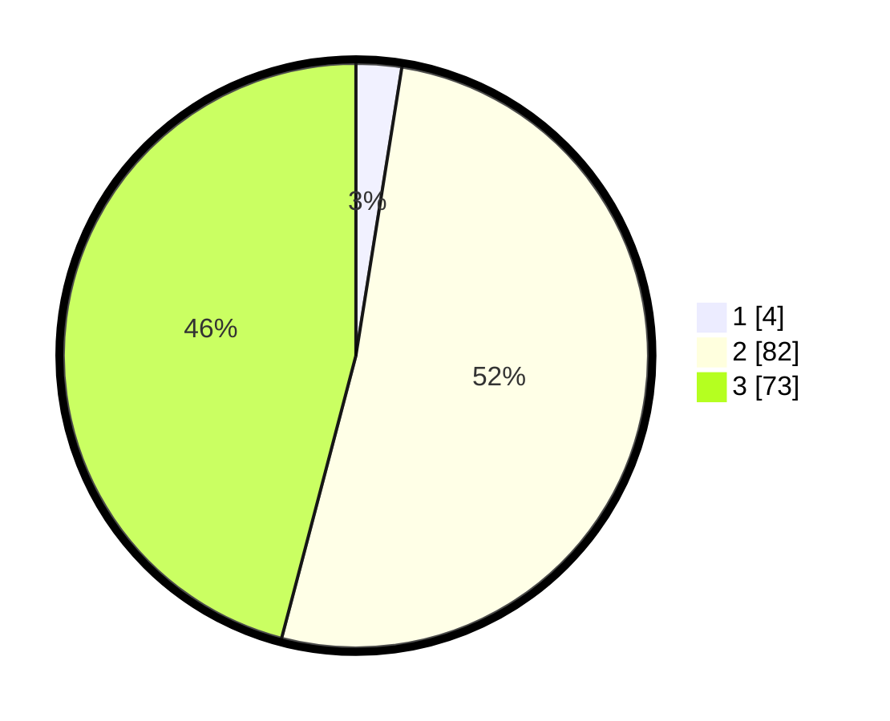

# Hasil

## Grafik

## Tabel

| No. | Nama Paslon    | Suara | Suara (raw) | Persentase |
|:--- |:-------------- | -----:| -----------:| ----------:|
| 1   | ANIES MUHAIMIN | 4     | [4][p-1]    | 2,52       |
| 2   | PRABOWO GIBRAN | 82    | [82][p-2]   | 51,57      |
| 3   | GANJAR MAHFUD  | 73    | [73][p-3]   | 45,91      |

[p-1]: https://github.com/gigit-pemilu/pemilu-2024/blob/main/pilpres/hitung-suara/sub/51-bali/sub/02-tabanan/sub/08-penebel/sub/2001-rejasa/sub/002-tps/sub/paslon-1.txt
[p-2]: https://github.com/gigit-pemilu/pemilu-2024/blob/main/pilpres/hitung-suara/sub/51-bali/sub/02-tabanan/sub/08-penebel/sub/2001-rejasa/sub/002-tps/sub/paslon-2.txt
[p-3]: https://github.com/gigit-pemilu/pemilu-2024/blob/main/pilpres/hitung-suara/sub/51-bali/sub/02-tabanan/sub/08-penebel/sub/2001-rejasa/sub/002-tps/sub/paslon-3.txt

## Foto C Plano

https://sirekap-obj-formc.kpu.go.id/062a/pemilu/ppwp/51/02/08/20/01/5102082001002-20240215-112459--8df007fb-87b7-4800-a6fe-090b990e54dc.jpg

https://sirekap-obj-formc.kpu.go.id/062a/pemilu/ppwp/51/02/08/20/01/5102082001002-20240215-112521--2325cf99-1968-4c37-a9e5-96cf23aae3ba.jpg

https://sirekap-obj-formc.kpu.go.id/062a/pemilu/ppwp/51/02/08/20/01/5102082001002-20240215-112510--1fb53573-a8a5-401e-bc33-f612902abd06.jpg

## Metadata

| Key        | Value               |
| ---------- | ------------------- |
| Time Stamp | 2024-02-15 23:29:50 |

## DATA PEMILIH TETAP

Jumlah pemilih dalam DPT: **196**.
 * L: **98**.
 * P: **98**.

## DATA PENGGUNA HAK PILIH

Jumlah pengguna hak pilih dalam DPT: **163**.
 * L: **83**.
 * P: **80**.

Jumlah pengguna hak pilih dalam DPTb: **1**.
 * L: **1**.
 * P: **0**.

Jumlah pengguna hak pilih dalam DPK: **2**.
 * L: **1**.
 * P: **1**.

Jumlah pengguna hak pilih: **166**.
 * L: **85**.
 * P: **81**.

## JUMLAH SUARA SAH DAN TIDAK SAH

JUMLAH SELURUH SUARA SAH: **159**.

JUMLAH SUARA TIDAK SAH: **7**.

JUMLAH SELURUH SUARA SAH DAN SUARA TIDAK SAH: **166**.

