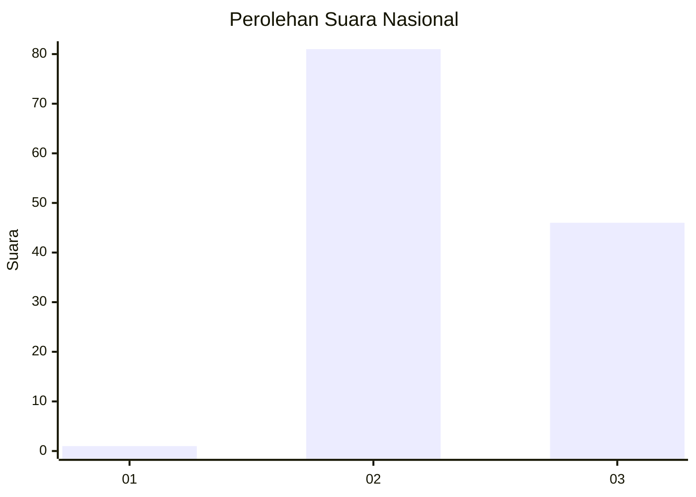
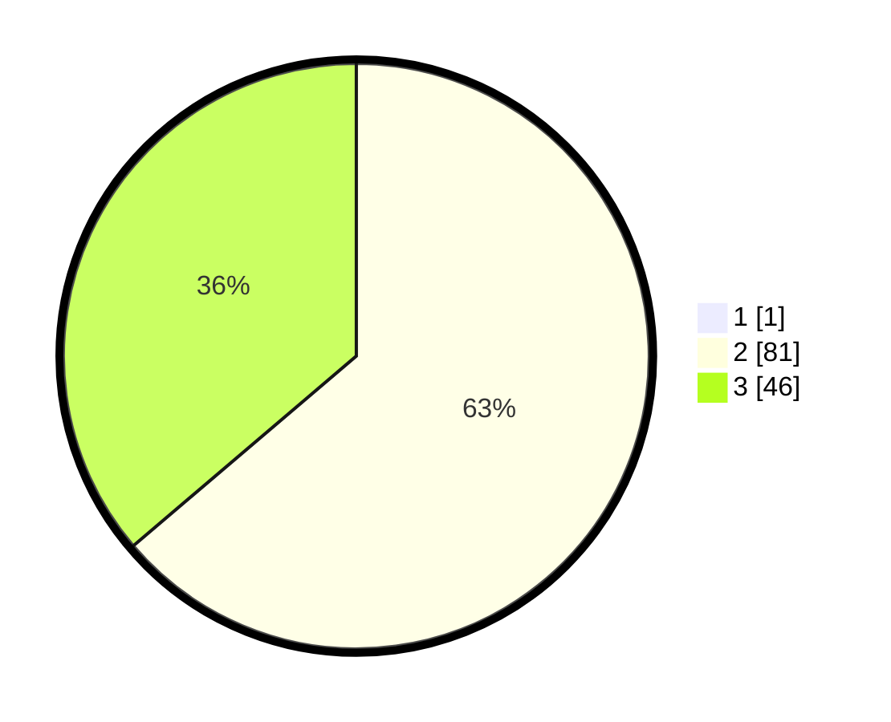

# Hasil

## Grafik

## Tabel

| No. | Nama Paslon    | Suara | Suara (raw) | Persentase |
|:--- |:-------------- | -----:| -----------:| ----------:|
| 1   | ANIES MUHAIMIN | 1     | [1][p-1]    | 0,78       |
| 2   | PRABOWO GIBRAN | 81    | [81][p-2]   | 63,28      |
| 3   | GANJAR MAHFUD  | 46    | [46][p-3]   | 35,94      |

[p-1]: https://github.com/gigit-pemilu/pemilu-2024/blob/main/pilpres/hitung-suara/sub/51-bali/sub/02-tabanan/sub/08-penebel/sub/2001-rejasa/sub/003-tps/sub/paslon-1.txt
[p-2]: https://github.com/gigit-pemilu/pemilu-2024/blob/main/pilpres/hitung-suara/sub/51-bali/sub/02-tabanan/sub/08-penebel/sub/2001-rejasa/sub/003-tps/sub/paslon-2.txt
[p-3]: https://github.com/gigit-pemilu/pemilu-2024/blob/main/pilpres/hitung-suara/sub/51-bali/sub/02-tabanan/sub/08-penebel/sub/2001-rejasa/sub/003-tps/sub/paslon-3.txt

## Foto C Plano

https://sirekap-obj-formc.kpu.go.id/d06e/pemilu/ppwp/51/02/08/20/01/5102082001003-20240215-223354--3668529f-c259-45de-8746-b668f6a38ba1.jpg

https://sirekap-obj-formc.kpu.go.id/d06e/pemilu/ppwp/51/02/08/20/01/5102082001003-20240215-223356--07b7cc00-8bd7-4e91-b40c-a218d96ae1cd.jpg

https://sirekap-obj-formc.kpu.go.id/d06e/pemilu/ppwp/51/02/08/20/01/5102082001003-20240215-223355--d7f59b4f-68a3-4821-b18a-141a03d6e060.jpg

## Metadata

| Key        | Value               |
| ---------- | ------------------- |
| Time Stamp | 2024-02-15 23:29:50 |

## DATA PEMILIH TETAP

Jumlah pemilih dalam DPT: **181**.
 * L: **89**.
 * P: **92**.

## DATA PENGGUNA HAK PILIH

Jumlah pengguna hak pilih dalam DPT: **134**.
 * L: **65**.
 * P: **69**.

Jumlah pengguna hak pilih dalam DPTb: **0**.
 * L: **0**.
 * P: **0**.

Jumlah pengguna hak pilih dalam DPK: **0**.
 * L: **0**.
 * P: **0**.

Jumlah pengguna hak pilih: **134**.
 * L: **65**.
 * P: **69**.

## JUMLAH SUARA SAH DAN TIDAK SAH

JUMLAH SELURUH SUARA SAH: **128**.

JUMLAH SUARA TIDAK SAH: **6**.

JUMLAH SELURUH SUARA SAH DAN SUARA TIDAK SAH: **134**.

