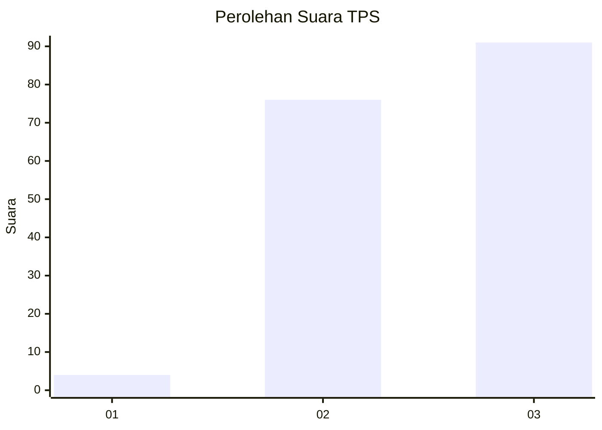
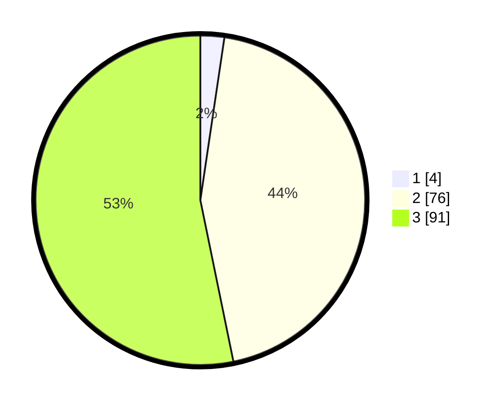

# Hasil

## Grafik

## Tabel

| No. | Nama Paslon    | Suara | Suara (raw) | Persentase |
|:--- |:-------------- | -----:| -----------:| ----------:|
| 1   | ANIES MUHAIMIN | 4     | [4][p-1]    | 2,34       |
| 2   | PRABOWO GIBRAN | 76    | [76][p-2]   | 44,44      |
| 3   | GANJAR MAHFUD  | 91    | [91][p-3]   | 53,22      |

[p-1]: https://github.com/gigit-pemilu/pemilu-2024-51-bali/blob/main/pilpres/hitung-suara/sub/51-bali/sub/02-tabanan/sub/08-penebel/sub/2001-rejasa/sub/005-tps/sub/paslon-1.txt
[p-2]: https://github.com/gigit-pemilu/pemilu-2024-51-bali/blob/main/pilpres/hitung-suara/sub/51-bali/sub/02-tabanan/sub/08-penebel/sub/2001-rejasa/sub/005-tps/sub/paslon-2.txt
[p-3]: https://github.com/gigit-pemilu/pemilu-2024-51-bali/blob/main/pilpres/hitung-suara/sub/51-bali/sub/02-tabanan/sub/08-penebel/sub/2001-rejasa/sub/005-tps/sub/paslon-3.txt

## Foto C Plano

https://sirekap-obj-formc.kpu.go.id/c232/pemilu/ppwp/51/02/08/20/01/5102082001005-20240216-153259--e86ea0a4-02fb-4bdb-be0a-0a03af3d8ff9.jpg

https://sirekap-obj-formc.kpu.go.id/c232/pemilu/ppwp/51/02/08/20/01/5102082001005-20240216-153301--e1900d73-2feb-47b5-82c9-e51782102e26.jpg

https://sirekap-obj-formc.kpu.go.id/c232/pemilu/ppwp/51/02/08/20/01/5102082001005-20240216-153300--a9863e8b-2559-4d53-b94d-738f4a2b1e8b.jpg

## Metadata

| Key        | Value               |
| ---------- | ------------------- |
| Time Stamp | 2024-02-21 15:00:00 |

## DATA PEMILIH TETAP

Jumlah pemilih dalam DPT: **205**.
 * L: **103**.
 * P: **102**.

## DATA PENGGUNA HAK PILIH

Jumlah pengguna hak pilih dalam DPT: **178**.
 * L: **87**.
 * P: **91**.

Jumlah pengguna hak pilih dalam DPTb: **2**.
 * L: **1**.
 * P: **1**.

Jumlah pengguna hak pilih dalam DPK: **0**.
 * L: **0**.
 * P: **0**.

Jumlah pengguna hak pilih: **180**.
 * L: **88**.
 * P: **92**.

## JUMLAH SUARA SAH DAN TIDAK SAH

JUMLAH SELURUH SUARA SAH: **171**.

JUMLAH SUARA TIDAK SAH: **9**.

JUMLAH SELURUH SUARA SAH DAN SUARA TIDAK SAH: **180**.

