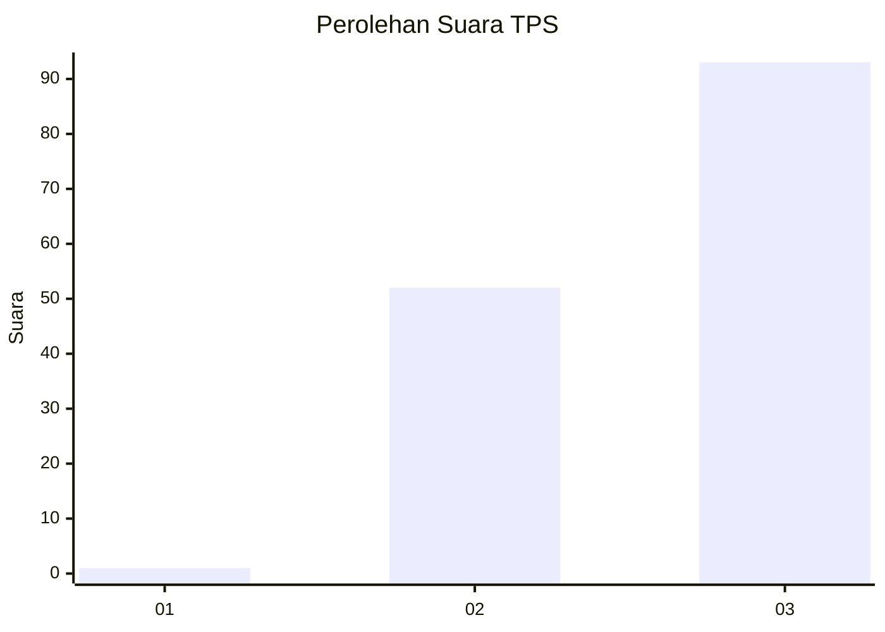
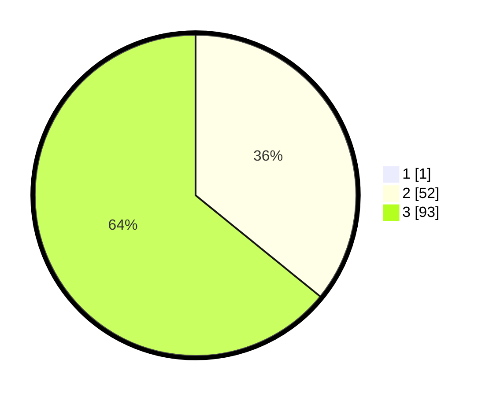

# Hasil

## Grafik

## Tabel

| No. | Nama Paslon    | Suara | Suara (raw) | Persentase |
|:--- |:-------------- | -----:| -----------:| ----------:|
| 1   | ANIES MUHAIMIN | 1     | [1][p-1]    | 0,68       |
| 2   | PRABOWO GIBRAN | 52    | [52][p-2]   | 35,62      |
| 3   | GANJAR MAHFUD  | 93    | [93][p-3]   | 63,70      |

[p-1]: https://github.com/gigit-pemilu/pemilu-2024-51-bali/blob/main/pilpres/hitung-suara/sub/51-bali/sub/02-tabanan/sub/08-penebel/sub/2002-jegu/sub/004-tps/sub/paslon-1.txt
[p-2]: https://github.com/gigit-pemilu/pemilu-2024-51-bali/blob/main/pilpres/hitung-suara/sub/51-bali/sub/02-tabanan/sub/08-penebel/sub/2002-jegu/sub/004-tps/sub/paslon-2.txt
[p-3]: https://github.com/gigit-pemilu/pemilu-2024-51-bali/blob/main/pilpres/hitung-suara/sub/51-bali/sub/02-tabanan/sub/08-penebel/sub/2002-jegu/sub/004-tps/sub/paslon-3.txt

## Foto C Plano

https://sirekap-obj-formc.kpu.go.id/017b/pemilu/ppwp/51/02/08/20/02/5102082002004-20240216-053810--c640a1b9-bc48-4635-b1f4-e4d9731d2493.jpg

https://sirekap-obj-formc.kpu.go.id/017b/pemilu/ppwp/51/02/08/20/02/5102082002004-20240216-053811--d2a1ade0-ea1d-4624-8748-7f137c998af3.jpg

https://sirekap-obj-formc.kpu.go.id/017b/pemilu/ppwp/51/02/08/20/02/5102082002004-20240216-053811--773d85e0-1651-43c0-b269-07eab8b69c8c.jpg

## Metadata

| Key        | Value               |
| ---------- | ------------------- |
| Time Stamp | 2024-02-16 12:51:22 |

## DATA PEMILIH TETAP

Jumlah pemilih dalam DPT: **178**.
 * L: **89**.
 * P: **89**.

## DATA PENGGUNA HAK PILIH

Jumlah pengguna hak pilih dalam DPT: **153**.
 * L: **77**.
 * P: **76**.

Jumlah pengguna hak pilih dalam DPTb: **0**.
 * L: **0**.
 * P: **0**.

Jumlah pengguna hak pilih dalam DPK: **0**.
 * L: **0**.
 * P: **0**.

Jumlah pengguna hak pilih: **153**.
 * L: **77**.
 * P: **76**.

## JUMLAH SUARA SAH DAN TIDAK SAH

JUMLAH SELURUH SUARA SAH: **146**.

JUMLAH SUARA TIDAK SAH: **7**.

JUMLAH SELURUH SUARA SAH DAN SUARA TIDAK SAH: **153**.

