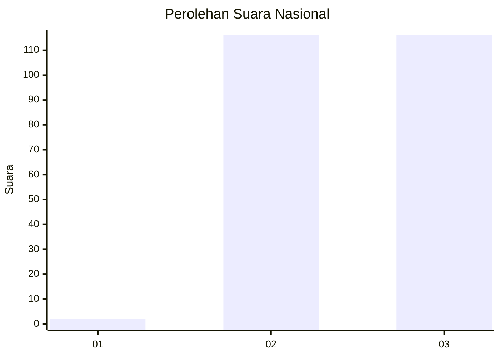
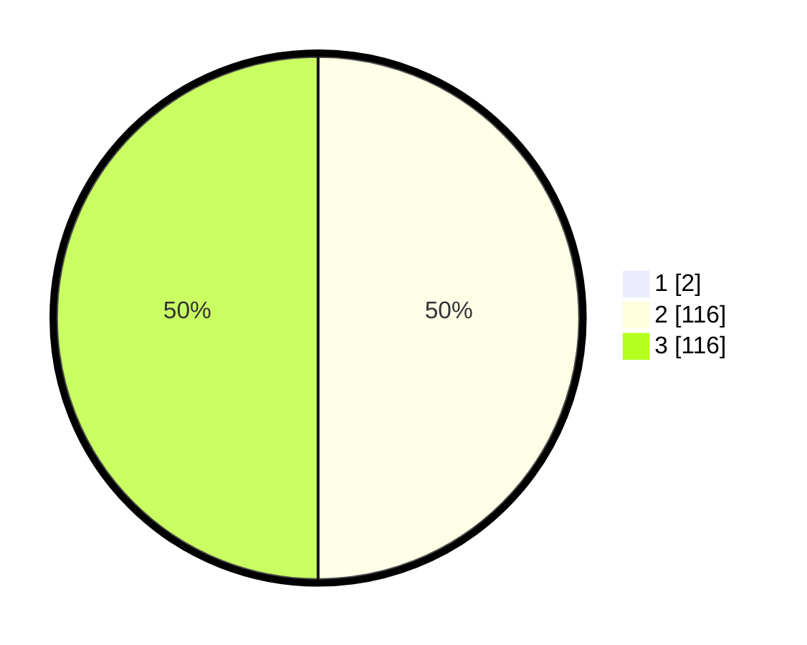

# Hasil

## Grafik

## Tabel

| No. | Nama Paslon    | Suara | Suara (raw) | Persentase |
|:--- |:-------------- | -----:| -----------:| ----------:|
| 1   | ANIES MUHAIMIN | 2     | [2][p-1]    | 0,85       |
| 2   | PRABOWO GIBRAN | 116   | [116][p-2]  | 49,57      |
| 3   | GANJAR MAHFUD  | 116   | [116][p-3]  | 49,57      |

[p-1]: https://github.com/gigit-pemilu/pemilu-2024/blob/main/pilpres/hitung-suara/sub/51-bali/sub/02-tabanan/sub/08-penebel/sub/2002-jegu/sub/005-tps/sub/paslon-1.txt
[p-2]: https://github.com/gigit-pemilu/pemilu-2024/blob/main/pilpres/hitung-suara/sub/51-bali/sub/02-tabanan/sub/08-penebel/sub/2002-jegu/sub/005-tps/sub/paslon-2.txt
[p-3]: https://github.com/gigit-pemilu/pemilu-2024/blob/main/pilpres/hitung-suara/sub/51-bali/sub/02-tabanan/sub/08-penebel/sub/2002-jegu/sub/005-tps/sub/paslon-3.txt

## Foto C Plano

https://sirekap-obj-formc.kpu.go.id/1049/pemilu/ppwp/51/02/08/20/02/5102082002005-20240215-231730--d06df075-5b55-404e-a015-2637539e3495.jpg

https://sirekap-obj-formc.kpu.go.id/1049/pemilu/ppwp/51/02/08/20/02/5102082002005-20240215-231733--1fd22c7e-f32c-4efc-a47b-ae5f6413402d.jpg

https://sirekap-obj-formc.kpu.go.id/1049/pemilu/ppwp/51/02/08/20/02/5102082002005-20240215-231732--9fdceac1-888e-4a13-8126-1423882a643f.jpg

## Metadata

| Key        | Value               |
| ---------- | ------------------- |
| Time Stamp | 2024-02-15 23:29:50 |

## DATA PEMILIH TETAP

Jumlah pemilih dalam DPT: **253**.
 * L: **121**.
 * P: **132**.

## DATA PENGGUNA HAK PILIH

Jumlah pengguna hak pilih dalam DPT: **233**.
 * L: **109**.
 * P: **124**.

Jumlah pengguna hak pilih dalam DPTb: **0**.
 * L: **0**.
 * P: **0**.

Jumlah pengguna hak pilih dalam DPK: **1**.
 * L: **0**.
 * P: **1**.

Jumlah pengguna hak pilih: **234**.
 * L: **109**.
 * P: **125**.

## JUMLAH SUARA SAH DAN TIDAK SAH

JUMLAH SELURUH SUARA SAH: **234**.

JUMLAH SUARA TIDAK SAH: **0**.

JUMLAH SELURUH SUARA SAH DAN SUARA TIDAK SAH: **234**.

