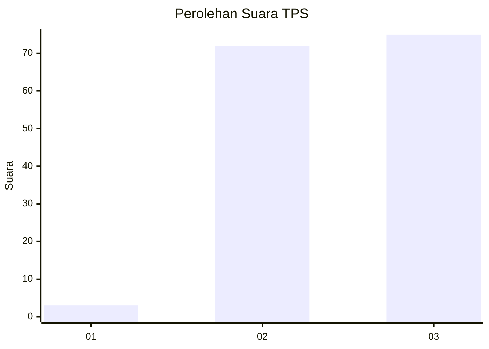
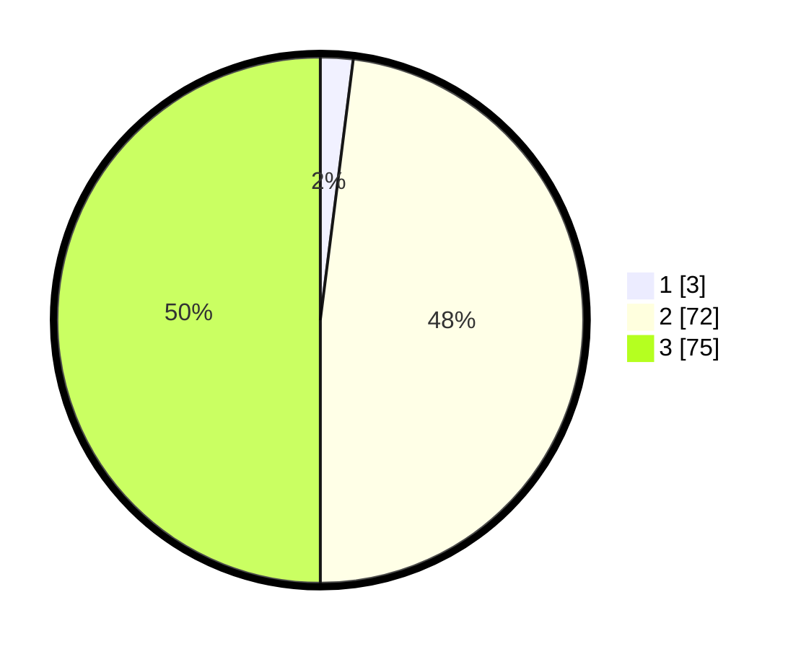

# Hasil

## Grafik

## Tabel

| No. | Nama Paslon    | Suara | Suara (raw) | Persentase |
|:--- |:-------------- | -----:| -----------:| ----------:|
| 1   | ANIES MUHAIMIN | 3     | [3][p-1]    | 2,00       |
| 2   | PRABOWO GIBRAN | 72    | [72][p-2]   | 48,00      |
| 3   | GANJAR MAHFUD  | 75    | [75][p-3]   | 50,00      |

[p-1]: https://github.com/gigit-pemilu/pemilu-2024-51-bali/blob/main/pilpres/hitung-suara/sub/51-bali/sub/02-tabanan/sub/08-penebel/sub/2002-jegu/sub/009-tps/sub/paslon-1.txt
[p-2]: https://github.com/gigit-pemilu/pemilu-2024-51-bali/blob/main/pilpres/hitung-suara/sub/51-bali/sub/02-tabanan/sub/08-penebel/sub/2002-jegu/sub/009-tps/sub/paslon-2.txt
[p-3]: https://github.com/gigit-pemilu/pemilu-2024-51-bali/blob/main/pilpres/hitung-suara/sub/51-bali/sub/02-tabanan/sub/08-penebel/sub/2002-jegu/sub/009-tps/sub/paslon-3.txt

## Foto C Plano

https://sirekap-obj-formc.kpu.go.id/6ff0/pemilu/ppwp/51/02/08/20/02/5102082002009-20240215-235034--6b232a71-0e8e-4eed-bdf1-73c8ac456cf8.jpg

https://sirekap-obj-formc.kpu.go.id/6ff0/pemilu/ppwp/51/02/08/20/02/5102082002009-20240215-235036--edfbdbfa-f02f-4711-9d6d-5f686d27ddd3.jpg

https://sirekap-obj-formc.kpu.go.id/6ff0/pemilu/ppwp/51/02/08/20/02/5102082002009-20240215-235035--83100b26-bec8-4628-a5e4-8fae1af37366.jpg

## Metadata

| Key        | Value               |
| ---------- | ------------------- |
| Time Stamp | 2024-02-16 12:51:22 |

## DATA PEMILIH TETAP

Jumlah pemilih dalam DPT: **167**.
 * L: **81**.
 * P: **86**.

## DATA PENGGUNA HAK PILIH

Jumlah pengguna hak pilih dalam DPT: **147**.
 * L: **74**.
 * P: **73**.

Jumlah pengguna hak pilih dalam DPTb: **3**.
 * L: **2**.
 * P: **1**.

Jumlah pengguna hak pilih dalam DPK: **3**.
 * L: **2**.
 * P: **1**.

Jumlah pengguna hak pilih: **153**.
 * L: **78**.
 * P: **75**.

## JUMLAH SUARA SAH DAN TIDAK SAH

JUMLAH SELURUH SUARA SAH: **150**.

JUMLAH SUARA TIDAK SAH: **3**.

JUMLAH SELURUH SUARA SAH DAN SUARA TIDAK SAH: **153**.

