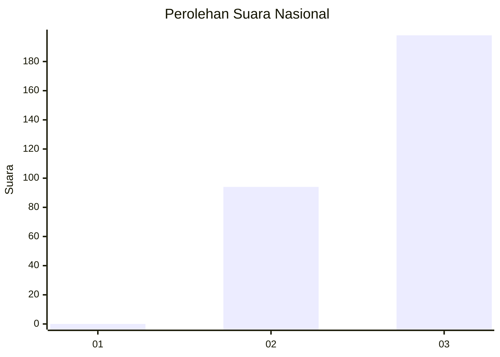
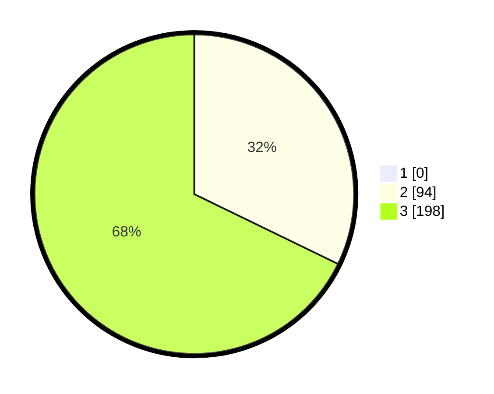

# Hasil

## Grafik

## Tabel

| No. | Nama Paslon    | Suara | Suara (raw) | Persentase |
|:--- |:-------------- | -----:| -----------:| ----------:|
| 1   | ANIES MUHAIMIN | 0     | [0][p-1]    | 0,00       |
| 2   | PRABOWO GIBRAN | 94    | [94][p-2]   | 32,19      |
| 3   | GANJAR MAHFUD  | 198   | [198][p-3]  | 67,81      |

[p-1]: https://github.com/gigit-pemilu/pemilu-2024/blob/main/pilpres/hitung-suara/sub/51-bali/sub/02-tabanan/sub/08-penebel/sub/2002-jegu/sub/012-tps/sub/paslon-1.txt
[p-2]: https://github.com/gigit-pemilu/pemilu-2024/blob/main/pilpres/hitung-suara/sub/51-bali/sub/02-tabanan/sub/08-penebel/sub/2002-jegu/sub/012-tps/sub/paslon-2.txt
[p-3]: https://github.com/gigit-pemilu/pemilu-2024/blob/main/pilpres/hitung-suara/sub/51-bali/sub/02-tabanan/sub/08-penebel/sub/2002-jegu/sub/012-tps/sub/paslon-3.txt

## Foto C Plano

https://sirekap-obj-formc.kpu.go.id/9b88/pemilu/ppwp/51/02/08/20/02/5102082002012-20240214-132934--5d669926-4ae8-4968-a73d-9c80bf06ec45.jpg

https://sirekap-obj-formc.kpu.go.id/9b88/pemilu/ppwp/51/02/08/20/02/5102082002012-20240214-133420--d48b5c5f-7229-492e-a0d2-9a8bb3ed9906.jpg

https://sirekap-obj-formc.kpu.go.id/9b88/pemilu/ppwp/51/02/08/20/02/5102082002012-20240214-133404--68d8dea3-137d-4e78-96da-73a24c4b7d83.jpg

## Metadata

| Key        | Value               |
| ---------- | ------------------- |
| Time Stamp | 2024-02-15 23:29:50 |

## DATA PEMILIH TETAP

Jumlah pemilih dalam DPT: **298**.
 * L: **137**.
 * P: **161**.

## DATA PENGGUNA HAK PILIH

Jumlah pengguna hak pilih dalam DPT: **293**.
 * L: **135**.
 * P: **158**.

Jumlah pengguna hak pilih dalam DPTb: **0**.
 * L: **0**.
 * P: **0**.

Jumlah pengguna hak pilih dalam DPK: **0**.
 * L: **0**.
 * P: **0**.

Jumlah pengguna hak pilih: **293**.
 * L: **135**.
 * P: **158**.

## JUMLAH SUARA SAH DAN TIDAK SAH

JUMLAH SELURUH SUARA SAH: **292**.

JUMLAH SUARA TIDAK SAH: **1**.

JUMLAH SELURUH SUARA SAH DAN SUARA TIDAK SAH: **293**.

