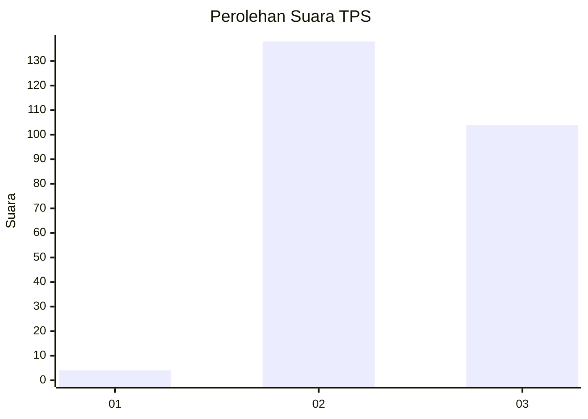
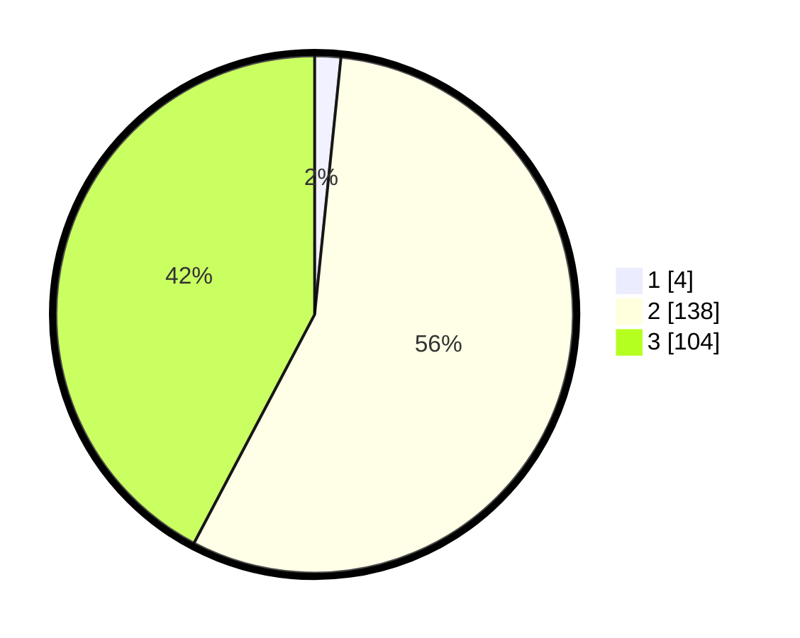

# Hasil

## Grafik

## Tabel

| No. | Nama Paslon    | Suara | Suara (raw) | Persentase |
|:--- |:-------------- | -----:| -----------:| ----------:|
| 1   | ANIES MUHAIMIN | 4     | [4][p-1]    | 1,63       |
| 2   | PRABOWO GIBRAN | 138   | [138][p-2]  | 56,10      |
| 3   | GANJAR MAHFUD  | 104   | [104][p-3]  | 42,28      |

[p-1]: https://github.com/gigit-pemilu/pemilu-2024-51-bali/blob/main/pilpres/hitung-suara/sub/51-bali/sub/02-tabanan/sub/08-penebel/sub/2003-riang-gede/sub/001-tps/sub/paslon-1.txt
[p-2]: https://github.com/gigit-pemilu/pemilu-2024-51-bali/blob/main/pilpres/hitung-suara/sub/51-bali/sub/02-tabanan/sub/08-penebel/sub/2003-riang-gede/sub/001-tps/sub/paslon-2.txt
[p-3]: https://github.com/gigit-pemilu/pemilu-2024-51-bali/blob/main/pilpres/hitung-suara/sub/51-bali/sub/02-tabanan/sub/08-penebel/sub/2003-riang-gede/sub/001-tps/sub/paslon-3.txt

## Foto C Plano

https://sirekap-obj-formc.kpu.go.id/9278/pemilu/ppwp/51/02/08/20/03/5102082003001-20240215-210554--5ed17430-060f-440a-b66f-e437dc4a4fe3.jpg

https://sirekap-obj-formc.kpu.go.id/9278/pemilu/ppwp/51/02/08/20/03/5102082003001-20240215-210557--920dffdd-d1f6-4700-8546-8e17352c7a3a.jpg

https://sirekap-obj-formc.kpu.go.id/9278/pemilu/ppwp/51/02/08/20/03/5102082003001-20240215-210556--c55b6678-d240-4f3f-a12d-087f9dcdc4b9.jpg

## Metadata

| Key        | Value               |
| ---------- | ------------------- |
| Time Stamp | 2024-02-15 23:29:50 |

## DATA PEMILIH TETAP

Jumlah pemilih dalam DPT: **276**.
 * L: **141**.
 * P: **135**.

## DATA PENGGUNA HAK PILIH

Jumlah pengguna hak pilih dalam DPT: **249**.
 * L: **128**.
 * P: **121**.

Jumlah pengguna hak pilih dalam DPTb: **0**.
 * L: **0**.
 * P: **0**.

Jumlah pengguna hak pilih dalam DPK: **0**.
 * L: **0**.
 * P: **0**.

Jumlah pengguna hak pilih: **249**.
 * L: **128**.
 * P: **121**.

## JUMLAH SUARA SAH DAN TIDAK SAH

JUMLAH SELURUH SUARA SAH: **246**.

JUMLAH SUARA TIDAK SAH: **3**.

JUMLAH SELURUH SUARA SAH DAN SUARA TIDAK SAH: **249**.

