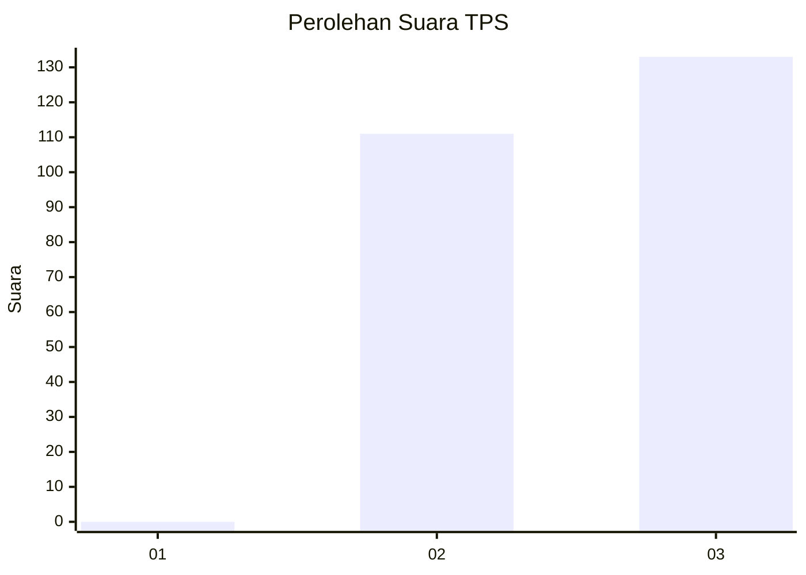
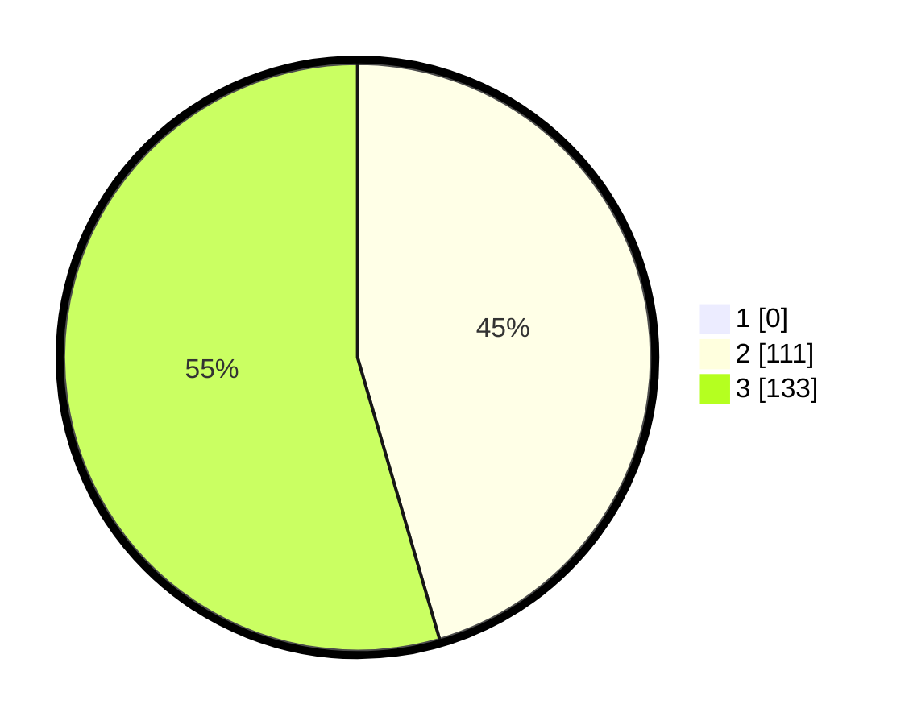

# Hasil

## Grafik

## Tabel

| No. | Nama Paslon    | Suara | Suara (raw) | Persentase |
|:--- |:-------------- | -----:| -----------:| ----------:|
| 1   | ANIES MUHAIMIN | 0     | [0][p-1]    | 0,00       |
| 2   | PRABOWO GIBRAN | 111   | [111][p-2]  | 45,49      |
| 3   | GANJAR MAHFUD  | 133   | [133][p-3]  | 54,51      |

[p-1]: https://github.com/gigit-pemilu/pemilu-2024-51-bali/blob/main/pilpres/hitung-suara/sub/51-bali/sub/02-tabanan/sub/08-penebel/sub/2003-riang-gede/sub/002-tps/sub/paslon-1.txt
[p-2]: https://github.com/gigit-pemilu/pemilu-2024-51-bali/blob/main/pilpres/hitung-suara/sub/51-bali/sub/02-tabanan/sub/08-penebel/sub/2003-riang-gede/sub/002-tps/sub/paslon-2.txt
[p-3]: https://github.com/gigit-pemilu/pemilu-2024-51-bali/blob/main/pilpres/hitung-suara/sub/51-bali/sub/02-tabanan/sub/08-penebel/sub/2003-riang-gede/sub/002-tps/sub/paslon-3.txt

## Foto C Plano

https://sirekap-obj-formc.kpu.go.id/bc61/pemilu/ppwp/51/02/08/20/03/5102082003002-20240214-222435--c53b9ef5-5a53-4914-b086-0e196c653b76.jpg

https://sirekap-obj-formc.kpu.go.id/bc61/pemilu/ppwp/51/02/08/20/03/5102082003002-20240214-222527--be92918a-e685-4379-aefa-c998e22d8ea0.jpg

https://sirekap-obj-formc.kpu.go.id/bc61/pemilu/ppwp/51/02/08/20/03/5102082003002-20240214-222628--bba679bd-9a9f-4ee1-bcdb-792f2fa55318.jpg

## Metadata

| Key        | Value               |
| ---------- | ------------------- |
| Time Stamp | 2024-02-15 21:01:18 |

## DATA PEMILIH TETAP

Jumlah pemilih dalam DPT: **288**.
 * L: **144**.
 * P: **144**.

## DATA PENGGUNA HAK PILIH

Jumlah pengguna hak pilih dalam DPT: **244**.
 * L: **122**.
 * P: **122**.

Jumlah pengguna hak pilih dalam DPTb: **1**.
 * L: **0**.
 * P: **1**.

Jumlah pengguna hak pilih dalam DPK: **0**.
 * L: **0**.
 * P: **0**.

Jumlah pengguna hak pilih: **245**.
 * L: **122**.
 * P: **123**.

## JUMLAH SUARA SAH DAN TIDAK SAH

JUMLAH SELURUH SUARA SAH: **244**.

JUMLAH SUARA TIDAK SAH: **1**.

JUMLAH SELURUH SUARA SAH DAN SUARA TIDAK SAH: **245**.

