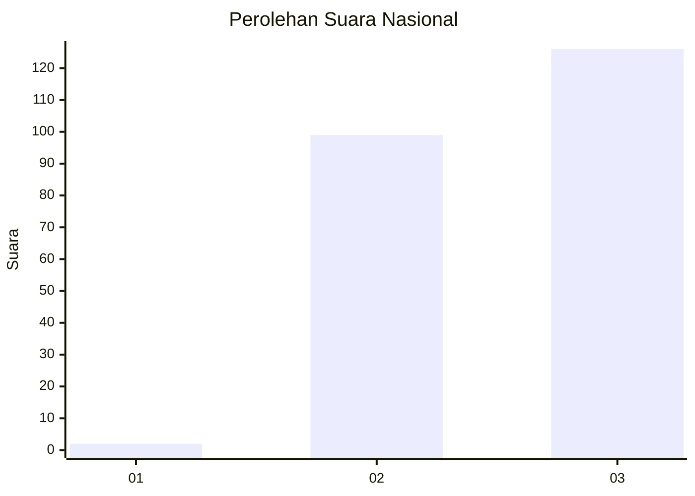
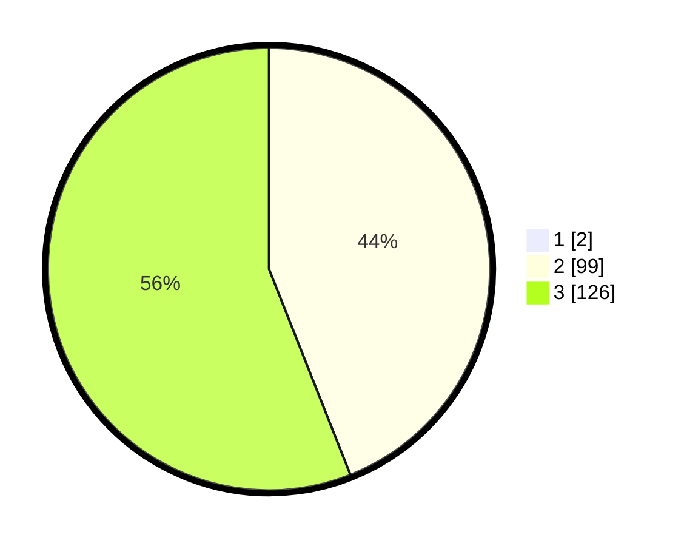

# Hasil

## Grafik

## Tabel

| No. | Nama Paslon    | Suara | Suara (raw) | Persentase |
|:--- |:-------------- | -----:| -----------:| ----------:|
| 1   | ANIES MUHAIMIN | 2     | [2][p-1]    | 0,88       |
| 2   | PRABOWO GIBRAN | 99    | [99][p-2]   | 43,61      |
| 3   | GANJAR MAHFUD  | 126   | [126][p-3]  | 55,51      |

[p-1]: https://github.com/gigit-pemilu/pemilu-2024/blob/main/pilpres/hitung-suara/sub/51-bali/sub/02-tabanan/sub/08-penebel/sub/2003-riang-gede/sub/003-tps/sub/paslon-1.txt
[p-2]: https://github.com/gigit-pemilu/pemilu-2024/blob/main/pilpres/hitung-suara/sub/51-bali/sub/02-tabanan/sub/08-penebel/sub/2003-riang-gede/sub/003-tps/sub/paslon-2.txt
[p-3]: https://github.com/gigit-pemilu/pemilu-2024/blob/main/pilpres/hitung-suara/sub/51-bali/sub/02-tabanan/sub/08-penebel/sub/2003-riang-gede/sub/003-tps/sub/paslon-3.txt

## Foto C Plano

https://sirekap-obj-formc.kpu.go.id/4d38/pemilu/ppwp/51/02/08/20/03/5102082003003-20240215-113726--ded27664-e2a6-4ead-b6f2-1ad45ca36699.jpg

https://sirekap-obj-formc.kpu.go.id/4d38/pemilu/ppwp/51/02/08/20/03/5102082003003-20240215-113743--356aa040-29dd-4977-89d3-4e6fd0a3009f.jpg

https://sirekap-obj-formc.kpu.go.id/4d38/pemilu/ppwp/51/02/08/20/03/5102082003003-20240215-113754--23ecf193-f165-45a3-976b-41c0acd250e3.jpg

## Metadata

| Key        | Value               |
| ---------- | ------------------- |
| Time Stamp | 2024-02-15 23:29:50 |

