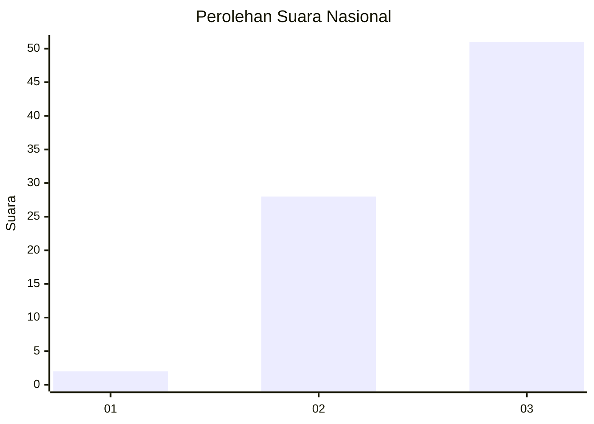
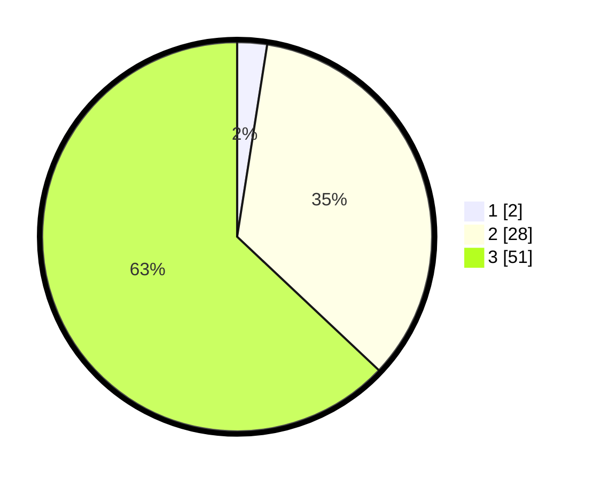

# Hasil

## Grafik

## Tabel

| No. | Nama Paslon    | Suara | Suara (raw) | Persentase |
|:--- |:-------------- | -----:| -----------:| ----------:|
| 1   | ANIES MUHAIMIN | 2     | [2][p-1]    | 2,47       |
| 2   | PRABOWO GIBRAN | 28    | [28][p-2]   | 34,57      |
| 3   | GANJAR MAHFUD  | 51    | [51][p-3]   | 62,96      |

[p-1]: https://github.com/gigit-pemilu/pemilu-2024/blob/main/pilpres/hitung-suara/sub/51-bali/sub/02-tabanan/sub/08-penebel/sub/2003-riang-gede/sub/009-tps/sub/paslon-1.txt
[p-2]: https://github.com/gigit-pemilu/pemilu-2024/blob/main/pilpres/hitung-suara/sub/51-bali/sub/02-tabanan/sub/08-penebel/sub/2003-riang-gede/sub/009-tps/sub/paslon-2.txt
[p-3]: https://github.com/gigit-pemilu/pemilu-2024/blob/main/pilpres/hitung-suara/sub/51-bali/sub/02-tabanan/sub/08-penebel/sub/2003-riang-gede/sub/009-tps/sub/paslon-3.txt

## Foto C Plano

https://sirekap-obj-formc.kpu.go.id/eb86/pemilu/ppwp/51/02/08/20/03/5102082003009-20240214-212315--d12f8ddb-1b20-4aa7-a6c6-cde192d430cf.jpg

https://sirekap-obj-formc.kpu.go.id/eb86/pemilu/ppwp/51/02/08/20/03/5102082003009-20240214-125146--1526c35b-5008-4397-94c1-a36e028f5d0a.jpg

https://sirekap-obj-formc.kpu.go.id/eb86/pemilu/ppwp/51/02/08/20/03/5102082003009-20240214-125305--225cfcd5-758e-448f-bbe9-3311bf945786.jpg

## Metadata

| Key        | Value               |
| ---------- | ------------------- |
| Time Stamp | 2024-02-15 00:41:44 |

## DATA PEMILIH TETAP

Jumlah pemilih dalam DPT: **88**.
 * L: **43**.
 * P: **45**.

## DATA PENGGUNA HAK PILIH

Jumlah pengguna hak pilih dalam DPT: **84**.
 * L: **43**.
 * P: **41**.

Jumlah pengguna hak pilih dalam DPTb: **1**.
 * L: **0**.
 * P: **1**.

Jumlah pengguna hak pilih dalam DPK: **0**.
 * L: **0**.
 * P: **0**.

Jumlah pengguna hak pilih: **85**.
 * L: **43**.
 * P: **42**.

## JUMLAH SUARA SAH DAN TIDAK SAH

JUMLAH SELURUH SUARA SAH: **81**.

JUMLAH SUARA TIDAK SAH: **4**.

JUMLAH SELURUH SUARA SAH DAN SUARA TIDAK SAH: **85**.

