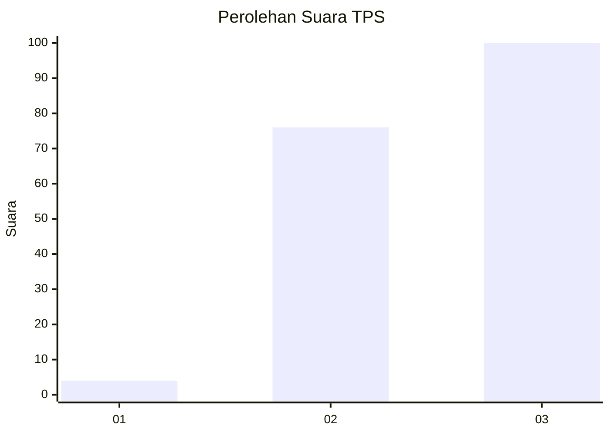
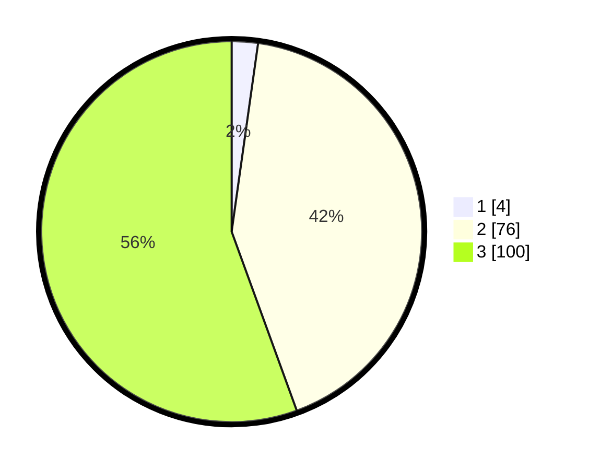

# Hasil

## Grafik

## Tabel

| No. | Nama Paslon    | Suara | Suara (raw) | Persentase |
|:--- |:-------------- | -----:| -----------:| ----------:|
| 1   | ANIES MUHAIMIN | 4     | [4][p-1]    | 2,22       |
| 2   | PRABOWO GIBRAN | 76    | [76][p-2]   | 42,22      |
| 3   | GANJAR MAHFUD  | 100   | [100][p-3]  | 55,56      |

[p-1]: https://github.com/gigit-pemilu/pemilu-2024-51-bali/blob/main/pilpres/hitung-suara/sub/51-bali/sub/02-tabanan/sub/08-penebel/sub/2004-buruan/sub/003-tps/sub/paslon-1.txt
[p-2]: https://github.com/gigit-pemilu/pemilu-2024-51-bali/blob/main/pilpres/hitung-suara/sub/51-bali/sub/02-tabanan/sub/08-penebel/sub/2004-buruan/sub/003-tps/sub/paslon-2.txt
[p-3]: https://github.com/gigit-pemilu/pemilu-2024-51-bali/blob/main/pilpres/hitung-suara/sub/51-bali/sub/02-tabanan/sub/08-penebel/sub/2004-buruan/sub/003-tps/sub/paslon-3.txt

## Foto C Plano

https://sirekap-obj-formc.kpu.go.id/a60a/pemilu/ppwp/51/02/08/20/04/5102082004003-20240216-011651--4fa82ccf-d5f1-4283-b93c-03f18e39c537.jpg

https://sirekap-obj-formc.kpu.go.id/a60a/pemilu/ppwp/51/02/08/20/04/5102082004003-20240216-011657--65b03e3a-6a3f-48a3-b4da-1a1dc8e973fc.jpg

https://sirekap-obj-formc.kpu.go.id/a60a/pemilu/ppwp/51/02/08/20/04/5102082004003-20240216-011652--8b17cd0b-5ab1-4eda-a956-98a1fc04dba6.jpg

## Metadata

| Key        | Value               |
| ---------- | ------------------- |
| Time Stamp | 2024-02-16 12:51:22 |

## DATA PEMILIH TETAP

Jumlah pemilih dalam DPT: **205**.
 * L: **98**.
 * P: **107**.

## DATA PENGGUNA HAK PILIH

Jumlah pengguna hak pilih dalam DPT: **183**.
 * L: **85**.
 * P: **98**.

Jumlah pengguna hak pilih dalam DPTb: **0**.
 * L: **0**.
 * P: **0**.

Jumlah pengguna hak pilih dalam DPK: **0**.
 * L: **0**.
 * P: **0**.

Jumlah pengguna hak pilih: **183**.
 * L: **85**.
 * P: **98**.

## JUMLAH SUARA SAH DAN TIDAK SAH

JUMLAH SELURUH SUARA SAH: **180**.

JUMLAH SUARA TIDAK SAH: **3**.

JUMLAH SELURUH SUARA SAH DAN SUARA TIDAK SAH: **183**.

