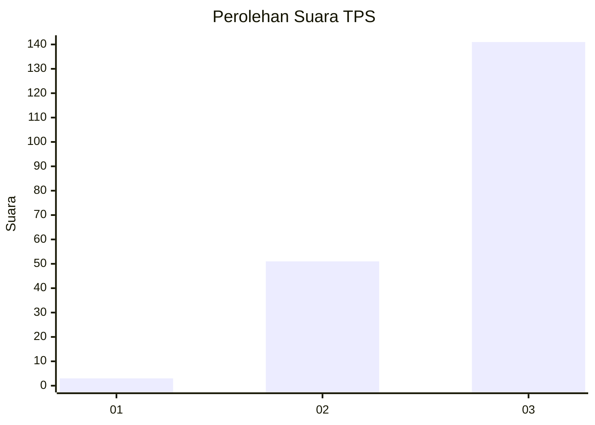
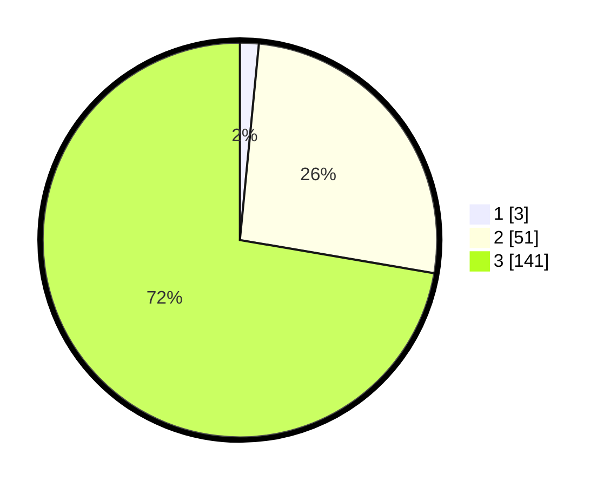

# Hasil

## Grafik

## Tabel

| No. | Nama Paslon    | Suara | Suara (raw) | Persentase |
|:--- |:-------------- | -----:| -----------:| ----------:|
| 1   | ANIES MUHAIMIN | 3     | [3][p-1]    | 1,54       |
| 2   | PRABOWO GIBRAN | 51    | [51][p-2]   | 26,15      |
| 3   | GANJAR MAHFUD  | 141   | [141][p-3]  | 72,31      |

[p-1]: https://github.com/gigit-pemilu/pemilu-2024-51-bali/blob/main/pilpres/hitung-suara/sub/51-bali/sub/02-tabanan/sub/08-penebel/sub/2004-buruan/sub/006-tps/sub/paslon-1.txt
[p-2]: https://github.com/gigit-pemilu/pemilu-2024-51-bali/blob/main/pilpres/hitung-suara/sub/51-bali/sub/02-tabanan/sub/08-penebel/sub/2004-buruan/sub/006-tps/sub/paslon-2.txt
[p-3]: https://github.com/gigit-pemilu/pemilu-2024-51-bali/blob/main/pilpres/hitung-suara/sub/51-bali/sub/02-tabanan/sub/08-penebel/sub/2004-buruan/sub/006-tps/sub/paslon-3.txt

## Foto C Plano

https://sirekap-obj-formc.kpu.go.id/8b88/pemilu/ppwp/51/02/08/20/04/5102082004006-20240214-141012--d8183ec0-b703-4463-a8d0-df829a0fdb53.jpg

https://sirekap-obj-formc.kpu.go.id/8b88/pemilu/ppwp/51/02/08/20/04/5102082004006-20240214-140942--f97a7529-1bfc-46d9-ba1d-feabe39818f4.jpg

https://sirekap-obj-formc.kpu.go.id/8b88/pemilu/ppwp/51/02/08/20/04/5102082004006-20240214-141039--9a0f48ad-ec94-4b17-8131-dc4462d26a2d.jpg

## Metadata

| Key        | Value               |
| ---------- | ------------------- |
| Time Stamp | 2024-02-15 23:29:50 |

