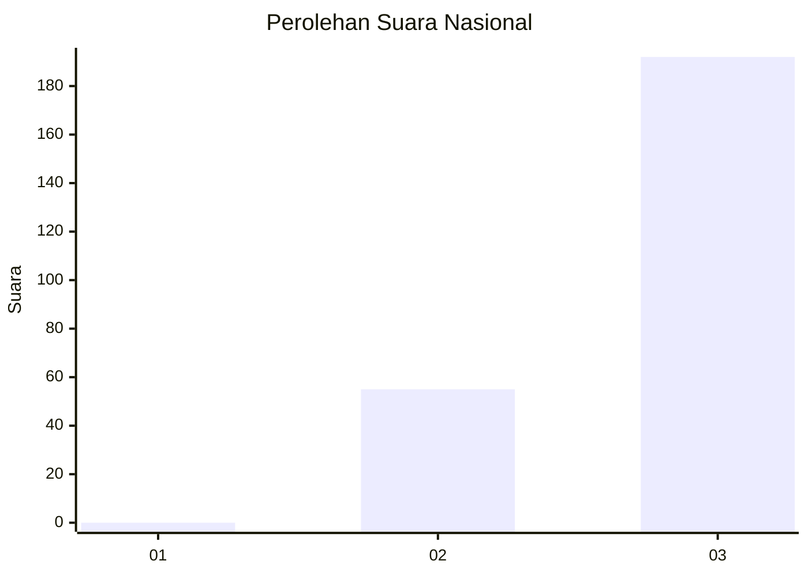
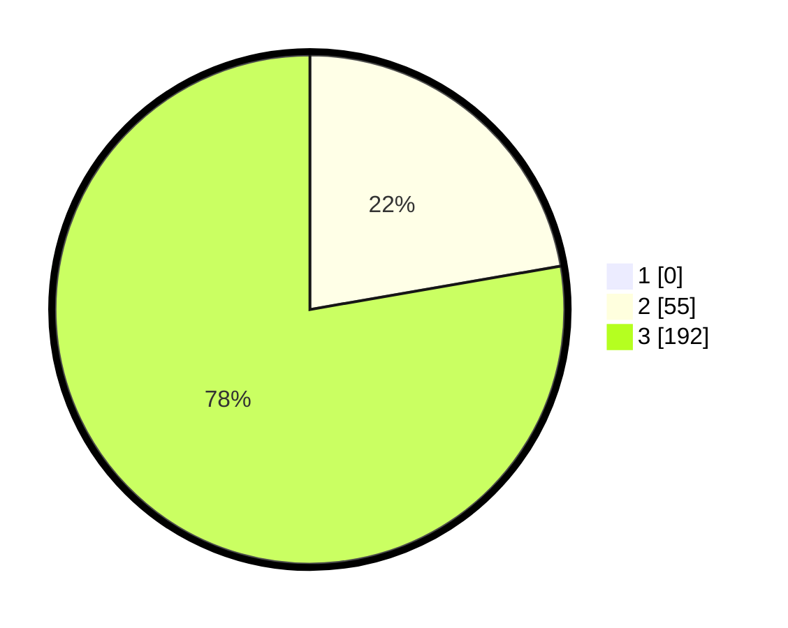

# Hasil

## Grafik

## Tabel

| No. | Nama Paslon    | Suara | Suara (raw) | Persentase |
|:--- |:-------------- | -----:| -----------:| ----------:|
| 1   | ANIES MUHAIMIN | 0     | [0][p-1]    | 0,00       |
| 2   | PRABOWO GIBRAN | 55    | [55][p-2]   | 22,27      |
| 3   | GANJAR MAHFUD  | 192   | [192][p-3]  | 77,73      |

[p-1]: https://github.com/gigit-pemilu/pemilu-2024/blob/main/pilpres/hitung-suara/sub/51-bali/sub/02-tabanan/sub/08-penebel/sub/2005-biaung/sub/006-tps/sub/paslon-1.txt
[p-2]: https://github.com/gigit-pemilu/pemilu-2024/blob/main/pilpres/hitung-suara/sub/51-bali/sub/02-tabanan/sub/08-penebel/sub/2005-biaung/sub/006-tps/sub/paslon-2.txt
[p-3]: https://github.com/gigit-pemilu/pemilu-2024/blob/main/pilpres/hitung-suara/sub/51-bali/sub/02-tabanan/sub/08-penebel/sub/2005-biaung/sub/006-tps/sub/paslon-3.txt

## Foto C Plano

https://sirekap-obj-formc.kpu.go.id/6d95/pemilu/ppwp/51/02/08/20/05/5102082005006-20240215-165824--32e687a9-a607-4bdf-92c8-ac43decb17fc.jpg

https://sirekap-obj-formc.kpu.go.id/6d95/pemilu/ppwp/51/02/08/20/05/5102082005006-20240215-165957--c2193f53-51f0-4f90-9e90-4c15ab01d615.jpg

https://sirekap-obj-formc.kpu.go.id/6d95/pemilu/ppwp/51/02/08/20/05/5102082005006-20240215-170145--3bd98e1b-55a7-4c38-bed0-6e8935901995.jpg

## Metadata

| Key        | Value               |
| ---------- | ------------------- |
| Time Stamp | 2024-02-26 23:00:00 |

