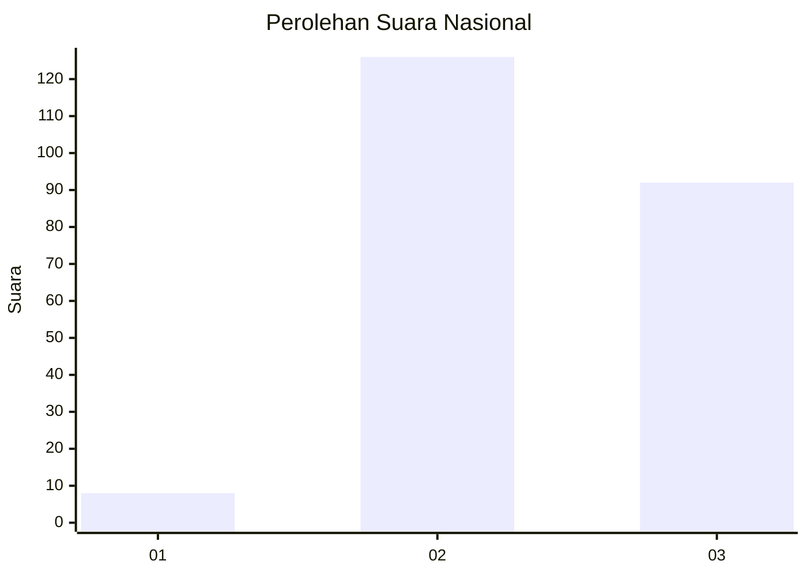
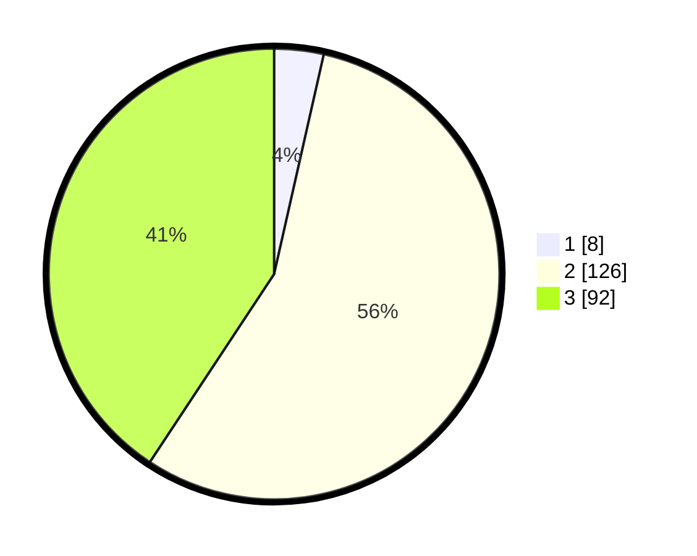

# Hasil

## Grafik

## Tabel

| No. | Nama Paslon    | Suara | Suara (raw) | Persentase |
|:--- |:-------------- | -----:| -----------:| ----------:|
| 1   | ANIES MUHAIMIN | 8     | [8][p-1]    | 3,54       |
| 2   | PRABOWO GIBRAN | 126   | [126][p-2]  | 55,75      |
| 3   | GANJAR MAHFUD  | 92    | [92][p-3]   | 40,71      |

[p-1]: https://github.com/gigit-pemilu/pemilu-2024/blob/main/pilpres/hitung-suara/sub/51-bali/sub/02-tabanan/sub/08-penebel/sub/2006-pitra/sub/001-tps/sub/paslon-1.txt
[p-2]: https://github.com/gigit-pemilu/pemilu-2024/blob/main/pilpres/hitung-suara/sub/51-bali/sub/02-tabanan/sub/08-penebel/sub/2006-pitra/sub/001-tps/sub/paslon-2.txt
[p-3]: https://github.com/gigit-pemilu/pemilu-2024/blob/main/pilpres/hitung-suara/sub/51-bali/sub/02-tabanan/sub/08-penebel/sub/2006-pitra/sub/001-tps/sub/paslon-3.txt

## Foto C Plano

https://sirekap-obj-formc.kpu.go.id/a896/pemilu/ppwp/51/02/08/20/06/5102082006001-20240214-233920--4326b71b-fa8b-4de0-ab43-0d580cc83129.jpg

https://sirekap-obj-formc.kpu.go.id/a896/pemilu/ppwp/51/02/08/20/06/5102082006001-20240214-192438--05485fc8-cf02-4889-93b3-3051c03038a7.jpg

https://sirekap-obj-formc.kpu.go.id/a896/pemilu/ppwp/51/02/08/20/06/5102082006001-20240214-233123--be01e6b9-ed6c-4751-81df-77f12c0071b7.jpg

## Metadata

| Key        | Value               |
| ---------- | ------------------- |
| Time Stamp | 2024-02-15 16:00:26 |

