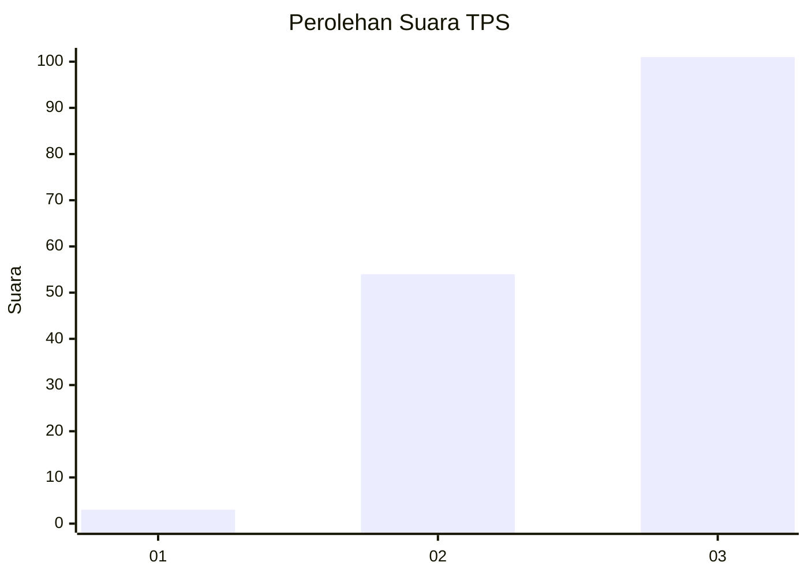
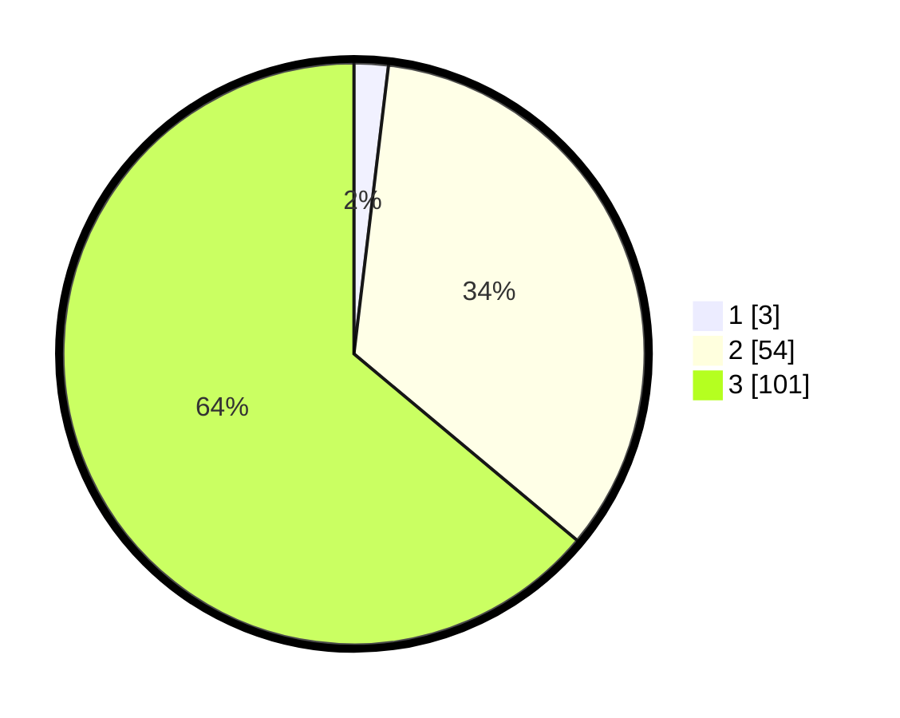

# Hasil

## Grafik

## Tabel

| No. | Nama Paslon    | Suara | Suara (raw) | Persentase |
|:--- |:-------------- | -----:| -----------:| ----------:|
| 1   | ANIES MUHAIMIN | 3     | [3][p-1]    | 1,90       |
| 2   | PRABOWO GIBRAN | 54    | [54][p-2]   | 34,18      |
| 3   | GANJAR MAHFUD  | 101   | [101][p-3]  | 63,92      |

[p-1]: https://github.com/gigit-pemilu/pemilu-2024-51-bali/blob/main/pilpres/hitung-suara/sub/51-bali/sub/02-tabanan/sub/08-penebel/sub/2006-pitra/sub/003-tps/sub/paslon-1.txt
[p-2]: https://github.com/gigit-pemilu/pemilu-2024-51-bali/blob/main/pilpres/hitung-suara/sub/51-bali/sub/02-tabanan/sub/08-penebel/sub/2006-pitra/sub/003-tps/sub/paslon-2.txt
[p-3]: https://github.com/gigit-pemilu/pemilu-2024-51-bali/blob/main/pilpres/hitung-suara/sub/51-bali/sub/02-tabanan/sub/08-penebel/sub/2006-pitra/sub/003-tps/sub/paslon-3.txt

## Foto C Plano

https://sirekap-obj-formc.kpu.go.id/26b9/pemilu/ppwp/51/02/08/20/06/5102082006003-20240214-233323--e043cfbf-a1eb-47b8-9bb9-cdb8048b9678.jpg

https://sirekap-obj-formc.kpu.go.id/26b9/pemilu/ppwp/51/02/08/20/06/5102082006003-20240214-233618--a1243111-ae46-4dcc-8b4e-64c55294c244.jpg

https://sirekap-obj-formc.kpu.go.id/26b9/pemilu/ppwp/51/02/08/20/06/5102082006003-20240214-235613--c177cb08-84d7-4403-8a0a-cef2ab5728a2.jpg

## Metadata

| Key        | Value               |
| ---------- | ------------------- |
| Time Stamp | 2024-02-15 23:29:50 |

