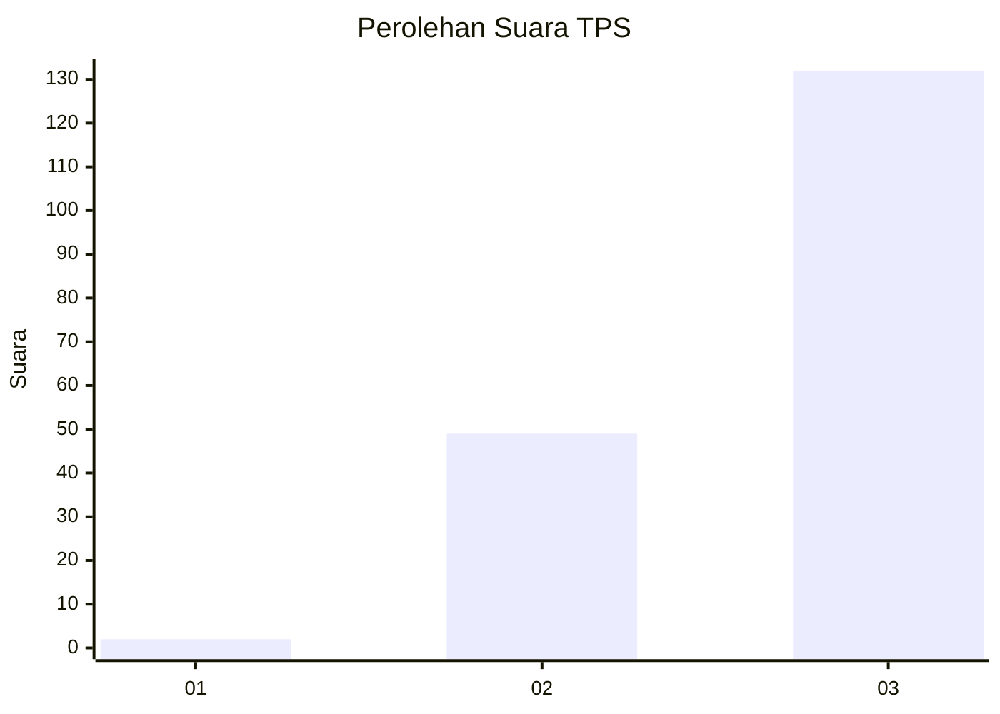
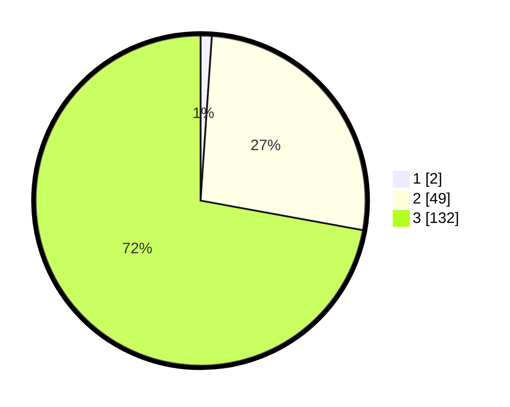

# Hasil

## Grafik

## Tabel

| No. | Nama Paslon    | Suara | Suara (raw) | Persentase |
|:--- |:-------------- | -----:| -----------:| ----------:|
| 1   | ANIES MUHAIMIN | 2     | [2][p-1]    | 1,09       |
| 2   | PRABOWO GIBRAN | 49    | [49][p-2]   | 26,78      |
| 3   | GANJAR MAHFUD  | 132   | [132][p-3]  | 72,13      |

[p-1]: https://github.com/gigit-pemilu/pemilu-2024-51-bali/blob/main/pilpres/hitung-suara/sub/51-bali/sub/02-tabanan/sub/08-penebel/sub/2006-pitra/sub/005-tps/sub/paslon-1.txt
[p-2]: https://github.com/gigit-pemilu/pemilu-2024-51-bali/blob/main/pilpres/hitung-suara/sub/51-bali/sub/02-tabanan/sub/08-penebel/sub/2006-pitra/sub/005-tps/sub/paslon-2.txt
[p-3]: https://github.com/gigit-pemilu/pemilu-2024-51-bali/blob/main/pilpres/hitung-suara/sub/51-bali/sub/02-tabanan/sub/08-penebel/sub/2006-pitra/sub/005-tps/sub/paslon-3.txt

## Foto C Plano

https://sirekap-obj-formc.kpu.go.id/8e43/pemilu/ppwp/51/02/08/20/06/5102082006005-20240214-221320--8efb3be7-497b-42ad-938f-addfd65083de.jpg

https://sirekap-obj-formc.kpu.go.id/8e43/pemilu/ppwp/51/02/08/20/06/5102082006005-20240214-221606--f17be5fd-a704-4318-9a26-24d72acd62f8.jpg

https://sirekap-obj-formc.kpu.go.id/8e43/pemilu/ppwp/51/02/08/20/06/5102082006005-20240214-221803--09f780ca-9696-4abd-9254-f8bb4d5a56df.jpg

## Metadata

| Key        | Value               |
| ---------- | ------------------- |
| Time Stamp | 2024-02-24 22:31:28 |

