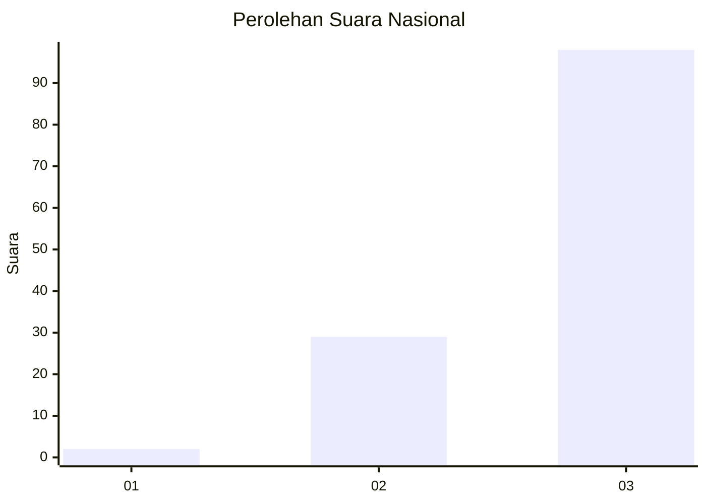
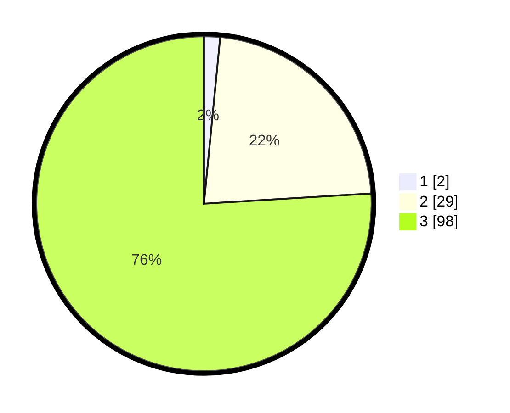

# Hasil

## Grafik

## Tabel

| No. | Nama Paslon    | Suara | Suara (raw) | Persentase |
|:--- |:-------------- | -----:| -----------:| ----------:|
| 1   | ANIES MUHAIMIN | 2     | [2][p-1]    | 1,55       |
| 2   | PRABOWO GIBRAN | 29    | [29][p-2]   | 22,48      |
| 3   | GANJAR MAHFUD  | 98    | [98][p-3]   | 75,97      |

[p-1]: https://github.com/gigit-pemilu/pemilu-2024/blob/main/pilpres/hitung-suara/sub/51-bali/sub/02-tabanan/sub/08-penebel/sub/2006-pitra/sub/008-tps/sub/paslon-1.txt
[p-2]: https://github.com/gigit-pemilu/pemilu-2024/blob/main/pilpres/hitung-suara/sub/51-bali/sub/02-tabanan/sub/08-penebel/sub/2006-pitra/sub/008-tps/sub/paslon-2.txt
[p-3]: https://github.com/gigit-pemilu/pemilu-2024/blob/main/pilpres/hitung-suara/sub/51-bali/sub/02-tabanan/sub/08-penebel/sub/2006-pitra/sub/008-tps/sub/paslon-3.txt

## Foto C Plano

https://sirekap-obj-formc.kpu.go.id/0473/pemilu/ppwp/51/02/08/20/06/5102082006008-20240214-132343--b939a9ec-8411-4822-8c51-282fe1b05b51.jpg

https://sirekap-obj-formc.kpu.go.id/0473/pemilu/ppwp/51/02/08/20/06/5102082006008-20240215-214717--3b959205-8946-4990-98c3-ae5fc519d670.jpg

https://sirekap-obj-formc.kpu.go.id/0473/pemilu/ppwp/51/02/08/20/06/5102082006008-20240214-132545--f04a956f-8d55-49c5-b6f7-9eecc0c4875d.jpg

## Metadata

| Key        | Value               |
| ---------- | ------------------- |
| Time Stamp | 2024-02-15 23:29:50 |

## DATA PEMILIH TETAP

Jumlah pemilih dalam DPT: **141**.
 * L: **60**.
 * P: **81**.

## DATA PENGGUNA HAK PILIH

Jumlah pengguna hak pilih dalam DPT: **131**.
 * L: **57**.
 * P: **74**.

Jumlah pengguna hak pilih dalam DPTb: **1**.
 * L: **0**.
 * P: **1**.

Jumlah pengguna hak pilih dalam DPK: **0**.
 * L: **0**.
 * P: **0**.

Jumlah pengguna hak pilih: **132**.
 * L: **57**.
 * P: **75**.

## JUMLAH SUARA SAH DAN TIDAK SAH

JUMLAH SELURUH SUARA SAH: **129**.

JUMLAH SUARA TIDAK SAH: **3**.

JUMLAH SELURUH SUARA SAH DAN SUARA TIDAK SAH: **132**.

