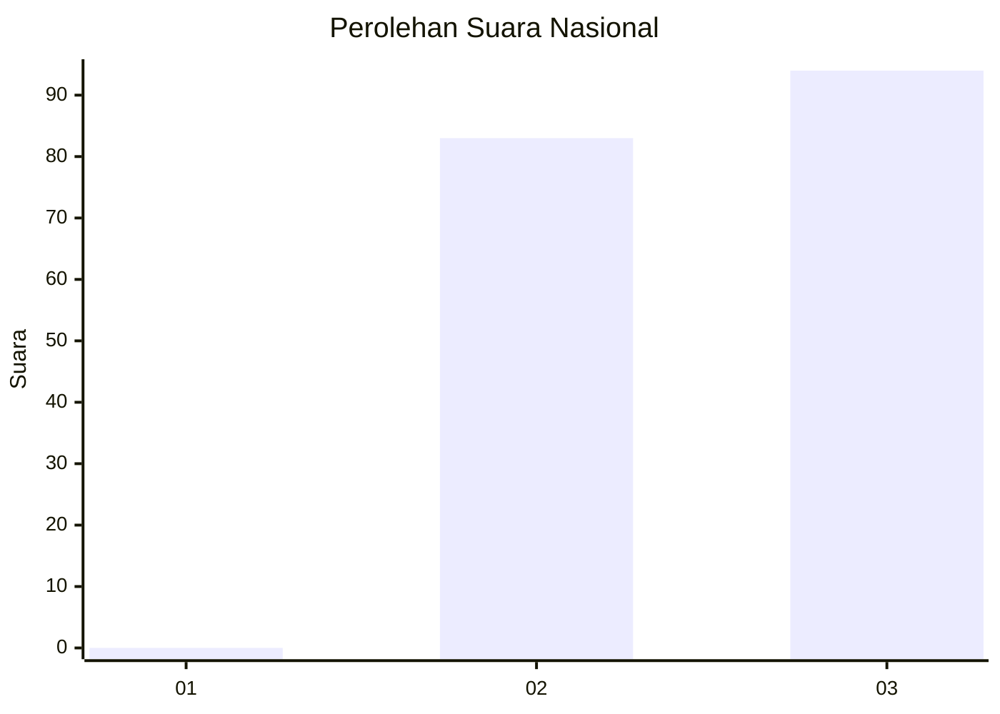
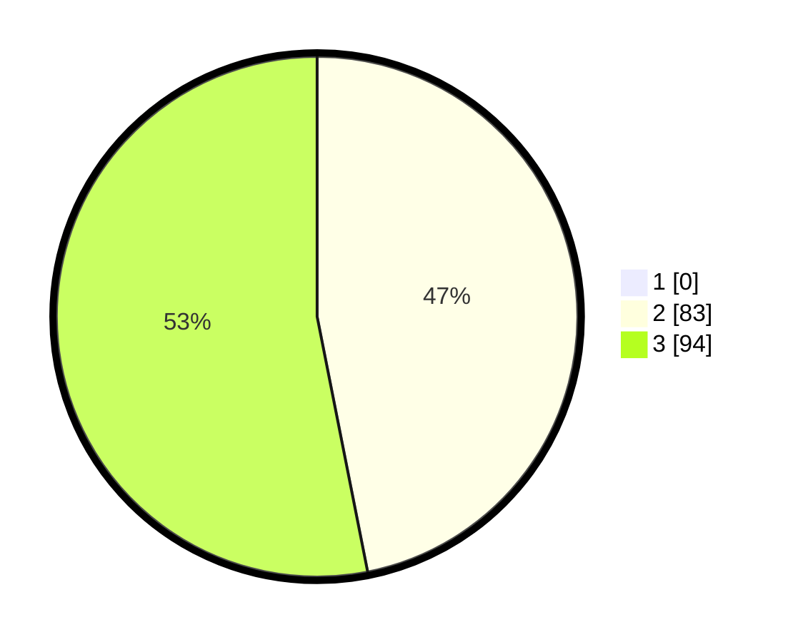

# Hasil

## Grafik

## Tabel

| No. | Nama Paslon    | Suara | Suara (raw) | Persentase |
|:--- |:-------------- | -----:| -----------:| ----------:|
| 1   | ANIES MUHAIMIN | 0     | [0][p-1]    | 0,00       |
| 2   | PRABOWO GIBRAN | 83    | [83][p-2]   | 46,89      |
| 3   | GANJAR MAHFUD  | 94    | [94][p-3]   | 53,11      |

[p-1]: https://github.com/gigit-pemilu/pemilu-2024/blob/main/pilpres/hitung-suara/sub/51-bali/sub/02-tabanan/sub/08-penebel/sub/2007-penatahan/sub/001-tps/sub/paslon-1.txt
[p-2]: https://github.com/gigit-pemilu/pemilu-2024/blob/main/pilpres/hitung-suara/sub/51-bali/sub/02-tabanan/sub/08-penebel/sub/2007-penatahan/sub/001-tps/sub/paslon-2.txt
[p-3]: https://github.com/gigit-pemilu/pemilu-2024/blob/main/pilpres/hitung-suara/sub/51-bali/sub/02-tabanan/sub/08-penebel/sub/2007-penatahan/sub/001-tps/sub/paslon-3.txt

## Foto C Plano

https://sirekap-obj-formc.kpu.go.id/9ffd/pemilu/ppwp/51/02/08/20/07/5102082007001-20240215-224032--6c459102-bb4d-4c9f-b5bb-38247652c074.jpg

https://sirekap-obj-formc.kpu.go.id/9ffd/pemilu/ppwp/51/02/08/20/07/5102082007001-20240215-224034--d9ae355a-6707-4825-abc7-7068ffc4de9c.jpg

https://sirekap-obj-formc.kpu.go.id/9ffd/pemilu/ppwp/51/02/08/20/07/5102082007001-20240215-224033--5125f8eb-0fdf-4e66-af6e-1e787cd81c4c.jpg

## Metadata

| Key        | Value               |
| ---------- | ------------------- |
| Time Stamp | 2024-02-15 23:29:50 |

## DATA PEMILIH TETAP

Jumlah pemilih dalam DPT: **209**.
 * L: **103**.
 * P: **106**.

## DATA PENGGUNA HAK PILIH

Jumlah pengguna hak pilih dalam DPT: **174**.
 * L: **88**.
 * P: **86**.

Jumlah pengguna hak pilih dalam DPTb: **0**.
 * L: **0**.
 * P: **0**.

Jumlah pengguna hak pilih dalam DPK: **4**.
 * L: **3**.
 * P: **1**.

Jumlah pengguna hak pilih: **178**.
 * L: **91**.
 * P: **87**.

## JUMLAH SUARA SAH DAN TIDAK SAH

JUMLAH SELURUH SUARA SAH: **177**.

JUMLAH SUARA TIDAK SAH: **1**.

JUMLAH SELURUH SUARA SAH DAN SUARA TIDAK SAH: **178**.

