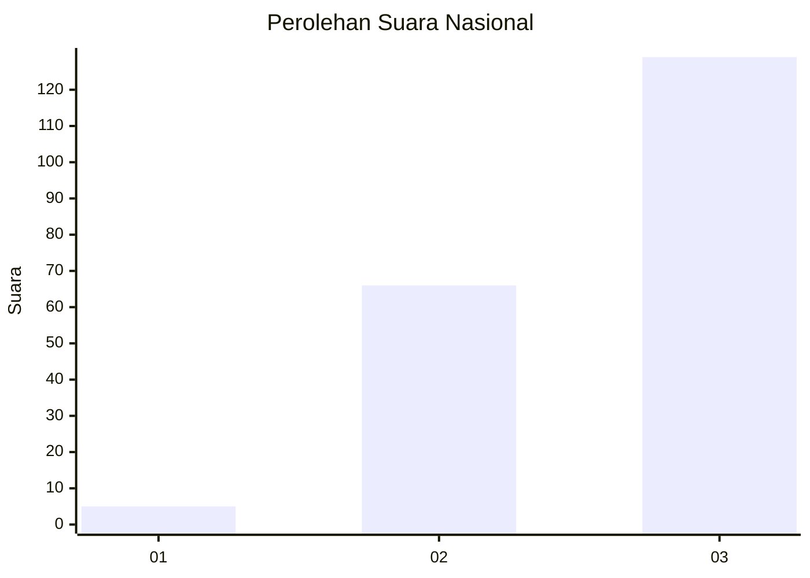
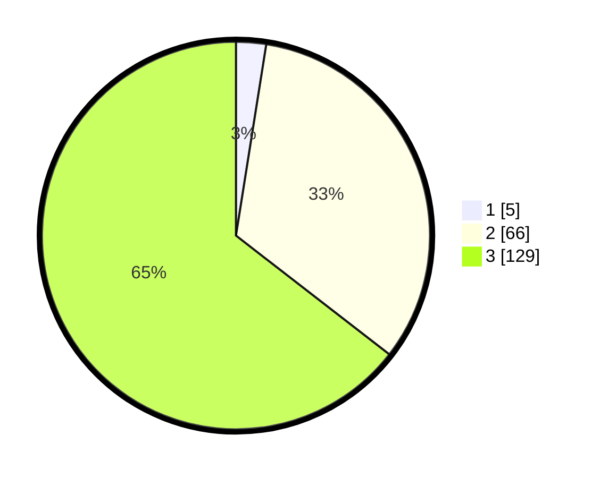

# Hasil

## Grafik

## Tabel

| No. | Nama Paslon    | Suara | Suara (raw) | Persentase |
|:--- |:-------------- | -----:| -----------:| ----------:|
| 1   | ANIES MUHAIMIN | 5     | [5][p-1]    | 2,50       |
| 2   | PRABOWO GIBRAN | 66    | [66][p-2]   | 33,00      |
| 3   | GANJAR MAHFUD  | 129   | [129][p-3]  | 64,50      |

[p-1]: https://github.com/gigit-pemilu/pemilu-2024/blob/main/pilpres/hitung-suara/sub/51-bali/sub/02-tabanan/sub/08-penebel/sub/2007-penatahan/sub/002-tps/sub/paslon-1.txt
[p-2]: https://github.com/gigit-pemilu/pemilu-2024/blob/main/pilpres/hitung-suara/sub/51-bali/sub/02-tabanan/sub/08-penebel/sub/2007-penatahan/sub/002-tps/sub/paslon-2.txt
[p-3]: https://github.com/gigit-pemilu/pemilu-2024/blob/main/pilpres/hitung-suara/sub/51-bali/sub/02-tabanan/sub/08-penebel/sub/2007-penatahan/sub/002-tps/sub/paslon-3.txt

## Foto C Plano

https://sirekap-obj-formc.kpu.go.id/fe63/pemilu/ppwp/51/02/08/20/07/5102082007002-20240216-143321--f43df81e-4e30-49d4-97b1-c449f7148b17.jpg

https://sirekap-obj-formc.kpu.go.id/fe63/pemilu/ppwp/51/02/08/20/07/5102082007002-20240216-143322--6275fd5e-5c16-4e0c-b60a-b863cd32833d.jpg

https://sirekap-obj-formc.kpu.go.id/fe63/pemilu/ppwp/51/02/08/20/07/5102082007002-20240216-143322--af7d05c5-8e9e-4666-be97-3dad6e8ad83f.jpg

## Metadata

| Key        | Value               |
| ---------- | ------------------- |
| Time Stamp | 2024-02-16 16:25:10 |

## DATA PEMILIH TETAP

Jumlah pemilih dalam DPT: **245**.
 * L: **122**.
 * P: **123**.

## DATA PENGGUNA HAK PILIH

Jumlah pengguna hak pilih dalam DPT: **211**.
 * L: **109**.
 * P: **102**.

Jumlah pengguna hak pilih dalam DPTb: **0**.
 * L: **0**.
 * P: **0**.

Jumlah pengguna hak pilih dalam DPK: **0**.
 * L: **0**.
 * P: **0**.

Jumlah pengguna hak pilih: **211**.
 * L: **109**.
 * P: **102**.

## JUMLAH SUARA SAH DAN TIDAK SAH

JUMLAH SELURUH SUARA SAH: **200**.

JUMLAH SUARA TIDAK SAH: **11**.

JUMLAH SELURUH SUARA SAH DAN SUARA TIDAK SAH: **211**.

