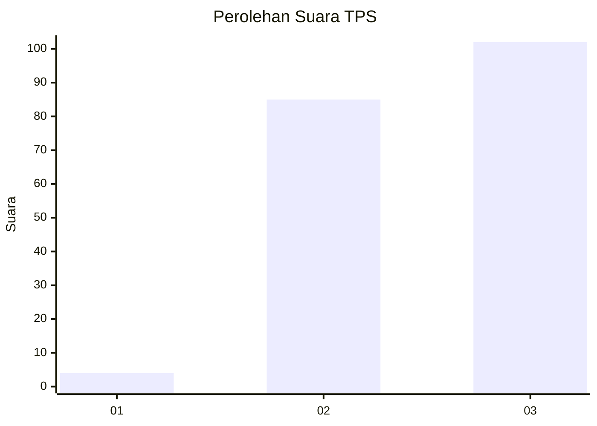
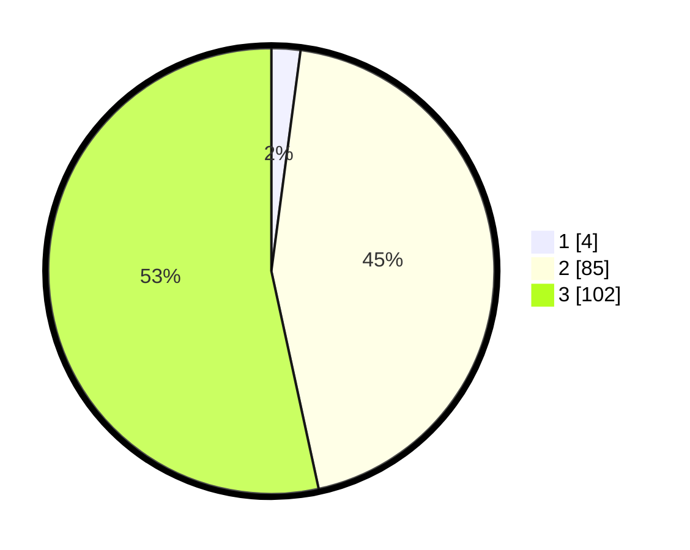

# Hasil

## Grafik

## Tabel

| No. | Nama Paslon    | Suara | Suara (raw) | Persentase |
|:--- |:-------------- | -----:| -----------:| ----------:|
| 1   | ANIES MUHAIMIN | 4     | [4][p-1]    | 2,09       |
| 2   | PRABOWO GIBRAN | 85    | [85][p-2]   | 44,50      |
| 3   | GANJAR MAHFUD  | 102   | [102][p-3]  | 53,40      |

[p-1]: https://github.com/gigit-pemilu/pemilu-2024-51-bali/blob/main/pilpres/hitung-suara/sub/51-bali/sub/02-tabanan/sub/08-penebel/sub/2007-penatahan/sub/003-tps/sub/paslon-1.txt
[p-2]: https://github.com/gigit-pemilu/pemilu-2024-51-bali/blob/main/pilpres/hitung-suara/sub/51-bali/sub/02-tabanan/sub/08-penebel/sub/2007-penatahan/sub/003-tps/sub/paslon-2.txt
[p-3]: https://github.com/gigit-pemilu/pemilu-2024-51-bali/blob/main/pilpres/hitung-suara/sub/51-bali/sub/02-tabanan/sub/08-penebel/sub/2007-penatahan/sub/003-tps/sub/paslon-3.txt

## Foto C Plano

https://sirekap-obj-formc.kpu.go.id/da0e/pemilu/ppwp/51/02/08/20/07/5102082007003-20240216-052723--8a9688be-8eb3-4daf-966e-73e3a49c8f17.jpg

https://sirekap-obj-formc.kpu.go.id/da0e/pemilu/ppwp/51/02/08/20/07/5102082007003-20240214-141156--6cbfc035-0056-43a6-abeb-59f69bbdd4c4.jpg

https://sirekap-obj-formc.kpu.go.id/da0e/pemilu/ppwp/51/02/08/20/07/5102082007003-20240216-052723--9ce2e0b7-1f28-4e63-82d0-12717549183a.jpg

## Metadata

| Key        | Value               |
| ---------- | ------------------- |
| Time Stamp | 2024-02-16 05:30:26 |

## DATA PEMILIH TETAP

Jumlah pemilih dalam DPT: **236**.
 * L: **120**.
 * P: **116**.

## DATA PENGGUNA HAK PILIH

Jumlah pengguna hak pilih dalam DPT: **197**.
 * L: **99**.
 * P: **98**.

Jumlah pengguna hak pilih dalam DPTb: **0**.
 * L: **0**.
 * P: **0**.

Jumlah pengguna hak pilih dalam DPK: **0**.
 * L: **0**.
 * P: **0**.

Jumlah pengguna hak pilih: **197**.
 * L: **99**.
 * P: **98**.

## JUMLAH SUARA SAH DAN TIDAK SAH

JUMLAH SELURUH SUARA SAH: **191**.

JUMLAH SUARA TIDAK SAH: **6**.

JUMLAH SELURUH SUARA SAH DAN SUARA TIDAK SAH: **197**.

