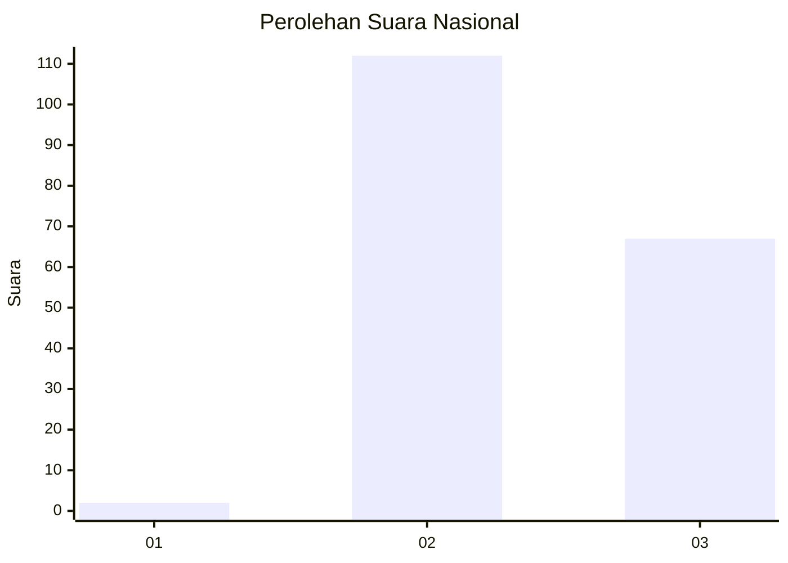
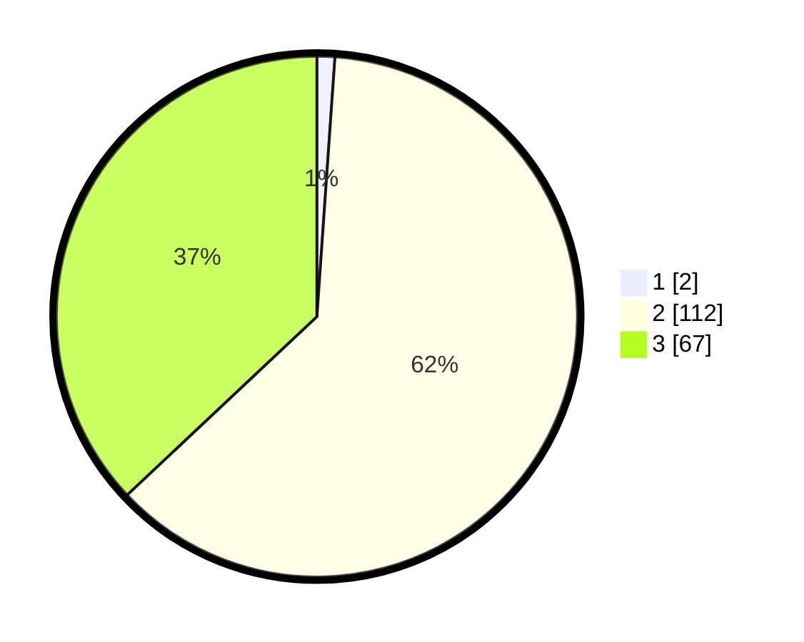

# Hasil

## Grafik

## Tabel

| No. | Nama Paslon    | Suara | Suara (raw) | Persentase |
|:--- |:-------------- | -----:| -----------:| ----------:|
| 1   | ANIES MUHAIMIN | 2     | [2][p-1]    | 1,10       |
| 2   | PRABOWO GIBRAN | 112   | [112][p-2]  | 61,88      |
| 3   | GANJAR MAHFUD  | 67    | [67][p-3]   | 37,02      |

[p-1]: https://github.com/gigit-pemilu/pemilu-2024/blob/main/pilpres/hitung-suara/sub/51-bali/sub/02-tabanan/sub/08-penebel/sub/2007-penatahan/sub/005-tps/sub/paslon-1.txt
[p-2]: https://github.com/gigit-pemilu/pemilu-2024/blob/main/pilpres/hitung-suara/sub/51-bali/sub/02-tabanan/sub/08-penebel/sub/2007-penatahan/sub/005-tps/sub/paslon-2.txt
[p-3]: https://github.com/gigit-pemilu/pemilu-2024/blob/main/pilpres/hitung-suara/sub/51-bali/sub/02-tabanan/sub/08-penebel/sub/2007-penatahan/sub/005-tps/sub/paslon-3.txt

## Foto C Plano

https://sirekap-obj-formc.kpu.go.id/9041/pemilu/ppwp/51/02/08/20/07/5102082007005-20240216-010559--c5ee2459-da54-4f73-9d54-d80f8a9f97f6.jpg

https://sirekap-obj-formc.kpu.go.id/9041/pemilu/ppwp/51/02/08/20/07/5102082007005-20240216-010609--bfa065ea-43a7-452f-99e4-91fe9b4fe18c.jpg

https://sirekap-obj-formc.kpu.go.id/9041/pemilu/ppwp/51/02/08/20/07/5102082007005-20240216-010604--760086ea-e5eb-4da9-93c0-bd491e8fbbbf.jpg

## Metadata

| Key        | Value               |
| ---------- | ------------------- |
| Time Stamp | 2024-02-16 12:51:22 |

## DATA PEMILIH TETAP

Jumlah pemilih dalam DPT: **220**.
 * L: **103**.
 * P: **117**.

## DATA PENGGUNA HAK PILIH

Jumlah pengguna hak pilih dalam DPT: **181**.
 * L: **80**.
 * P: **101**.

Jumlah pengguna hak pilih dalam DPTb: **1**.
 * L: **1**.
 * P: **0**.

Jumlah pengguna hak pilih dalam DPK: **0**.
 * L: **0**.
 * P: **0**.

Jumlah pengguna hak pilih: **182**.
 * L: **81**.
 * P: **101**.

## JUMLAH SUARA SAH DAN TIDAK SAH

JUMLAH SELURUH SUARA SAH: **181**.

JUMLAH SUARA TIDAK SAH: **1**.

JUMLAH SELURUH SUARA SAH DAN SUARA TIDAK SAH: **182**.

