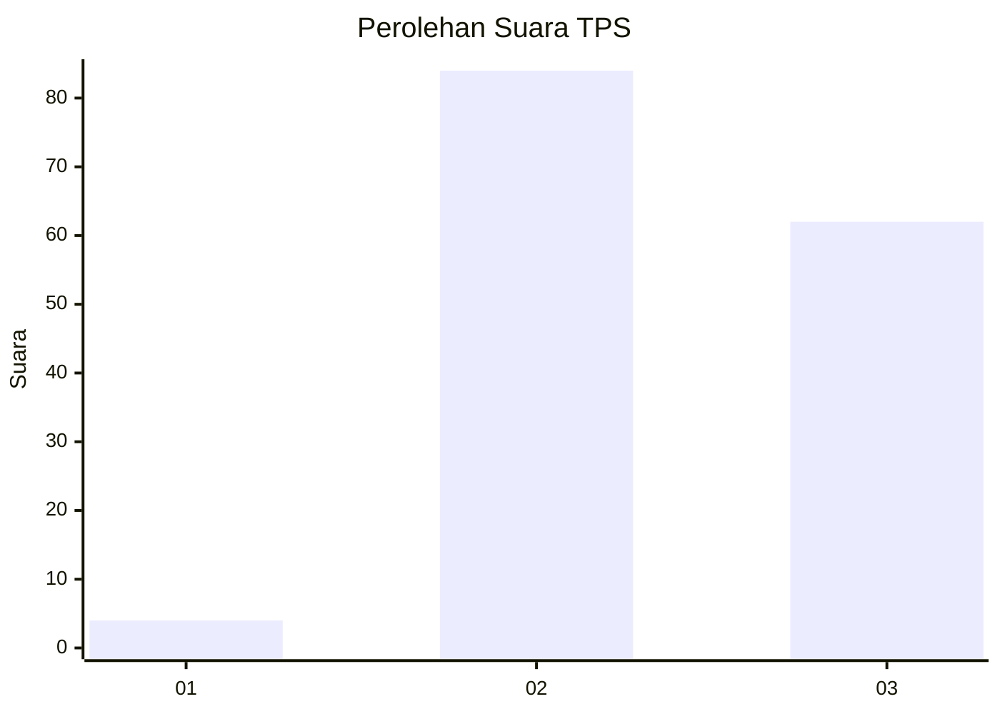
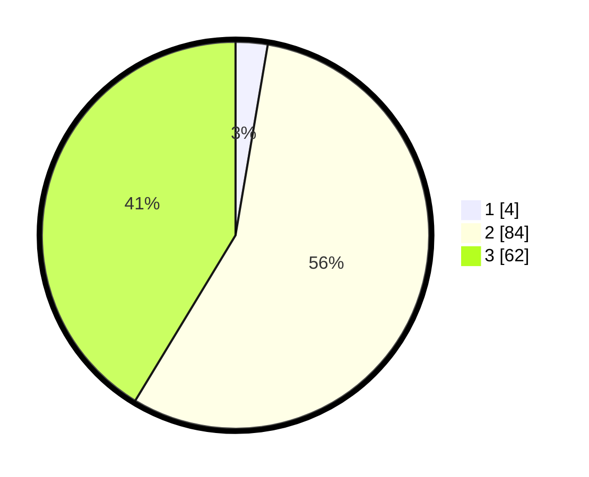

# Hasil

## Grafik

## Tabel

| No. | Nama Paslon    | Suara | Suara (raw) | Persentase |
|:--- |:-------------- | -----:| -----------:| ----------:|
| 1   | ANIES MUHAIMIN | 4     | [4][p-1]    | 2,67       |
| 2   | PRABOWO GIBRAN | 84    | [84][p-2]   | 56,00      |
| 3   | GANJAR MAHFUD  | 62    | [62][p-3]   | 41,33      |

[p-1]: https://github.com/gigit-pemilu/pemilu-2024-51-bali/blob/main/pilpres/hitung-suara/sub/51-bali/sub/02-tabanan/sub/08-penebel/sub/2007-penatahan/sub/009-tps/sub/paslon-1.txt
[p-2]: https://github.com/gigit-pemilu/pemilu-2024-51-bali/blob/main/pilpres/hitung-suara/sub/51-bali/sub/02-tabanan/sub/08-penebel/sub/2007-penatahan/sub/009-tps/sub/paslon-2.txt
[p-3]: https://github.com/gigit-pemilu/pemilu-2024-51-bali/blob/main/pilpres/hitung-suara/sub/51-bali/sub/02-tabanan/sub/08-penebel/sub/2007-penatahan/sub/009-tps/sub/paslon-3.txt

## Foto C Plano

https://sirekap-obj-formc.kpu.go.id/ed96/pemilu/ppwp/51/02/08/20/07/5102082007009-20240215-023830--0fd61ba8-c898-4f1f-86a5-03566b362e44.jpg

https://sirekap-obj-formc.kpu.go.id/ed96/pemilu/ppwp/51/02/08/20/07/5102082007009-20240215-023901--2e756d83-337f-4d8a-adc2-f085c6a29d23.jpg

https://sirekap-obj-formc.kpu.go.id/ed96/pemilu/ppwp/51/02/08/20/07/5102082007009-20240215-023848--38be2f6a-602e-47aa-82b6-3a1d818078a5.jpg

## Metadata

| Key        | Value               |
| ---------- | ------------------- |
| Time Stamp | 2024-02-15 23:29:50 |

## DATA PEMILIH TETAP

Jumlah pemilih dalam DPT: **164**.
 * L: **70**.
 * P: **94**.

## DATA PENGGUNA HAK PILIH

Jumlah pengguna hak pilih dalam DPT: **157**.
 * L: **69**.
 * P: **88**.

Jumlah pengguna hak pilih dalam DPTb: **1**.
 * L: **1**.
 * P: **0**.

Jumlah pengguna hak pilih dalam DPK: **0**.
 * L: **0**.
 * P: **0**.

Jumlah pengguna hak pilih: **158**.
 * L: **70**.
 * P: **88**.

## JUMLAH SUARA SAH DAN TIDAK SAH

JUMLAH SELURUH SUARA SAH: **150**.

JUMLAH SUARA TIDAK SAH: **8**.

JUMLAH SELURUH SUARA SAH DAN SUARA TIDAK SAH: **158**.

