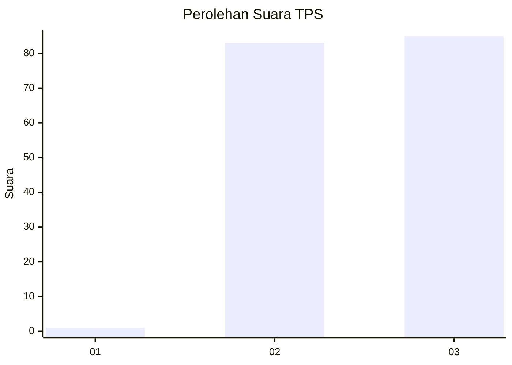
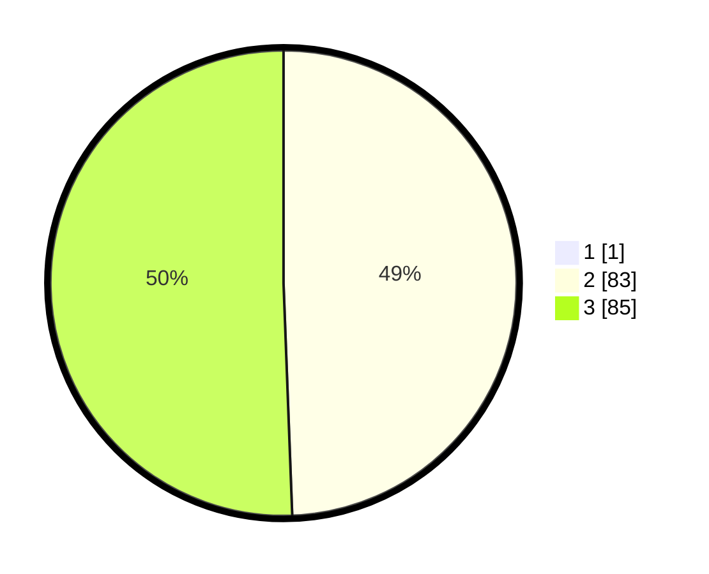

# Hasil

## Grafik

## Tabel

| No. | Nama Paslon    | Suara | Suara (raw) | Persentase |
|:--- |:-------------- | -----:| -----------:| ----------:|
| 1   | ANIES MUHAIMIN | 1     | [1][p-1]    | 0,59       |
| 2   | PRABOWO GIBRAN | 83    | [83][p-2]   | 49,11      |
| 3   | GANJAR MAHFUD  | 85    | [85][p-3]   | 50,30      |

[p-1]: https://github.com/gigit-pemilu/pemilu-2024-51-bali/blob/main/pilpres/hitung-suara/sub/51-bali/sub/02-tabanan/sub/08-penebel/sub/2007-penatahan/sub/010-tps/sub/paslon-1.txt
[p-2]: https://github.com/gigit-pemilu/pemilu-2024-51-bali/blob/main/pilpres/hitung-suara/sub/51-bali/sub/02-tabanan/sub/08-penebel/sub/2007-penatahan/sub/010-tps/sub/paslon-2.txt
[p-3]: https://github.com/gigit-pemilu/pemilu-2024-51-bali/blob/main/pilpres/hitung-suara/sub/51-bali/sub/02-tabanan/sub/08-penebel/sub/2007-penatahan/sub/010-tps/sub/paslon-3.txt

## Foto C Plano

https://sirekap-obj-formc.kpu.go.id/db59/pemilu/ppwp/51/02/08/20/07/5102082007010-20240216-160153--7bca92c0-54b9-4662-ad23-936bf2ddd59d.jpg

https://sirekap-obj-formc.kpu.go.id/db59/pemilu/ppwp/51/02/08/20/07/5102082007010-20240216-160154--0826e262-6118-48b5-a600-22aa0fcdbc53.jpg

https://sirekap-obj-formc.kpu.go.id/db59/pemilu/ppwp/51/02/08/20/07/5102082007010-20240216-160154--67fcbce0-abab-476e-bf57-e937bdb5831f.jpg

## Metadata

| Key        | Value               |
| ---------- | ------------------- |
| Time Stamp | 2024-02-21 13:00:00 |

## DATA PEMILIH TETAP

Jumlah pemilih dalam DPT: **185**.
 * L: **94**.
 * P: **91**.

## DATA PENGGUNA HAK PILIH

Jumlah pengguna hak pilih dalam DPT: **170**.
 * L: **88**.
 * P: **82**.

Jumlah pengguna hak pilih dalam DPTb: **0**.
 * L: **0**.
 * P: **0**.

Jumlah pengguna hak pilih dalam DPK: **0**.
 * L: **0**.
 * P: **0**.

Jumlah pengguna hak pilih: **170**.
 * L: **88**.
 * P: **82**.

## JUMLAH SUARA SAH DAN TIDAK SAH

JUMLAH SELURUH SUARA SAH: **169**.

JUMLAH SUARA TIDAK SAH: **1**.

JUMLAH SELURUH SUARA SAH DAN SUARA TIDAK SAH: **170**.

