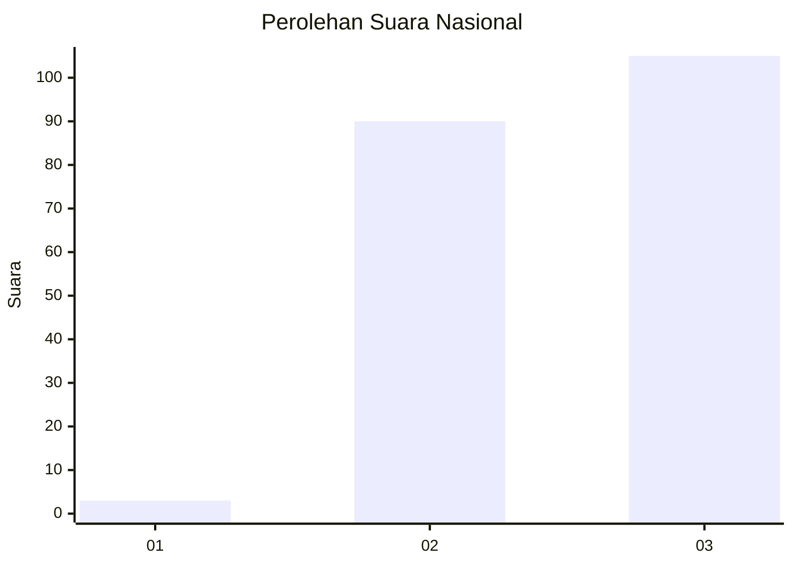
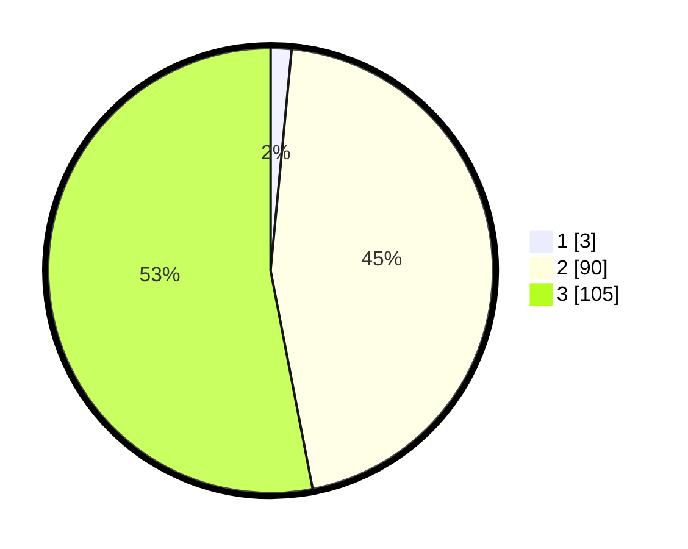

# Hasil

## Grafik

## Tabel

| No. | Nama Paslon    | Suara | Suara (raw) | Persentase |
|:--- |:-------------- | -----:| -----------:| ----------:|
| 1   | ANIES MUHAIMIN | 3     | [3][p-1]    | 1,52       |
| 2   | PRABOWO GIBRAN | 90    | [90][p-2]   | 45,45      |
| 3   | GANJAR MAHFUD  | 105   | [105][p-3]  | 53,03      |

[p-1]: https://github.com/gigit-pemilu/pemilu-2024/blob/main/pilpres/hitung-suara/sub/51-bali/sub/02-tabanan/sub/08-penebel/sub/2009-mengesta/sub/001-tps/sub/paslon-1.txt
[p-2]: https://github.com/gigit-pemilu/pemilu-2024/blob/main/pilpres/hitung-suara/sub/51-bali/sub/02-tabanan/sub/08-penebel/sub/2009-mengesta/sub/001-tps/sub/paslon-2.txt
[p-3]: https://github.com/gigit-pemilu/pemilu-2024/blob/main/pilpres/hitung-suara/sub/51-bali/sub/02-tabanan/sub/08-penebel/sub/2009-mengesta/sub/001-tps/sub/paslon-3.txt

## Foto C Plano

https://sirekap-obj-formc.kpu.go.id/931d/pemilu/ppwp/51/02/08/20/09/5102082009001-20240216-125539--c7b6db26-ed5f-4c5f-abd7-0be22b0b2f7e.jpg

https://sirekap-obj-formc.kpu.go.id/931d/pemilu/ppwp/51/02/08/20/09/5102082009001-20240216-125547--7116dcff-e844-429c-bd40-85d782a35e5b.jpg

https://sirekap-obj-formc.kpu.go.id/931d/pemilu/ppwp/51/02/08/20/09/5102082009001-20240216-125542--83dc3f32-b42a-4a12-98ca-a8c5e63105a2.jpg

## Metadata

| Key        | Value               |
| ---------- | ------------------- |
| Time Stamp | 2024-02-19 06:16:00 |

## DATA PEMILIH TETAP

Jumlah pemilih dalam DPT: **236**.
 * L: **112**.
 * P: **124**.

## DATA PENGGUNA HAK PILIH

Jumlah pengguna hak pilih dalam DPT: **197**.
 * L: **94**.
 * P: **103**.

Jumlah pengguna hak pilih dalam DPTb: **0**.
 * L: **0**.
 * P: **0**.

Jumlah pengguna hak pilih dalam DPK: **1**.
 * L: **0**.
 * P: **1**.

Jumlah pengguna hak pilih: **198**.
 * L: **94**.
 * P: **104**.

## JUMLAH SUARA SAH DAN TIDAK SAH

JUMLAH SELURUH SUARA SAH: **198**.

JUMLAH SUARA TIDAK SAH: **0**.

JUMLAH SELURUH SUARA SAH DAN SUARA TIDAK SAH: **198**.

