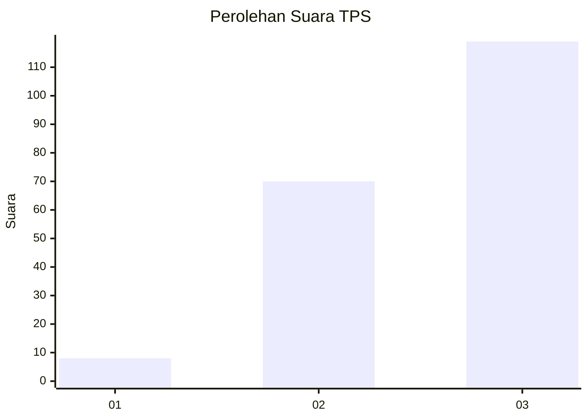
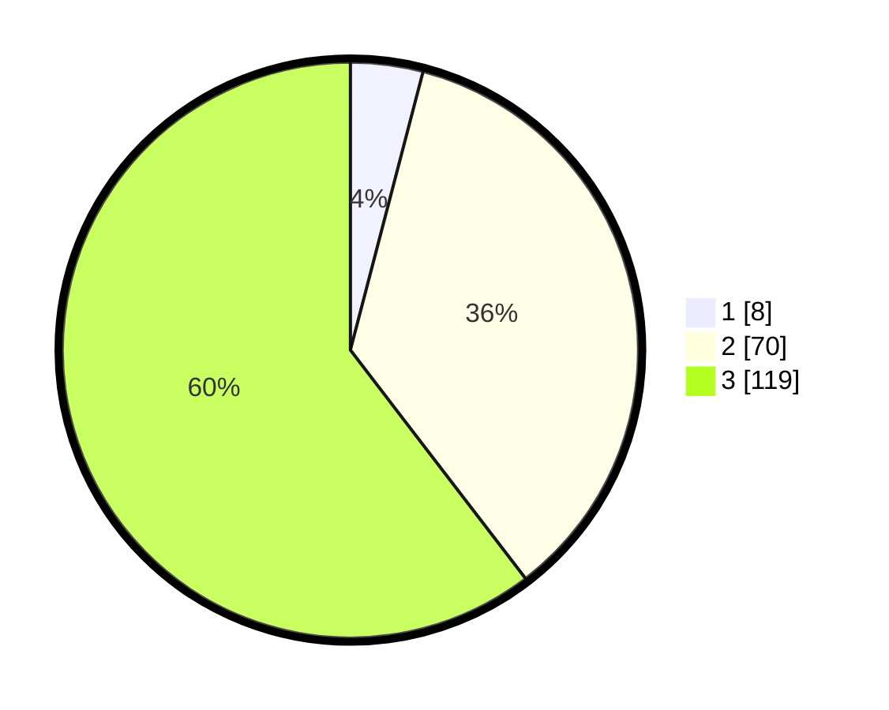

# Hasil

## Grafik

## Tabel

| No. | Nama Paslon    | Suara | Suara (raw) | Persentase |
|:--- |:-------------- | -----:| -----------:| ----------:|
| 1   | ANIES MUHAIMIN | 8     | [8][p-1]    | 4,06       |
| 2   | PRABOWO GIBRAN | 70    | [70][p-2]   | 35,53      |
| 3   | GANJAR MAHFUD  | 119   | [119][p-3]  | 60,41      |

[p-1]: https://github.com/gigit-pemilu/pemilu-2024-51-bali/blob/main/pilpres/hitung-suara/sub/51-bali/sub/02-tabanan/sub/08-penebel/sub/2009-mengesta/sub/002-tps/sub/paslon-1.txt
[p-2]: https://github.com/gigit-pemilu/pemilu-2024-51-bali/blob/main/pilpres/hitung-suara/sub/51-bali/sub/02-tabanan/sub/08-penebel/sub/2009-mengesta/sub/002-tps/sub/paslon-2.txt
[p-3]: https://github.com/gigit-pemilu/pemilu-2024-51-bali/blob/main/pilpres/hitung-suara/sub/51-bali/sub/02-tabanan/sub/08-penebel/sub/2009-mengesta/sub/002-tps/sub/paslon-3.txt

## Foto C Plano

https://sirekap-obj-formc.kpu.go.id/7a2e/pemilu/ppwp/51/02/08/20/09/5102082009002-20240215-040218--542ac049-12e9-4f17-81fc-a9f08abd570a.jpg

https://sirekap-obj-formc.kpu.go.id/7a2e/pemilu/ppwp/51/02/08/20/09/5102082009002-20240215-040305--f69e2537-8ffd-427c-bca1-e8b230a34942.jpg

https://sirekap-obj-formc.kpu.go.id/7a2e/pemilu/ppwp/51/02/08/20/09/5102082009002-20240215-040320--7735b0de-e822-472a-bc1c-4e9e68882a41.jpg

## Metadata

| Key        | Value               |
| ---------- | ------------------- |
| Time Stamp | 2024-02-15 15:00:29 |

## DATA PEMILIH TETAP

Jumlah pemilih dalam DPT: **242**.
 * L: **128**.
 * P: **114**.

## DATA PENGGUNA HAK PILIH

Jumlah pengguna hak pilih dalam DPT: **206**.
 * L: **110**.
 * P: **96**.

Jumlah pengguna hak pilih dalam DPTb: **0**.
 * L: **0**.
 * P: **0**.

Jumlah pengguna hak pilih dalam DPK: **0**.
 * L: **0**.
 * P: **0**.

Jumlah pengguna hak pilih: **206**.
 * L: **110**.
 * P: **96**.

## JUMLAH SUARA SAH DAN TIDAK SAH

JUMLAH SELURUH SUARA SAH: **197**.

JUMLAH SUARA TIDAK SAH: **9**.

JUMLAH SELURUH SUARA SAH DAN SUARA TIDAK SAH: **206**.

