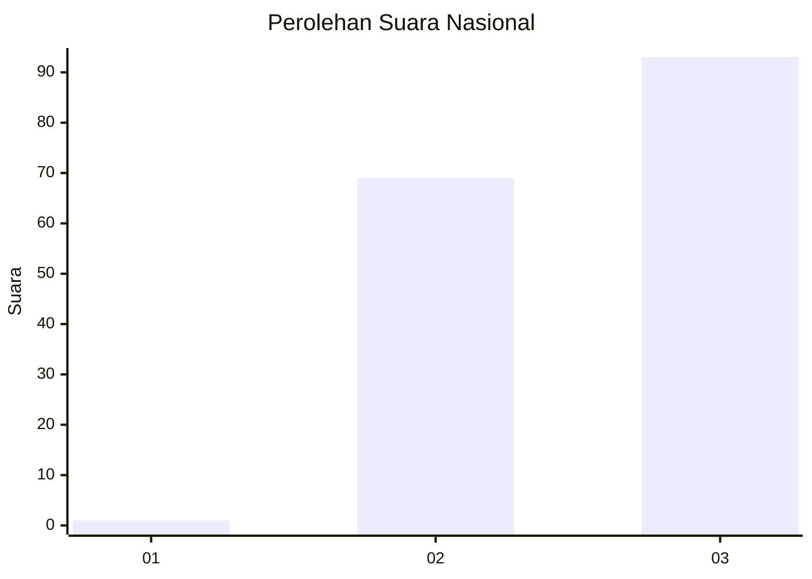
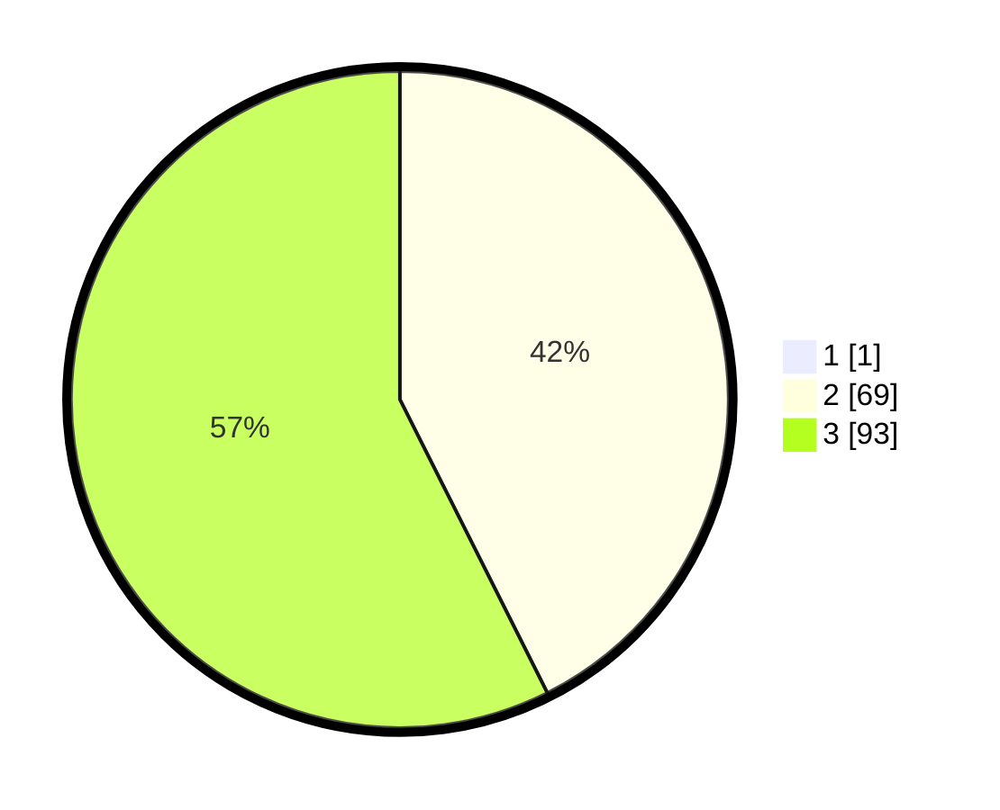

# Hasil

## Grafik

## Tabel

| No. | Nama Paslon    | Suara | Suara (raw) | Persentase |
|:--- |:-------------- | -----:| -----------:| ----------:|
| 1   | ANIES MUHAIMIN | 1     | [1][p-1]    | 0,61       |
| 2   | PRABOWO GIBRAN | 69    | [69][p-2]   | 42,33      |
| 3   | GANJAR MAHFUD  | 93    | [93][p-3]   | 57,06      |

[p-1]: https://github.com/gigit-pemilu/pemilu-2024/blob/main/pilpres/hitung-suara/sub/51-bali/sub/02-tabanan/sub/08-penebel/sub/2009-mengesta/sub/003-tps/sub/paslon-1.txt
[p-2]: https://github.com/gigit-pemilu/pemilu-2024/blob/main/pilpres/hitung-suara/sub/51-bali/sub/02-tabanan/sub/08-penebel/sub/2009-mengesta/sub/003-tps/sub/paslon-2.txt
[p-3]: https://github.com/gigit-pemilu/pemilu-2024/blob/main/pilpres/hitung-suara/sub/51-bali/sub/02-tabanan/sub/08-penebel/sub/2009-mengesta/sub/003-tps/sub/paslon-3.txt

## Foto C Plano

https://sirekap-obj-formc.kpu.go.id/7ac6/pemilu/ppwp/51/02/08/20/09/5102082009003-20240214-214453--61a7ceca-a6c9-4144-9820-d8009f7375f4.jpg

https://sirekap-obj-formc.kpu.go.id/7ac6/pemilu/ppwp/51/02/08/20/09/5102082009003-20240214-215244--c09d3128-63ce-4d3e-94d3-2f3904d67a90.jpg

https://sirekap-obj-formc.kpu.go.id/7ac6/pemilu/ppwp/51/02/08/20/09/5102082009003-20240214-215450--ad1900d8-8f1a-458c-85ad-ce1dc7718c10.jpg

## Metadata

| Key        | Value               |
| ---------- | ------------------- |
| Time Stamp | 2024-02-15 23:29:50 |

