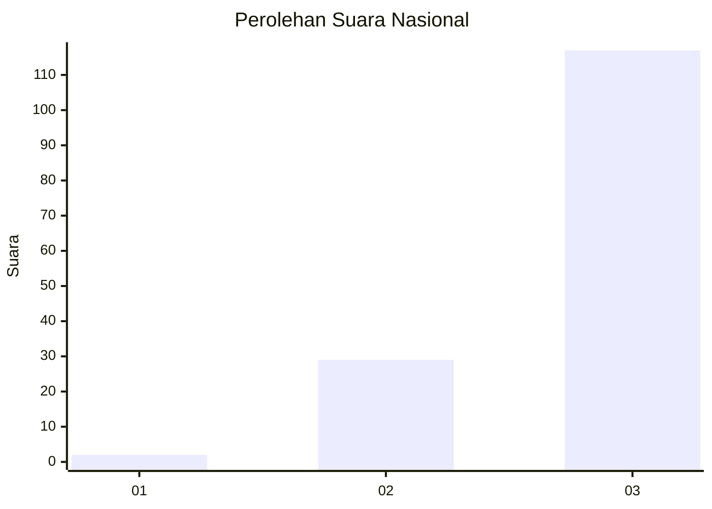
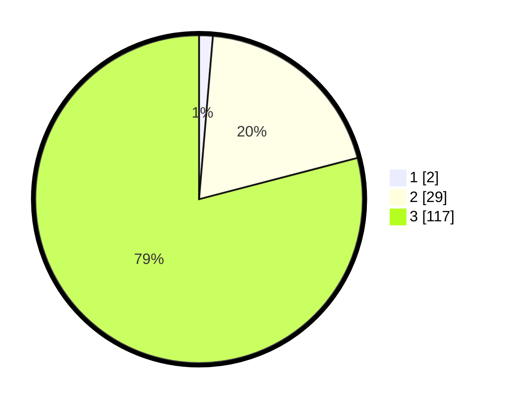

# Hasil

## Grafik

## Tabel

| No. | Nama Paslon    | Suara | Suara (raw) | Persentase |
|:--- |:-------------- | -----:| -----------:| ----------:|
| 1   | ANIES MUHAIMIN | 2     | [2][p-1]    | 1,35       |
| 2   | PRABOWO GIBRAN | 29    | [29][p-2]   | 19,59      |
| 3   | GANJAR MAHFUD  | 117   | [117][p-3]  | 79,05      |

[p-1]: https://github.com/gigit-pemilu/pemilu-2024/blob/main/pilpres/hitung-suara/sub/51-bali/sub/02-tabanan/sub/08-penebel/sub/2009-mengesta/sub/004-tps/sub/paslon-1.txt
[p-2]: https://github.com/gigit-pemilu/pemilu-2024/blob/main/pilpres/hitung-suara/sub/51-bali/sub/02-tabanan/sub/08-penebel/sub/2009-mengesta/sub/004-tps/sub/paslon-2.txt
[p-3]: https://github.com/gigit-pemilu/pemilu-2024/blob/main/pilpres/hitung-suara/sub/51-bali/sub/02-tabanan/sub/08-penebel/sub/2009-mengesta/sub/004-tps/sub/paslon-3.txt

## Foto C Plano

https://sirekap-obj-formc.kpu.go.id/56d9/pemilu/ppwp/51/02/08/20/09/5102082009004-20240214-130852--632fcd9b-1283-4b86-a71e-c90295218184.jpg

https://sirekap-obj-formc.kpu.go.id/56d9/pemilu/ppwp/51/02/08/20/09/5102082009004-20240214-131334--a49ae897-31c5-4765-9d03-c87009b547e2.jpg

https://sirekap-obj-formc.kpu.go.id/56d9/pemilu/ppwp/51/02/08/20/09/5102082009004-20240214-131542--f6f3ee3b-172c-4b1e-8af3-21e4f27b12c0.jpg

## Metadata

| Key        | Value               |
| ---------- | ------------------- |
| Time Stamp | 2024-02-14 21:46:01 |

## DATA PEMILIH TETAP

Jumlah pemilih dalam DPT: **174**.
 * L: **87**.
 * P: **87**.

## DATA PENGGUNA HAK PILIH

Jumlah pengguna hak pilih dalam DPT: **150**.
 * L: **74**.
 * P: **76**.

Jumlah pengguna hak pilih dalam DPTb: **0**.
 * L: **0**.
 * P: **0**.

Jumlah pengguna hak pilih dalam DPK: **0**.
 * L: **0**.
 * P: **0**.

Jumlah pengguna hak pilih: **150**.
 * L: **74**.
 * P: **76**.

## JUMLAH SUARA SAH DAN TIDAK SAH

JUMLAH SELURUH SUARA SAH: **148**.

JUMLAH SUARA TIDAK SAH: **2**.

JUMLAH SELURUH SUARA SAH DAN SUARA TIDAK SAH: **150**.

