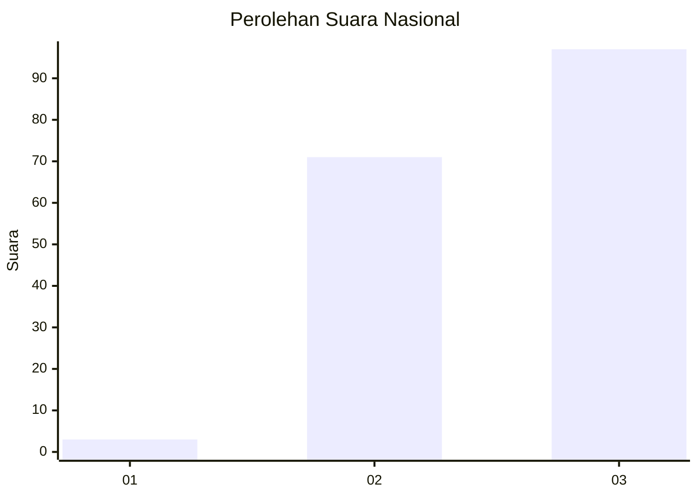
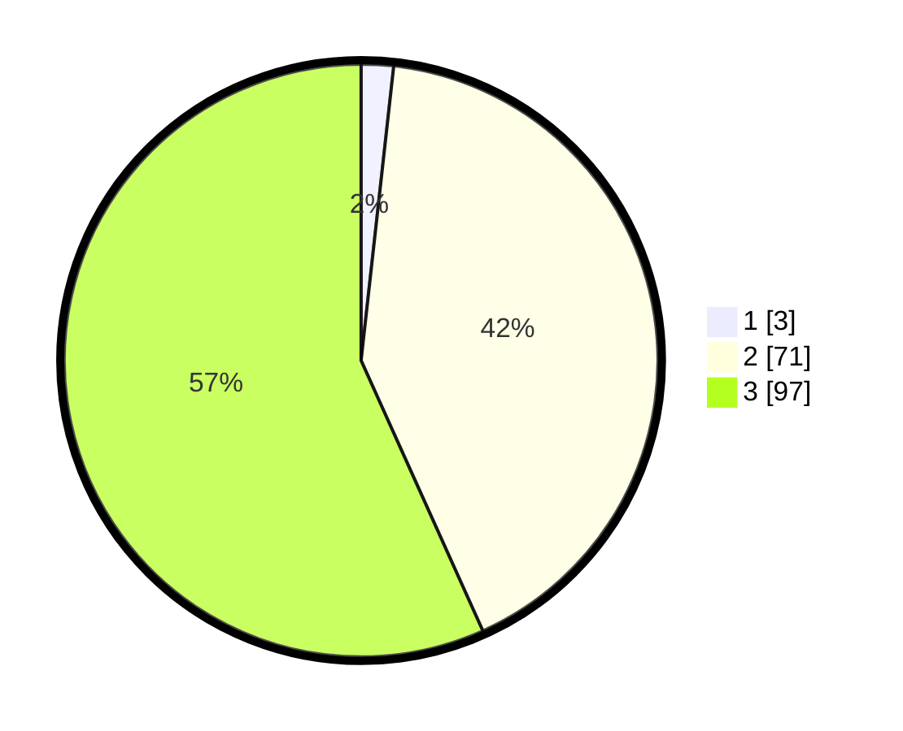

# Hasil

## Grafik

## Tabel

| No. | Nama Paslon    | Suara | Suara (raw) | Persentase |
|:--- |:-------------- | -----:| -----------:| ----------:|
| 1   | ANIES MUHAIMIN | 3     | [3][p-1]    | 1,75       |
| 2   | PRABOWO GIBRAN | 71    | [71][p-2]   | 41,52      |
| 3   | GANJAR MAHFUD  | 97    | [97][p-3]   | 56,73      |

[p-1]: https://github.com/gigit-pemilu/pemilu-2024/blob/main/pilpres/hitung-suara/sub/51-bali/sub/02-tabanan/sub/08-penebel/sub/2009-mengesta/sub/006-tps/sub/paslon-1.txt
[p-2]: https://github.com/gigit-pemilu/pemilu-2024/blob/main/pilpres/hitung-suara/sub/51-bali/sub/02-tabanan/sub/08-penebel/sub/2009-mengesta/sub/006-tps/sub/paslon-2.txt
[p-3]: https://github.com/gigit-pemilu/pemilu-2024/blob/main/pilpres/hitung-suara/sub/51-bali/sub/02-tabanan/sub/08-penebel/sub/2009-mengesta/sub/006-tps/sub/paslon-3.txt

## Foto C Plano

https://sirekap-obj-formc.kpu.go.id/53a3/pemilu/ppwp/51/02/08/20/09/5102082009006-20240214-131629--3ba5e1d3-8800-4f77-9bd0-1a548a45f396.jpg

https://sirekap-obj-formc.kpu.go.id/53a3/pemilu/ppwp/51/02/08/20/09/5102082009006-20240214-131705--1c9d7705-ecad-4df7-9304-4ded6f28c808.jpg

https://sirekap-obj-formc.kpu.go.id/53a3/pemilu/ppwp/51/02/08/20/09/5102082009006-20240214-131754--457d5615-09a9-4f71-b094-6a6b682eee6a.jpg

## Metadata

| Key        | Value               |
| ---------- | ------------------- |
| Time Stamp | 2024-02-14 21:46:01 |

## DATA PEMILIH TETAP

Jumlah pemilih dalam DPT: **187**.
 * L: **95**.
 * P: **92**.

## DATA PENGGUNA HAK PILIH

Jumlah pengguna hak pilih dalam DPT: **169**.
 * L: **87**.
 * P: **82**.

Jumlah pengguna hak pilih dalam DPTb: **0**.
 * L: **0**.
 * P: **0**.

Jumlah pengguna hak pilih dalam DPK: **3**.
 * L: **0**.
 * P: **3**.

Jumlah pengguna hak pilih: **172**.
 * L: **87**.
 * P: **85**.

## JUMLAH SUARA SAH DAN TIDAK SAH

JUMLAH SELURUH SUARA SAH: **171**.

JUMLAH SUARA TIDAK SAH: **1**.

JUMLAH SELURUH SUARA SAH DAN SUARA TIDAK SAH: **172**.

