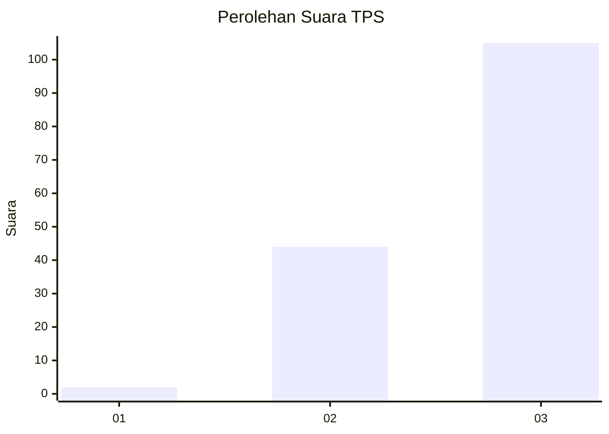
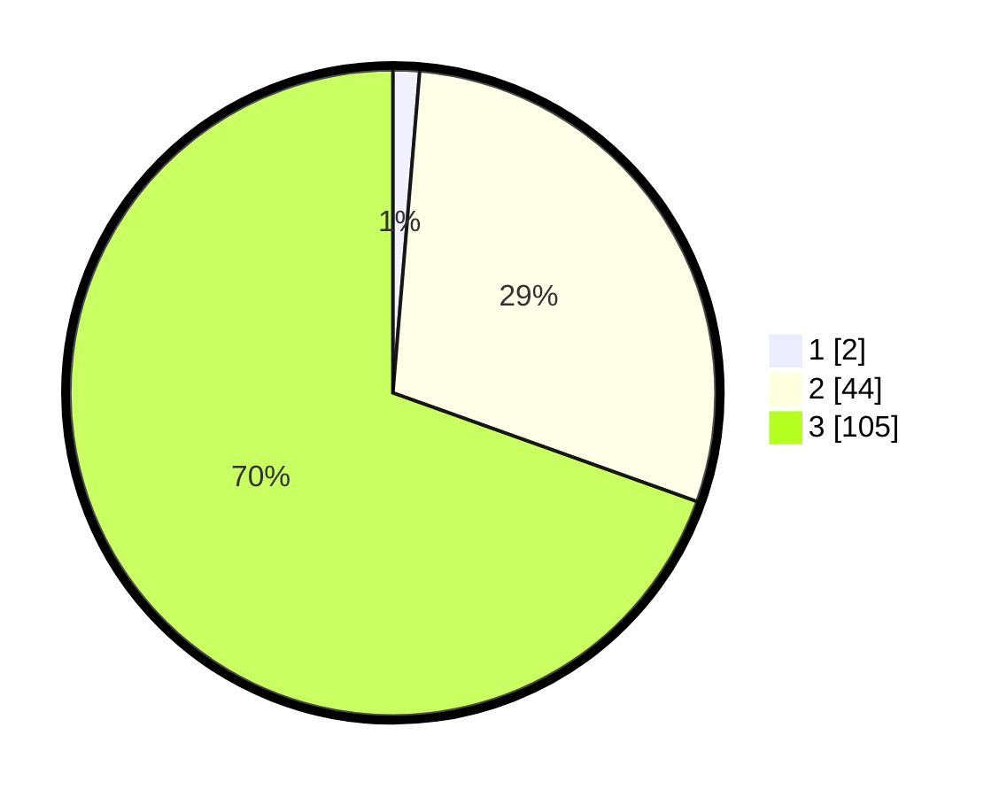

# Hasil

## Grafik

## Tabel

| No. | Nama Paslon    | Suara | Suara (raw) | Persentase |
|:--- |:-------------- | -----:| -----------:| ----------:|
| 1   | ANIES MUHAIMIN | 2     | [2][p-1]    | 1,32       |
| 2   | PRABOWO GIBRAN | 44    | [44][p-2]   | 29,14      |
| 3   | GANJAR MAHFUD  | 105   | [105][p-3]  | 69,54      |

[p-1]: https://github.com/gigit-pemilu/pemilu-2024-51-bali/blob/main/pilpres/hitung-suara/sub/51-bali/sub/02-tabanan/sub/08-penebel/sub/2009-mengesta/sub/007-tps/sub/paslon-1.txt
[p-2]: https://github.com/gigit-pemilu/pemilu-2024-51-bali/blob/main/pilpres/hitung-suara/sub/51-bali/sub/02-tabanan/sub/08-penebel/sub/2009-mengesta/sub/007-tps/sub/paslon-2.txt
[p-3]: https://github.com/gigit-pemilu/pemilu-2024-51-bali/blob/main/pilpres/hitung-suara/sub/51-bali/sub/02-tabanan/sub/08-penebel/sub/2009-mengesta/sub/007-tps/sub/paslon-3.txt

## Foto C Plano

https://sirekap-obj-formc.kpu.go.id/c14b/pemilu/ppwp/51/02/08/20/09/5102082009007-20240216-032243--856ffcdc-a2c5-4f21-b9f7-36f76142842c.jpg

https://sirekap-obj-formc.kpu.go.id/c14b/pemilu/ppwp/51/02/08/20/09/5102082009007-20240216-032251--6c5342fe-e8fc-46ac-9c62-0ca8787b087b.jpg

https://sirekap-obj-formc.kpu.go.id/c14b/pemilu/ppwp/51/02/08/20/09/5102082009007-20240216-032244--892aee97-c2f6-40bf-a97e-1d82cf59e335.jpg

## Metadata

| Key        | Value               |
| ---------- | ------------------- |
| Time Stamp | 2024-02-16 12:51:22 |

## DATA PEMILIH TETAP

Jumlah pemilih dalam DPT: **179**.
 * L: **86**.
 * P: **93**.

## DATA PENGGUNA HAK PILIH

Jumlah pengguna hak pilih dalam DPT: **154**.
 * L: **73**.
 * P: **81**.

Jumlah pengguna hak pilih dalam DPTb: **0**.
 * L: **0**.
 * P: **0**.

Jumlah pengguna hak pilih dalam DPK: **0**.
 * L: **0**.
 * P: **0**.

Jumlah pengguna hak pilih: **154**.
 * L: **73**.
 * P: **81**.

## JUMLAH SUARA SAH DAN TIDAK SAH

JUMLAH SELURUH SUARA SAH: **151**.

JUMLAH SUARA TIDAK SAH: **3**.

JUMLAH SELURUH SUARA SAH DAN SUARA TIDAK SAH: **154**.

