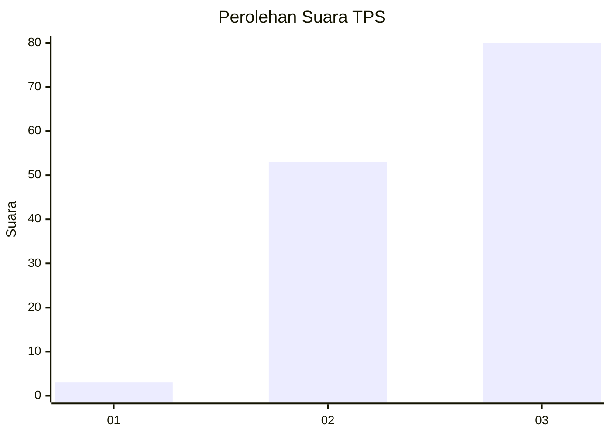
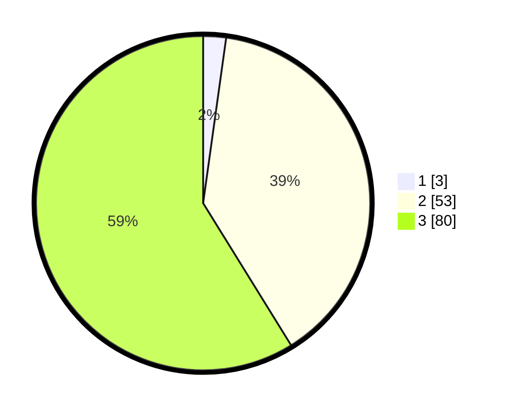

# Hasil

## Grafik

## Tabel

| No. | Nama Paslon    | Suara | Suara (raw) | Persentase |
|:--- |:-------------- | -----:| -----------:| ----------:|
| 1   | ANIES MUHAIMIN | 3     | [3][p-1]    | 2,21       |
| 2   | PRABOWO GIBRAN | 53    | [53][p-2]   | 38,97      |
| 3   | GANJAR MAHFUD  | 80    | [80][p-3]   | 58,82      |

[p-1]: https://github.com/gigit-pemilu/pemilu-2024-51-bali/blob/main/pilpres/hitung-suara/sub/51-bali/sub/02-tabanan/sub/08-penebel/sub/2010-penebel/sub/001-tps/sub/paslon-1.txt
[p-2]: https://github.com/gigit-pemilu/pemilu-2024-51-bali/blob/main/pilpres/hitung-suara/sub/51-bali/sub/02-tabanan/sub/08-penebel/sub/2010-penebel/sub/001-tps/sub/paslon-2.txt
[p-3]: https://github.com/gigit-pemilu/pemilu-2024-51-bali/blob/main/pilpres/hitung-suara/sub/51-bali/sub/02-tabanan/sub/08-penebel/sub/2010-penebel/sub/001-tps/sub/paslon-3.txt

## Foto C Plano

https://sirekap-obj-formc.kpu.go.id/e1fa/pemilu/ppwp/51/02/08/20/10/5102082010001-20240214-132022--281fee6d-6107-4ca7-a116-f546348292ed.jpg

https://sirekap-obj-formc.kpu.go.id/e1fa/pemilu/ppwp/51/02/08/20/10/5102082010001-20240214-132103--d19eb856-7ba5-4784-ae88-66a32b04efac.jpg

https://sirekap-obj-formc.kpu.go.id/e1fa/pemilu/ppwp/51/02/08/20/10/5102082010001-20240216-015314--c3d5a3ca-814d-448d-80eb-27b8d57b6b64.jpg

## Metadata

| Key        | Value               |
| ---------- | ------------------- |
| Time Stamp | 2024-02-16 02:00:27 |

## DATA PEMILIH TETAP

Jumlah pemilih dalam DPT: **154**.
 * L: **75**.
 * P: **79**.

## DATA PENGGUNA HAK PILIH

Jumlah pengguna hak pilih dalam DPT: **137**.
 * L: **67**.
 * P: **70**.

Jumlah pengguna hak pilih dalam DPTb: **0**.
 * L: **0**.
 * P: **0**.

Jumlah pengguna hak pilih dalam DPK: **0**.
 * L: **0**.
 * P: **0**.

Jumlah pengguna hak pilih: **137**.
 * L: **67**.
 * P: **70**.

## JUMLAH SUARA SAH DAN TIDAK SAH

JUMLAH SELURUH SUARA SAH: **136**.

JUMLAH SUARA TIDAK SAH: **1**.

JUMLAH SELURUH SUARA SAH DAN SUARA TIDAK SAH: **137**.

