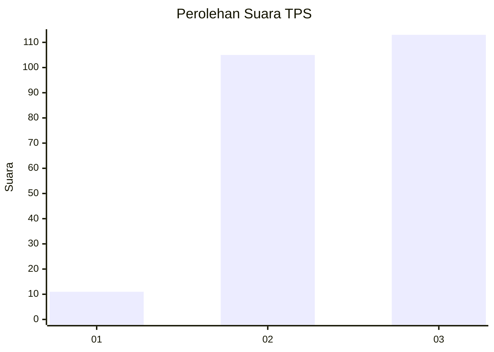
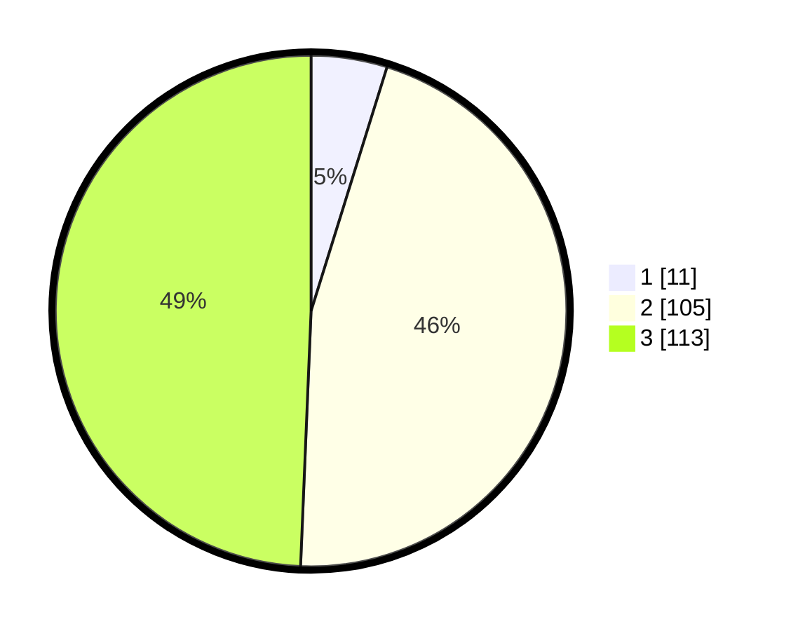

# Hasil

## Grafik

## Tabel

| No. | Nama Paslon    | Suara | Suara (raw) | Persentase |
|:--- |:-------------- | -----:| -----------:| ----------:|
| 1   | ANIES MUHAIMIN | 11    | [11][p-1]   | 4,80       |
| 2   | PRABOWO GIBRAN | 105   | [105][p-2]  | 45,85      |
| 3   | GANJAR MAHFUD  | 113   | [113][p-3]  | 49,34      |

[p-1]: https://github.com/gigit-pemilu/pemilu-2024-51-bali/blob/main/pilpres/hitung-suara/sub/51-bali/sub/02-tabanan/sub/08-penebel/sub/2010-penebel/sub/005-tps/sub/paslon-1.txt
[p-2]: https://github.com/gigit-pemilu/pemilu-2024-51-bali/blob/main/pilpres/hitung-suara/sub/51-bali/sub/02-tabanan/sub/08-penebel/sub/2010-penebel/sub/005-tps/sub/paslon-2.txt
[p-3]: https://github.com/gigit-pemilu/pemilu-2024-51-bali/blob/main/pilpres/hitung-suara/sub/51-bali/sub/02-tabanan/sub/08-penebel/sub/2010-penebel/sub/005-tps/sub/paslon-3.txt

## Foto C Plano

https://sirekap-obj-formc.kpu.go.id/382e/pemilu/ppwp/51/02/08/20/10/5102082010005-20240216-185813--aef89743-33f2-43bb-b762-ab41dcae31ca.jpg

https://sirekap-obj-formc.kpu.go.id/382e/pemilu/ppwp/51/02/08/20/10/5102082010005-20240216-185815--ec9d03f1-e1b8-441c-ad5e-7c6d8292b677.jpg

https://sirekap-obj-formc.kpu.go.id/382e/pemilu/ppwp/51/02/08/20/10/5102082010005-20240216-185814--7089768d-9545-4e62-9203-617ae552b9eb.jpg

## Metadata

| Key        | Value               |
| ---------- | ------------------- |
| Time Stamp | 2024-02-21 18:00:00 |

## DATA PEMILIH TETAP

Jumlah pemilih dalam DPT: **280**.
 * L: **165**.
 * P: **115**.

## DATA PENGGUNA HAK PILIH

Jumlah pengguna hak pilih dalam DPT: **234**.
 * L: **121**.
 * P: **113**.

Jumlah pengguna hak pilih dalam DPTb: **1**.
 * L: **0**.
 * P: **1**.

Jumlah pengguna hak pilih dalam DPK: **1**.
 * L: **1**.
 * P: **0**.

Jumlah pengguna hak pilih: **236**.
 * L: **112**.
 * P: **114**.

## JUMLAH SUARA SAH DAN TIDAK SAH

JUMLAH SELURUH SUARA SAH: **229**.

JUMLAH SUARA TIDAK SAH: **7**.

JUMLAH SELURUH SUARA SAH DAN SUARA TIDAK SAH: **236**.

