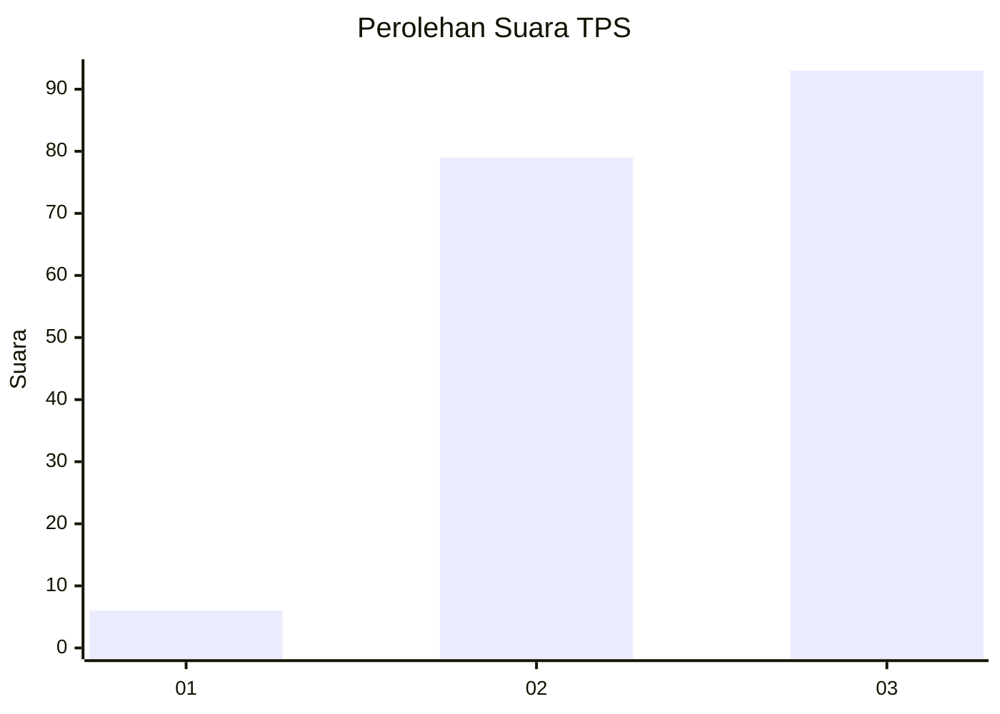
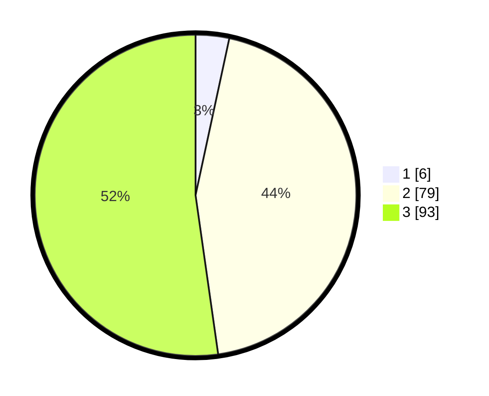

# Hasil

## Grafik

## Tabel

| No. | Nama Paslon    | Suara | Suara (raw) | Persentase |
|:--- |:-------------- | -----:| -----------:| ----------:|
| 1   | ANIES MUHAIMIN | 6     | [6][p-1]    | 3,37       |
| 2   | PRABOWO GIBRAN | 79    | [79][p-2]   | 44,38      |
| 3   | GANJAR MAHFUD  | 93    | [93][p-3]   | 52,25      |

[p-1]: https://github.com/gigit-pemilu/pemilu-2024-51-bali/blob/main/pilpres/hitung-suara/sub/51-bali/sub/02-tabanan/sub/08-penebel/sub/2010-penebel/sub/006-tps/sub/paslon-1.txt
[p-2]: https://github.com/gigit-pemilu/pemilu-2024-51-bali/blob/main/pilpres/hitung-suara/sub/51-bali/sub/02-tabanan/sub/08-penebel/sub/2010-penebel/sub/006-tps/sub/paslon-2.txt
[p-3]: https://github.com/gigit-pemilu/pemilu-2024-51-bali/blob/main/pilpres/hitung-suara/sub/51-bali/sub/02-tabanan/sub/08-penebel/sub/2010-penebel/sub/006-tps/sub/paslon-3.txt

## Foto C Plano

https://sirekap-obj-formc.kpu.go.id/56ab/pemilu/ppwp/51/02/08/20/10/5102082010006-20240215-002642--8bcef6cf-e82a-4c24-9d2a-e9a596b7bd28.jpg

https://sirekap-obj-formc.kpu.go.id/56ab/pemilu/ppwp/51/02/08/20/10/5102082010006-20240215-002702--0e3a8025-4811-45c6-a1f5-f67231398080.jpg

https://sirekap-obj-formc.kpu.go.id/56ab/pemilu/ppwp/51/02/08/20/10/5102082010006-20240215-002730--0fef4200-9a60-4cc7-90fe-11f40554567d.jpg

## Metadata

| Key        | Value               |
| ---------- | ------------------- |
| Time Stamp | 2024-02-15 23:29:50 |

