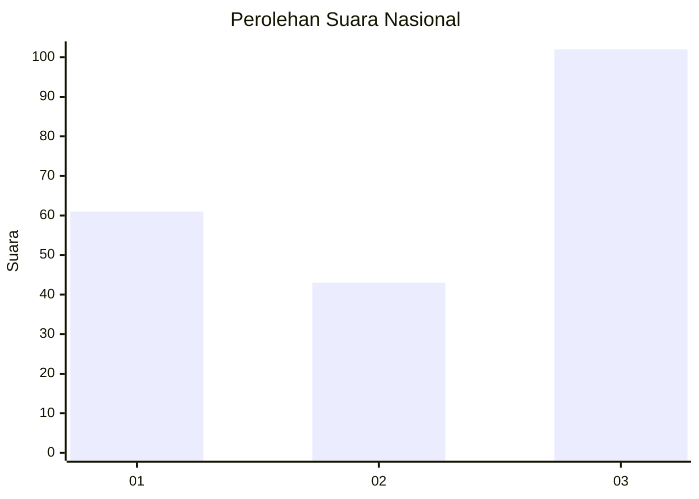
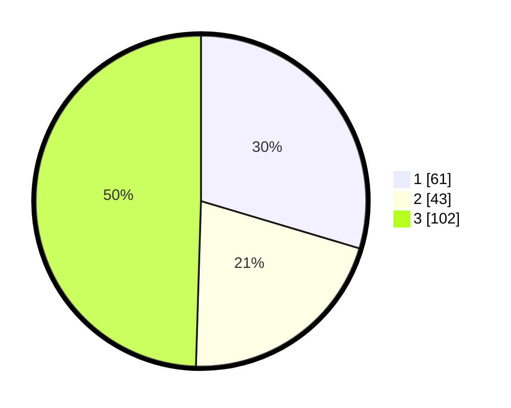

# Hasil

## Grafik

## Tabel

| No. | Nama Paslon    | Suara | Suara (raw) | Persentase |
|:--- |:-------------- | -----:| -----------:| ----------:|
| 1   | ANIES MUHAIMIN | 61    | [61][p-1]   | 29,61      |
| 2   | PRABOWO GIBRAN | 43    | [43][p-2]   | 20,87      |
| 3   | GANJAR MAHFUD  | 102   | [102][p-3]  | 49,51      |

[p-1]: https://github.com/gigit-pemilu/pemilu-2024/blob/main/pilpres/hitung-suara/sub/51-bali/sub/02-tabanan/sub/08-penebel/sub/2010-penebel/sub/010-tps/sub/paslon-1.txt
[p-2]: https://github.com/gigit-pemilu/pemilu-2024/blob/main/pilpres/hitung-suara/sub/51-bali/sub/02-tabanan/sub/08-penebel/sub/2010-penebel/sub/010-tps/sub/paslon-2.txt
[p-3]: https://github.com/gigit-pemilu/pemilu-2024/blob/main/pilpres/hitung-suara/sub/51-bali/sub/02-tabanan/sub/08-penebel/sub/2010-penebel/sub/010-tps/sub/paslon-3.txt

## Foto C Plano

https://sirekap-obj-formc.kpu.go.id/72ae/pemilu/ppwp/51/02/08/20/10/5102082010010-20240215-022950--4848b502-f35f-41f3-9000-e7a5690b09db.jpg

https://sirekap-obj-formc.kpu.go.id/72ae/pemilu/ppwp/51/02/08/20/10/5102082010010-20240215-022953--b4e96a00-07e8-4148-b0a1-2378cdb87039.jpg

https://sirekap-obj-formc.kpu.go.id/72ae/pemilu/ppwp/51/02/08/20/10/5102082010010-20240215-022958--08333477-ecb2-4d52-96f8-819d55559ecb.jpg

## Metadata

| Key        | Value               |
| ---------- | ------------------- |
| Time Stamp | 2024-02-15 20:00:44 |

## DATA PEMILIH TETAP

Jumlah pemilih dalam DPT: **270**.
 * L: **124**.
 * P: **146**.

## DATA PENGGUNA HAK PILIH

Jumlah pengguna hak pilih dalam DPT: **212**.
 * L: **97**.
 * P: **115**.

Jumlah pengguna hak pilih dalam DPTb: **4**.
 * L: **2**.
 * P: **2**.

Jumlah pengguna hak pilih dalam DPK: **0**.
 * L: **0**.
 * P: **0**.

Jumlah pengguna hak pilih: **216**.
 * L: **99**.
 * P: **117**.

## JUMLAH SUARA SAH DAN TIDAK SAH

JUMLAH SELURUH SUARA SAH: **196**.

JUMLAH SUARA TIDAK SAH: **20**.

JUMLAH SELURUH SUARA SAH DAN SUARA TIDAK SAH: **216**.

