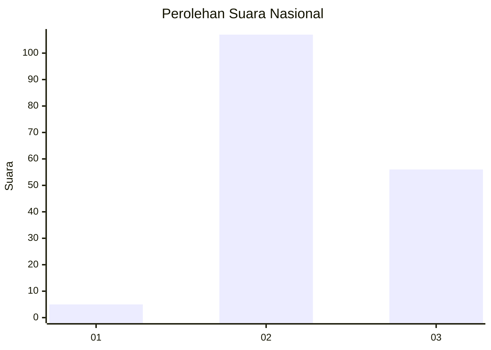
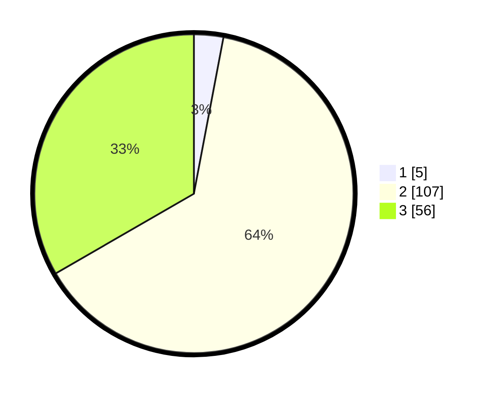

# Hasil

## Grafik

## Tabel

| No. | Nama Paslon    | Suara | Suara (raw) | Persentase |
|:--- |:-------------- | -----:| -----------:| ----------:|
| 1   | ANIES MUHAIMIN | 5     | [5][p-1]    | 2,98       |
| 2   | PRABOWO GIBRAN | 107   | [107][p-2]  | 63,69      |
| 3   | GANJAR MAHFUD  | 56    | [56][p-3]   | 33,33      |

[p-1]: https://github.com/gigit-pemilu/pemilu-2024/blob/main/pilpres/hitung-suara/sub/51-bali/sub/02-tabanan/sub/08-penebel/sub/2010-penebel/sub/013-tps/sub/paslon-1.txt
[p-2]: https://github.com/gigit-pemilu/pemilu-2024/blob/main/pilpres/hitung-suara/sub/51-bali/sub/02-tabanan/sub/08-penebel/sub/2010-penebel/sub/013-tps/sub/paslon-2.txt
[p-3]: https://github.com/gigit-pemilu/pemilu-2024/blob/main/pilpres/hitung-suara/sub/51-bali/sub/02-tabanan/sub/08-penebel/sub/2010-penebel/sub/013-tps/sub/paslon-3.txt

## Foto C Plano

https://sirekap-obj-formc.kpu.go.id/3acd/pemilu/ppwp/51/02/08/20/10/5102082010013-20240214-192059--6e8c1b89-c01c-45f4-a10b-98086a568662.jpg

https://sirekap-obj-formc.kpu.go.id/3acd/pemilu/ppwp/51/02/08/20/10/5102082010013-20240214-192124--f98085a3-5ce3-4031-be0b-4b074c4e81af.jpg

https://sirekap-obj-formc.kpu.go.id/3acd/pemilu/ppwp/51/02/08/20/10/5102082010013-20240214-192710--7071e5c5-cb4f-4cd3-b46d-0da863e62568.jpg

## Metadata

| Key        | Value               |
| ---------- | ------------------- |
| Time Stamp | 2024-02-15 23:29:50 |

