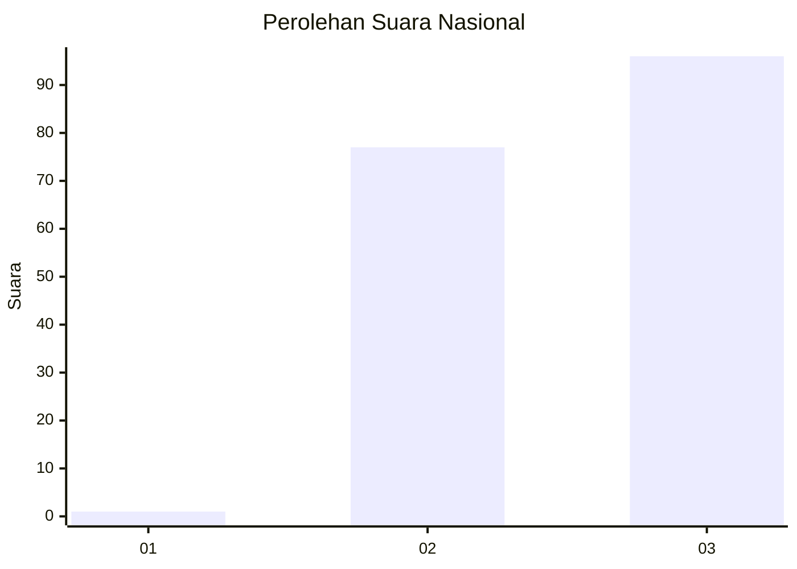
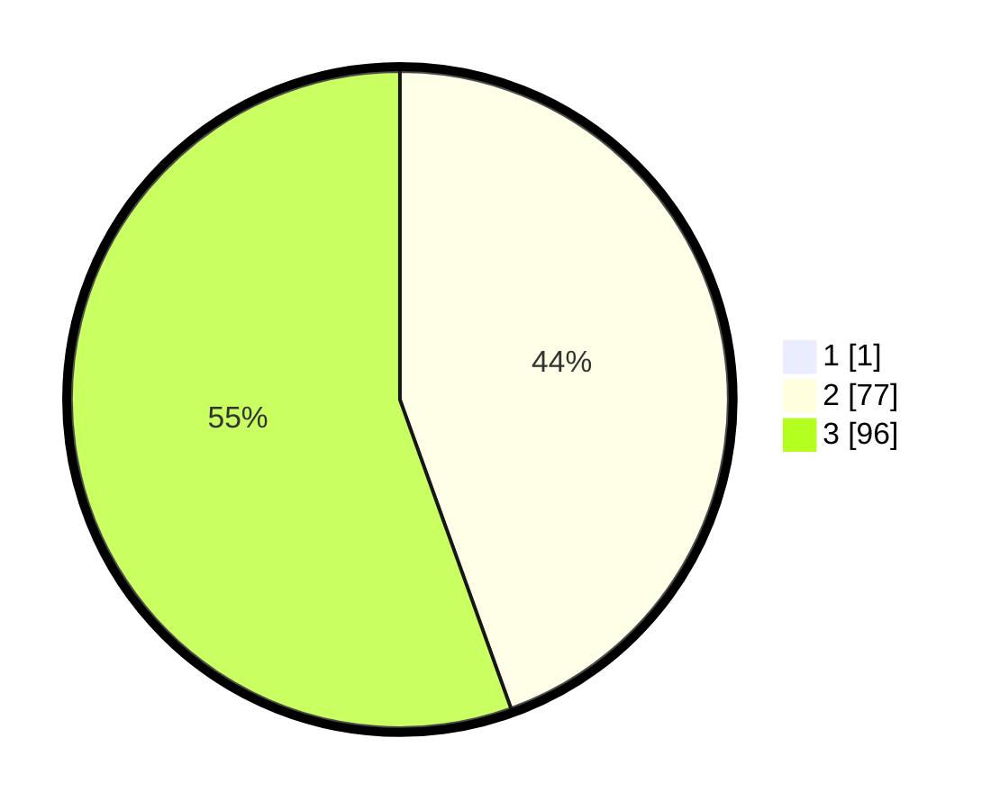

# Hasil

## Grafik

## Tabel

| No. | Nama Paslon    | Suara | Suara (raw) | Persentase |
|:--- |:-------------- | -----:| -----------:| ----------:|
| 1   | ANIES MUHAIMIN | 1     | [1][p-1]    | 0,57       |
| 2   | PRABOWO GIBRAN | 77    | [77][p-2]   | 44,25      |
| 3   | GANJAR MAHFUD  | 96    | [96][p-3]   | 55,17      |

[p-1]: https://github.com/gigit-pemilu/pemilu-2024/blob/main/pilpres/hitung-suara/sub/51-bali/sub/02-tabanan/sub/08-penebel/sub/2011-babahan/sub/001-tps/sub/paslon-1.txt
[p-2]: https://github.com/gigit-pemilu/pemilu-2024/blob/main/pilpres/hitung-suara/sub/51-bali/sub/02-tabanan/sub/08-penebel/sub/2011-babahan/sub/001-tps/sub/paslon-2.txt
[p-3]: https://github.com/gigit-pemilu/pemilu-2024/blob/main/pilpres/hitung-suara/sub/51-bali/sub/02-tabanan/sub/08-penebel/sub/2011-babahan/sub/001-tps/sub/paslon-3.txt

## Foto C Plano

https://sirekap-obj-formc.kpu.go.id/f61a/pemilu/ppwp/51/02/08/20/11/5102082011001-20240214-213608--65aab337-eb7d-4fdd-b728-10a4d197bdd9.jpg

https://sirekap-obj-formc.kpu.go.id/f61a/pemilu/ppwp/51/02/08/20/11/5102082011001-20240214-213654--0a766504-bf37-4d42-a4ed-b34b7346f73d.jpg

https://sirekap-obj-formc.kpu.go.id/f61a/pemilu/ppwp/51/02/08/20/11/5102082011001-20240214-213736--1151f796-08f9-476e-a374-a7f224371ebf.jpg

## Metadata

| Key        | Value               |
| ---------- | ------------------- |
| Time Stamp | 2024-02-15 23:29:50 |

