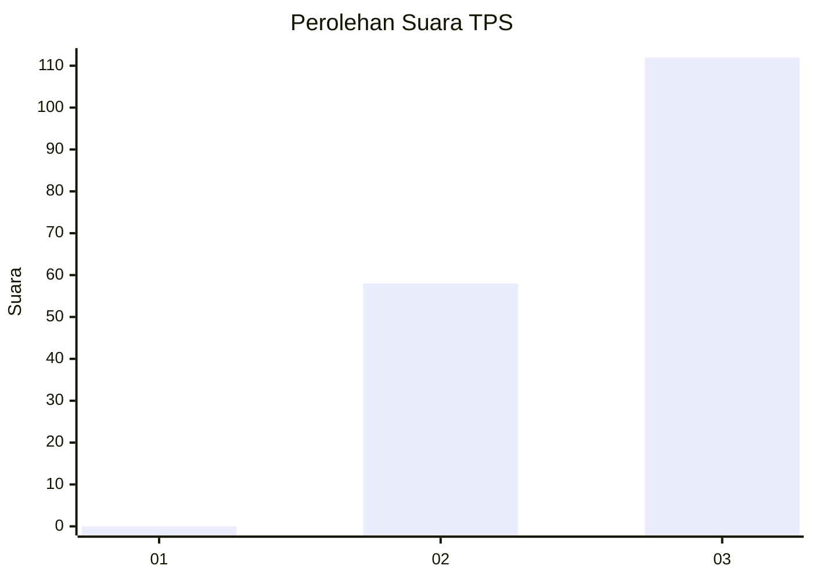
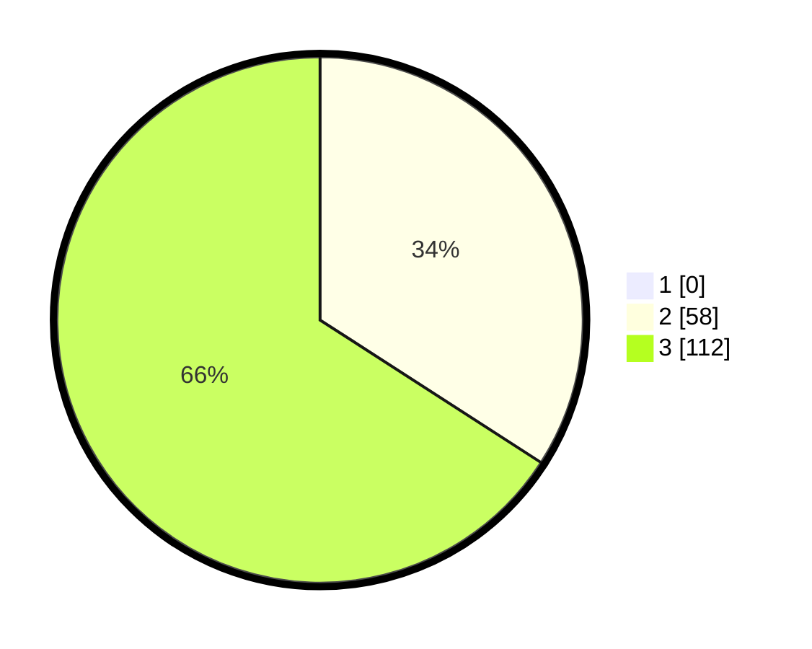

# Hasil

## Grafik

## Tabel

| No. | Nama Paslon    | Suara | Suara (raw) | Persentase |
|:--- |:-------------- | -----:| -----------:| ----------:|
| 1   | ANIES MUHAIMIN | 0     | [0][p-1]    | 0,00       |
| 2   | PRABOWO GIBRAN | 58    | [58][p-2]   | 34,12      |
| 3   | GANJAR MAHFUD  | 112   | [112][p-3]  | 65,88      |

[p-1]: https://github.com/gigit-pemilu/pemilu-2024-51-bali/blob/main/pilpres/hitung-suara/sub/51-bali/sub/02-tabanan/sub/08-penebel/sub/2011-babahan/sub/002-tps/sub/paslon-1.txt
[p-2]: https://github.com/gigit-pemilu/pemilu-2024-51-bali/blob/main/pilpres/hitung-suara/sub/51-bali/sub/02-tabanan/sub/08-penebel/sub/2011-babahan/sub/002-tps/sub/paslon-2.txt
[p-3]: https://github.com/gigit-pemilu/pemilu-2024-51-bali/blob/main/pilpres/hitung-suara/sub/51-bali/sub/02-tabanan/sub/08-penebel/sub/2011-babahan/sub/002-tps/sub/paslon-3.txt

## Foto C Plano

https://sirekap-obj-formc.kpu.go.id/11fc/pemilu/ppwp/51/02/08/20/11/5102082011002-20240216-144742--b2582df7-abab-46bc-a505-ab0c5528c0f3.jpg

https://sirekap-obj-formc.kpu.go.id/11fc/pemilu/ppwp/51/02/08/20/11/5102082011002-20240216-144743--d8687225-6b0e-4d59-80ca-91e8205cba36.jpg

https://sirekap-obj-formc.kpu.go.id/11fc/pemilu/ppwp/51/02/08/20/11/5102082011002-20240216-144742--9ca752dd-95a6-420d-aa14-2385be3d4f0e.jpg

## Metadata

| Key        | Value               |
| ---------- | ------------------- |
| Time Stamp | 2024-02-21 18:00:00 |

## DATA PEMILIH TETAP

Jumlah pemilih dalam DPT: **185**.
 * L: **90**.
 * P: **95**.

## DATA PENGGUNA HAK PILIH

Jumlah pengguna hak pilih dalam DPT: **176**.
 * L: **89**.
 * P: **87**.

Jumlah pengguna hak pilih dalam DPTb: **0**.
 * L: **0**.
 * P: **0**.

Jumlah pengguna hak pilih dalam DPK: **1**.
 * L: **0**.
 * P: **1**.

Jumlah pengguna hak pilih: **177**.
 * L: **89**.
 * P: **88**.

## JUMLAH SUARA SAH DAN TIDAK SAH

JUMLAH SELURUH SUARA SAH: **170**.

JUMLAH SUARA TIDAK SAH: **7**.

JUMLAH SELURUH SUARA SAH DAN SUARA TIDAK SAH: **177**.

