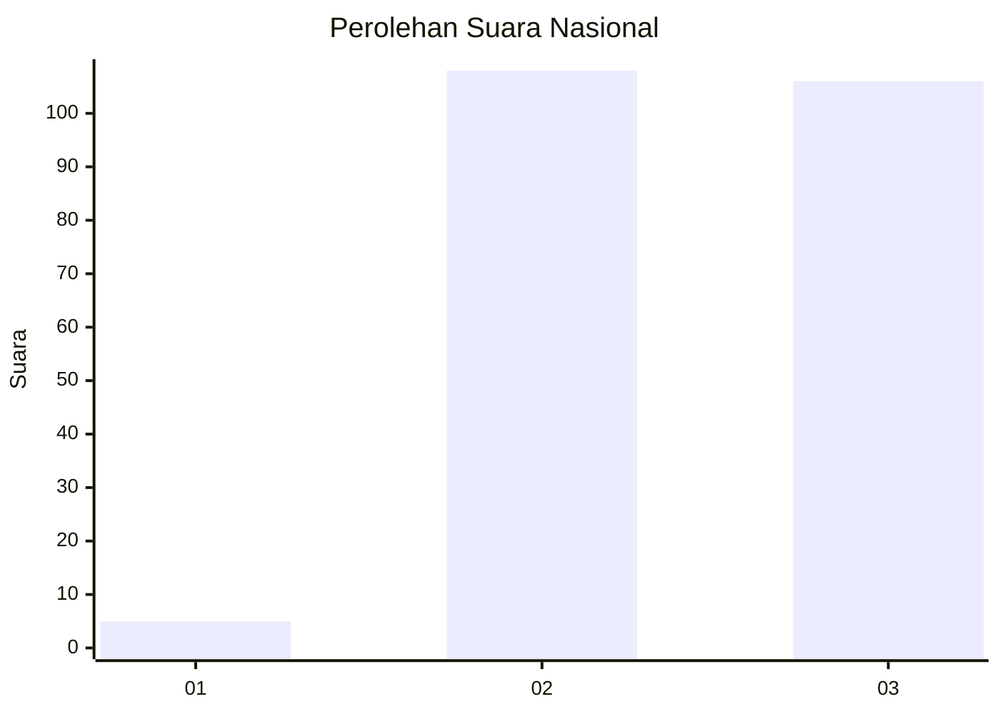
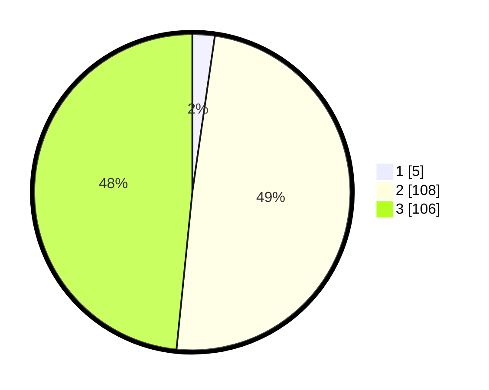

# Hasil

## Grafik

## Tabel

| No. | Nama Paslon    | Suara | Suara (raw) | Persentase |
|:--- |:-------------- | -----:| -----------:| ----------:|
| 1   | ANIES MUHAIMIN | 5     | [5][p-1]    | 2,28       |
| 2   | PRABOWO GIBRAN | 108   | [108][p-2]  | 49,32      |
| 3   | GANJAR MAHFUD  | 106   | [106][p-3]  | 48,40      |

[p-1]: https://github.com/gigit-pemilu/pemilu-2024/blob/main/pilpres/hitung-suara/sub/51-bali/sub/02-tabanan/sub/08-penebel/sub/2011-babahan/sub/004-tps/sub/paslon-1.txt
[p-2]: https://github.com/gigit-pemilu/pemilu-2024/blob/main/pilpres/hitung-suara/sub/51-bali/sub/02-tabanan/sub/08-penebel/sub/2011-babahan/sub/004-tps/sub/paslon-2.txt
[p-3]: https://github.com/gigit-pemilu/pemilu-2024/blob/main/pilpres/hitung-suara/sub/51-bali/sub/02-tabanan/sub/08-penebel/sub/2011-babahan/sub/004-tps/sub/paslon-3.txt

## Foto C Plano

https://sirekap-obj-formc.kpu.go.id/38fc/pemilu/ppwp/51/02/08/20/11/5102082011004-20240215-105622--33c506e9-518e-47bc-8bab-def26d576aad.jpg

https://sirekap-obj-formc.kpu.go.id/38fc/pemilu/ppwp/51/02/08/20/11/5102082011004-20240215-105635--c4080ca7-37a0-4bef-8340-d69d97861d13.jpg

## Metadata

| Key        | Value               |
| ---------- | ------------------- |
| Time Stamp | 2024-02-15 23:29:50 |

