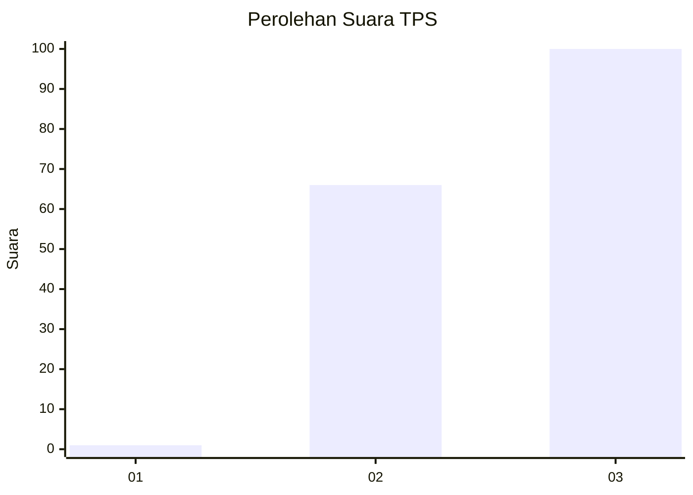
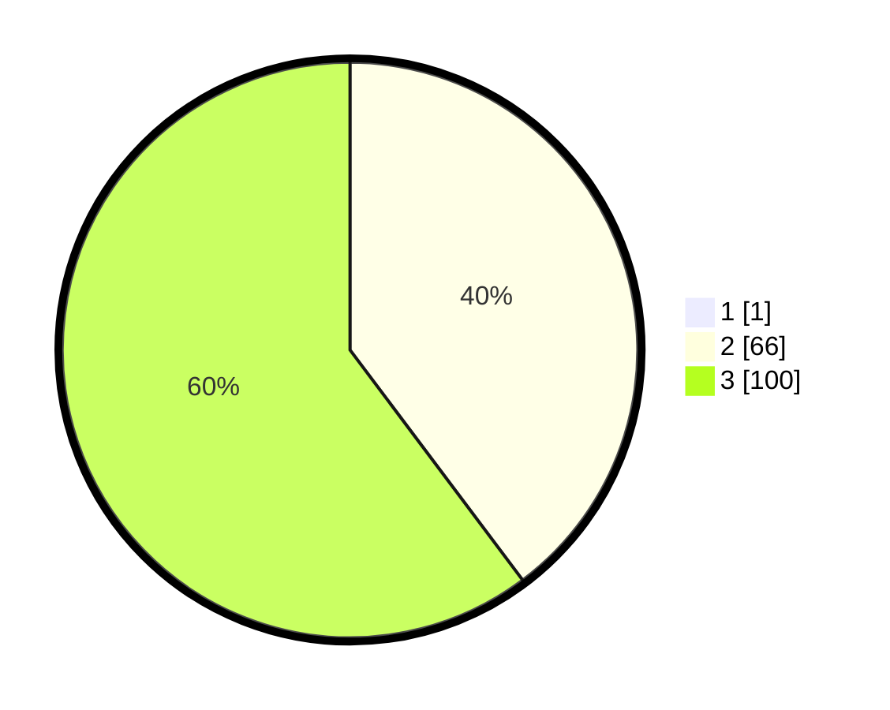

# Hasil

## Grafik

## Tabel

| No. | Nama Paslon    | Suara | Suara (raw) | Persentase |
|:--- |:-------------- | -----:| -----------:| ----------:|
| 1   | ANIES MUHAIMIN | 1     | [1][p-1]    | 0,60       |
| 2   | PRABOWO GIBRAN | 66    | [66][p-2]   | 39,52      |
| 3   | GANJAR MAHFUD  | 100   | [100][p-3]  | 59,88      |

[p-1]: https://github.com/gigit-pemilu/pemilu-2024-51-bali/blob/main/pilpres/hitung-suara/sub/51-bali/sub/02-tabanan/sub/08-penebel/sub/2011-babahan/sub/005-tps/sub/paslon-1.txt
[p-2]: https://github.com/gigit-pemilu/pemilu-2024-51-bali/blob/main/pilpres/hitung-suara/sub/51-bali/sub/02-tabanan/sub/08-penebel/sub/2011-babahan/sub/005-tps/sub/paslon-2.txt
[p-3]: https://github.com/gigit-pemilu/pemilu-2024-51-bali/blob/main/pilpres/hitung-suara/sub/51-bali/sub/02-tabanan/sub/08-penebel/sub/2011-babahan/sub/005-tps/sub/paslon-3.txt

## Foto C Plano

https://sirekap-obj-formc.kpu.go.id/a61f/pemilu/ppwp/51/02/08/20/11/5102082011005-20240214-201511--6fb40d96-5bd0-4372-bc73-af5ef2146087.jpg

https://sirekap-obj-formc.kpu.go.id/a61f/pemilu/ppwp/51/02/08/20/11/5102082011005-20240214-201526--8767a501-e12a-42cc-8cf6-92d84cf86f16.jpg

https://sirekap-obj-formc.kpu.go.id/a61f/pemilu/ppwp/51/02/08/20/11/5102082011005-20240214-201547--fd1f8be3-40d7-4dd2-90d7-cd5fd511ace0.jpg

## Metadata

| Key        | Value               |
| ---------- | ------------------- |
| Time Stamp | 2024-02-15 12:00:28 |

## DATA PEMILIH TETAP

Jumlah pemilih dalam DPT: **210**.
 * L: **103**.
 * P: **107**.

## DATA PENGGUNA HAK PILIH

Jumlah pengguna hak pilih dalam DPT: **167**.
 * L: **82**.
 * P: **85**.

Jumlah pengguna hak pilih dalam DPTb: **0**.
 * L: **0**.
 * P: **0**.

Jumlah pengguna hak pilih dalam DPK: **1**.
 * L: **0**.
 * P: **1**.

Jumlah pengguna hak pilih: **168**.
 * L: **82**.
 * P: **86**.

## JUMLAH SUARA SAH DAN TIDAK SAH

JUMLAH SELURUH SUARA SAH: **167**.

JUMLAH SUARA TIDAK SAH: **1**.

JUMLAH SELURUH SUARA SAH DAN SUARA TIDAK SAH: **168**.

