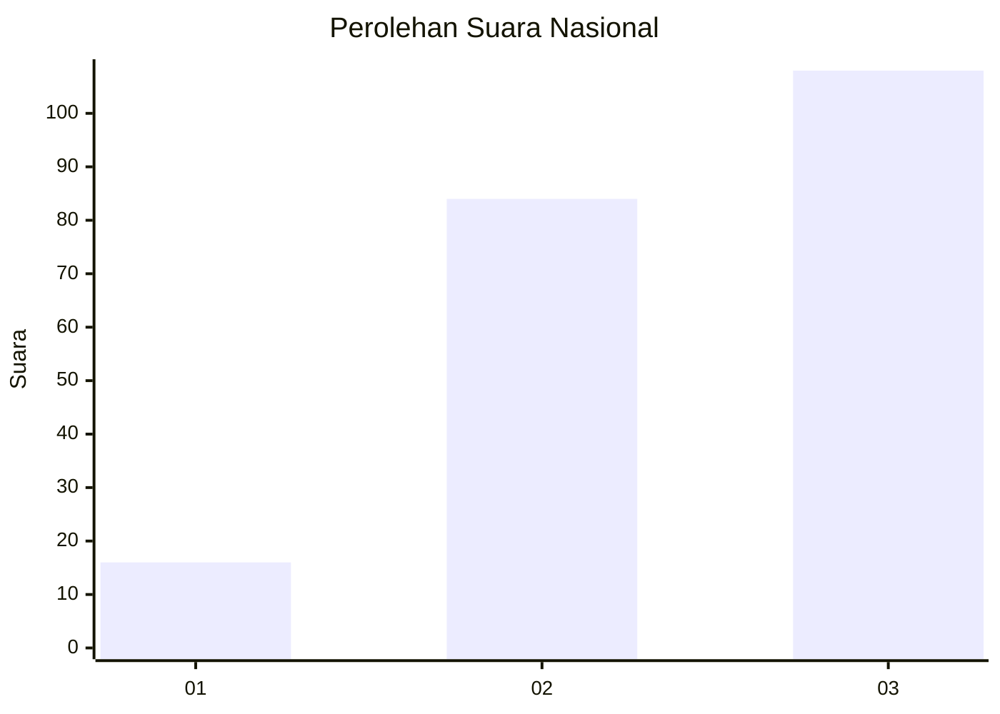
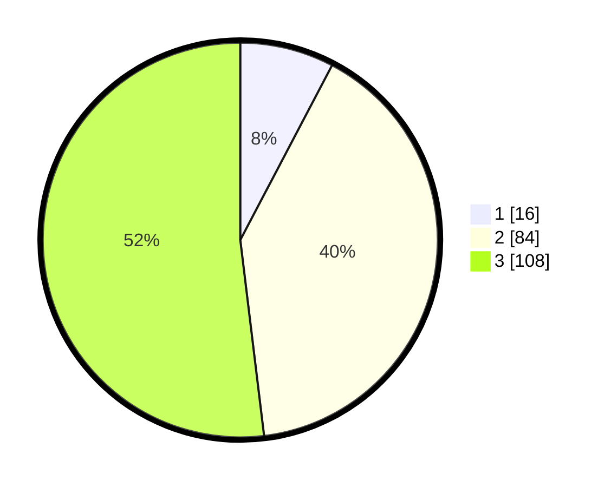

# Hasil

## Grafik

## Tabel

| No. | Nama Paslon    | Suara | Suara (raw) | Persentase |
|:--- |:-------------- | -----:| -----------:| ----------:|
| 1   | ANIES MUHAIMIN | 16    | [16][p-1]   | 7,69       |
| 2   | PRABOWO GIBRAN | 84    | [84][p-2]   | 40,38      |
| 3   | GANJAR MAHFUD  | 108   | [108][p-3]  | 51,92      |

[p-1]: https://github.com/gigit-pemilu/pemilu-2024/blob/main/pilpres/hitung-suara/sub/51-bali/sub/02-tabanan/sub/08-penebel/sub/2012-senganan/sub/003-tps/sub/paslon-1.txt
[p-2]: https://github.com/gigit-pemilu/pemilu-2024/blob/main/pilpres/hitung-suara/sub/51-bali/sub/02-tabanan/sub/08-penebel/sub/2012-senganan/sub/003-tps/sub/paslon-2.txt
[p-3]: https://github.com/gigit-pemilu/pemilu-2024/blob/main/pilpres/hitung-suara/sub/51-bali/sub/02-tabanan/sub/08-penebel/sub/2012-senganan/sub/003-tps/sub/paslon-3.txt

## Foto C Plano

https://sirekap-obj-formc.kpu.go.id/111b/pemilu/ppwp/51/02/08/20/12/5102082012003-20240214-234706--e3d362b3-2895-46e0-9c3b-db1922f9706e.jpg

https://sirekap-obj-formc.kpu.go.id/111b/pemilu/ppwp/51/02/08/20/12/5102082012003-20240214-234903--d54d8cb2-0350-4504-8fe7-0441204a91ee.jpg

https://sirekap-obj-formc.kpu.go.id/111b/pemilu/ppwp/51/02/08/20/12/5102082012003-20240214-234756--8dbc10c8-5d54-4506-8033-eb8b6e02738a.jpg

## Metadata

| Key        | Value               |
| ---------- | ------------------- |
| Time Stamp | 2024-02-15 23:29:50 |

