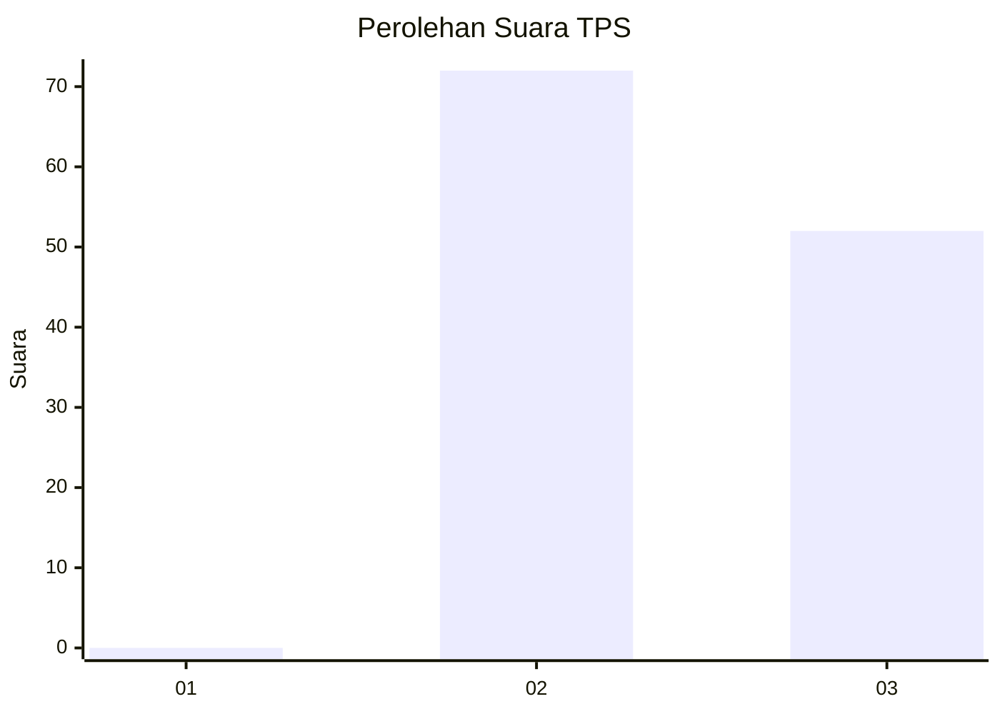
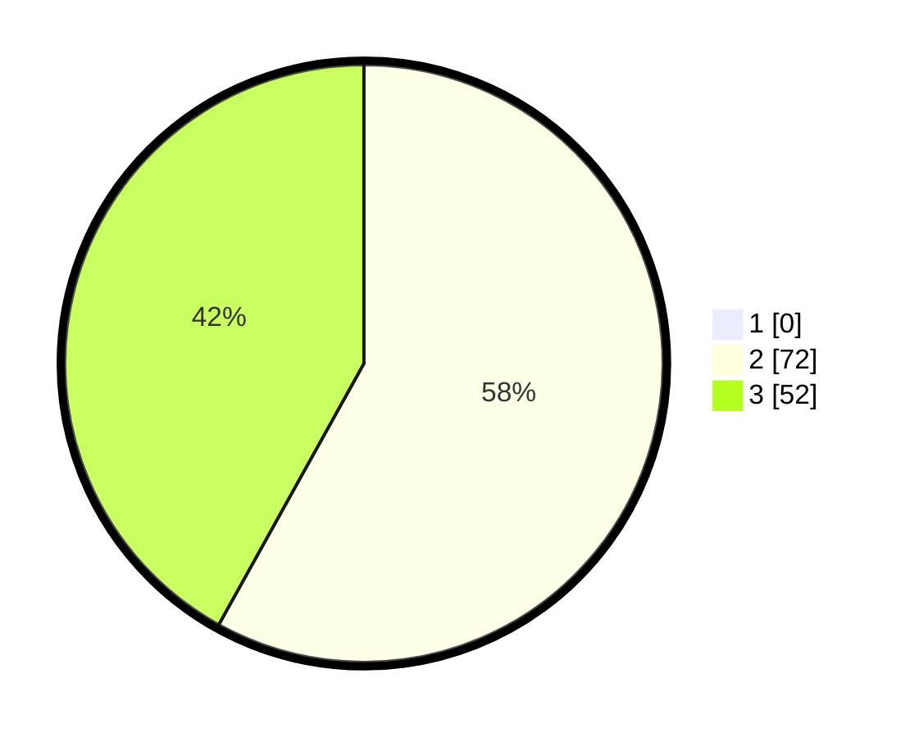

# Hasil

## Grafik

## Tabel

| No. | Nama Paslon    | Suara | Suara (raw) | Persentase |
|:--- |:-------------- | -----:| -----------:| ----------:|
| 1   | ANIES MUHAIMIN | 0     | [0][p-1]    | 0,00       |
| 2   | PRABOWO GIBRAN | 72    | [72][p-2]   | 58,06      |
| 3   | GANJAR MAHFUD  | 52    | [52][p-3]   | 41,94      |

[p-1]: https://github.com/gigit-pemilu/pemilu-2024-51-bali/blob/main/pilpres/hitung-suara/sub/51-bali/sub/02-tabanan/sub/08-penebel/sub/2012-senganan/sub/007-tps/sub/paslon-1.txt
[p-2]: https://github.com/gigit-pemilu/pemilu-2024-51-bali/blob/main/pilpres/hitung-suara/sub/51-bali/sub/02-tabanan/sub/08-penebel/sub/2012-senganan/sub/007-tps/sub/paslon-2.txt
[p-3]: https://github.com/gigit-pemilu/pemilu-2024-51-bali/blob/main/pilpres/hitung-suara/sub/51-bali/sub/02-tabanan/sub/08-penebel/sub/2012-senganan/sub/007-tps/sub/paslon-3.txt

## Foto C Plano

https://sirekap-obj-formc.kpu.go.id/93f5/pemilu/ppwp/51/02/08/20/12/5102082012007-20240214-132207--a2bbb838-5f4f-40ca-a2dd-6b4c11068ca0.jpg

https://sirekap-obj-formc.kpu.go.id/93f5/pemilu/ppwp/51/02/08/20/12/5102082012007-20240214-131935--e453850f-bd28-458b-ae02-19778d87fb97.jpg

https://sirekap-obj-formc.kpu.go.id/93f5/pemilu/ppwp/51/02/08/20/12/5102082012007-20240214-132141--63c3bde1-9455-48d9-9399-1899ddd71ca0.jpg

## Metadata

| Key        | Value               |
| ---------- | ------------------- |
| Time Stamp | 2024-02-15 23:29:50 |

## DATA PEMILIH TETAP

Jumlah pemilih dalam DPT: **152**.
 * L: **72**.
 * P: **80**.

## DATA PENGGUNA HAK PILIH

Jumlah pengguna hak pilih dalam DPT: **123**.
 * L: **59**.
 * P: **64**.

Jumlah pengguna hak pilih dalam DPTb: **0**.
 * L: **0**.
 * P: **0**.

Jumlah pengguna hak pilih dalam DPK: **3**.
 * L: **3**.
 * P: **0**.

Jumlah pengguna hak pilih: **126**.
 * L: **62**.
 * P: **64**.

## JUMLAH SUARA SAH DAN TIDAK SAH

JUMLAH SELURUH SUARA SAH: **123**.

JUMLAH SUARA TIDAK SAH: **3**.

JUMLAH SELURUH SUARA SAH DAN SUARA TIDAK SAH: **126**.

