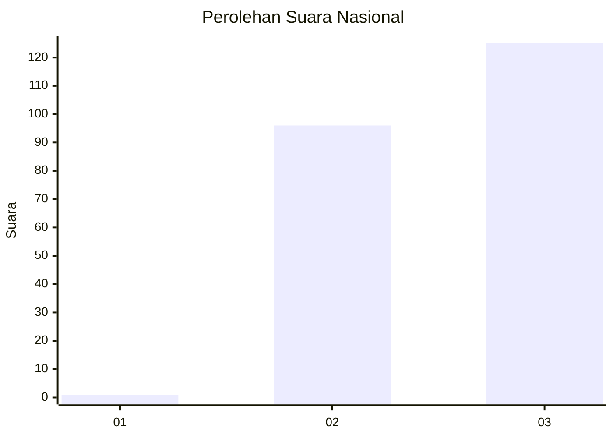
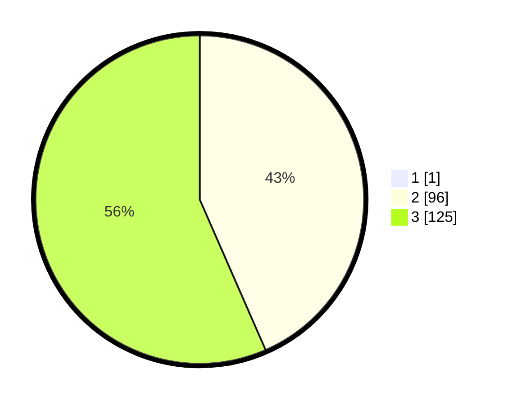

# Hasil

## Grafik

## Tabel

| No. | Nama Paslon    | Suara | Suara (raw) | Persentase |
|:--- |:-------------- | -----:| -----------:| ----------:|
| 1   | ANIES MUHAIMIN | 1     | [1][p-1]    | 0,45       |
| 2   | PRABOWO GIBRAN | 96    | [96][p-2]   | 43,24      |
| 3   | GANJAR MAHFUD  | 125   | [125][p-3]  | 56,31      |

[p-1]: https://github.com/gigit-pemilu/pemilu-2024/blob/main/pilpres/hitung-suara/sub/51-bali/sub/02-tabanan/sub/08-penebel/sub/2012-senganan/sub/012-tps/sub/paslon-1.txt
[p-2]: https://github.com/gigit-pemilu/pemilu-2024/blob/main/pilpres/hitung-suara/sub/51-bali/sub/02-tabanan/sub/08-penebel/sub/2012-senganan/sub/012-tps/sub/paslon-2.txt
[p-3]: https://github.com/gigit-pemilu/pemilu-2024/blob/main/pilpres/hitung-suara/sub/51-bali/sub/02-tabanan/sub/08-penebel/sub/2012-senganan/sub/012-tps/sub/paslon-3.txt

## Foto C Plano

https://sirekap-obj-formc.kpu.go.id/8858/pemilu/ppwp/51/02/08/20/12/5102082012012-20240214-192047--6ea5e0c9-fc4c-400b-a442-e52e1851b9d6.jpg

https://sirekap-obj-formc.kpu.go.id/8858/pemilu/ppwp/51/02/08/20/12/5102082012012-20240214-192154--9535a40f-7365-4872-9142-f68d5c3e8227.jpg

https://sirekap-obj-formc.kpu.go.id/8858/pemilu/ppwp/51/02/08/20/12/5102082012012-20240214-192231--b190adf6-9acf-4bf3-9347-f1dfdc6235ee.jpg

## Metadata

| Key        | Value               |
| ---------- | ------------------- |
| Time Stamp | 2024-02-15 18:00:26 |

## DATA PEMILIH TETAP

Jumlah pemilih dalam DPT: **255**.
 * L: **140**.
 * P: **115**.

## DATA PENGGUNA HAK PILIH

Jumlah pengguna hak pilih dalam DPT: **224**.
 * L: **122**.
 * P: **102**.

Jumlah pengguna hak pilih dalam DPTb: **0**.
 * L: **0**.
 * P: **0**.

Jumlah pengguna hak pilih dalam DPK: **1**.
 * L: **0**.
 * P: **1**.

Jumlah pengguna hak pilih: **225**.
 * L: **122**.
 * P: **103**.

## JUMLAH SUARA SAH DAN TIDAK SAH

JUMLAH SELURUH SUARA SAH: **222**.

JUMLAH SUARA TIDAK SAH: **3**.

JUMLAH SELURUH SUARA SAH DAN SUARA TIDAK SAH: **225**.

